# System Architecture — AI-Powered Loan Risk & Recommendation System

**Project:** AI-Powered Loan Risk & Recommendation System (Sri Lankan banking context)
**Repository:** `finance-application/` (monorepo — four modules)
**Last updated:** 2026-08-11

This document describes the **structural architecture** of the system: its
components, technology stack, machine-learning models, data model,
integration contracts, and security design. For setup/installation/run
instructions, see **[README.md](README.md)**.

---

## 1. Overview

The system is a modular, service-oriented web application that classifies loan
applicants into **Low / Medium / High** risk, produces loan recommendations,
carries a loan through its full lifecycle from application to offer,
disbursement, and repayment (including online card repayment), carries a
**vehicle finance lease** — a distinct instrument from a loan, see §9.19 —
through its own full lifecycle from application to valuation, quotation,
down payment, vehicle purchase and registration, monthly rentals, and
release, and surfaces currency exchange-rate analytics plus a bank-style FX
exchange workflow. It is composed of five cooperating parts:

1. A **Single-Page Application** (React) — the presentation layer for customers, staff, and admins, in English, Sinhala, and Tamil.
2. An **API gateway** (Node/Express) — authentication, business logic, orchestration, and persistence.
3. A **machine-learning microservice** (Python/FastAPI) — loan risk inference only.
4. A second **machine-learning microservice** (Python/FastAPI) — currency exchange-rate forecasting only (`currency-forecast-model/`; LSTM, XGBoost, GARCH, Isolation Forest).
5. A **relational database** (MySQL) — the system of record.

Two external services are consumed by the gateway: a **generative-AI API**
(Gemini) for natural-language risk explanations, called with a graceful
deterministic fallback when no key is configured or the call fails; and a
**payment gateway** (Stripe) for customer-initiated online card repayments,
which the system likewise runs correctly without — a missing configuration
there simply disables the online-payment button rather than affecting
anything else (§9.15).

**Architectural style:** layered gateway architecture. The browser talks only to
the gateway; the gateway fans out to the ML services, the database, and Gemini.

---

## 2. Architectural principles

| # | Principle |
|---|---|
| P1 | **Single gateway.** The SPA calls only the Node API. It never calls an ML service, database, or external API directly. |
| P2 | **ML as an isolated microservice.** Each Python service is a pure *features-in → prediction-out* function with no database or business logic. |
| P3 | **Secrets stay server-side.** API keys (Gemini), DB credentials, and the model URLs live only in the Node process. |
| P4 | **Stateless authentication.** JSON Web Tokens; no server-side session store. |
| P5 | **Separation of concerns.** Risk/analytics *scoring* (ML) is separate from *recommendation*/business decisions (deterministic rules in Node). |
| P6 | **Data-plane separation (currency feature).** A live rate and a trained-model output are never merged into one field — every currency number carries provenance saying which plane it came from (see §9.5). |

---

## 3. System context (Level 1)

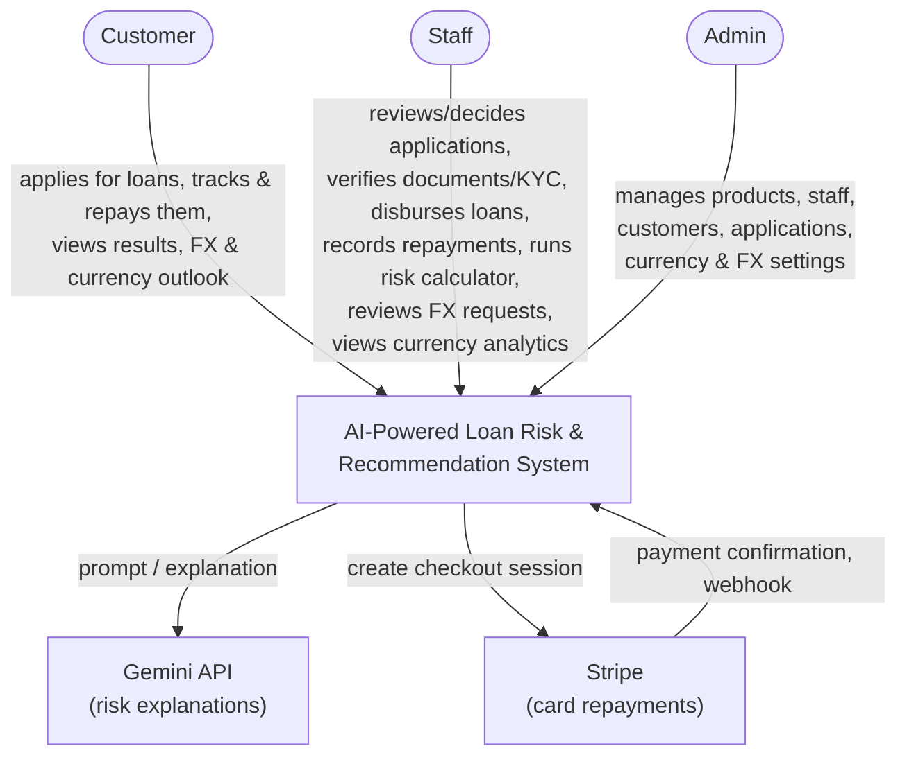

---

## 4. Container architecture (Level 2)

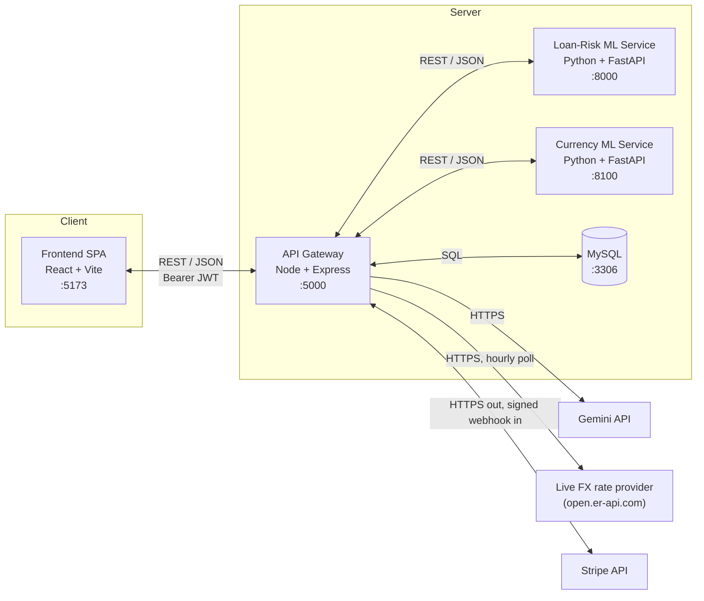

| Container | Module | Runtime | Port | Responsibility |
|---|---|---|---|---|
| Frontend SPA | `finance-frontend/` | React 19 / Vite | 5173 | Presentation, routing, i18n, auth session, forms, dashboards |
| API Gateway | `finance-backend/` | Node / Express 5 | 5000 | Auth, loan lifecycle (application → offer → disbursement → repayment), orchestration, recommendation & explanation, FX workflow, persistence |
| Loan-Risk ML Service | `loan-risk-model/` | Python / FastAPI | 8000 | Feature engineering + loan risk inference (XGBoost) |
| Currency ML Service | `currency-forecast-model/` | Python / FastAPI | 8100 | Exchange-rate forecast / trend / volatility / anomaly inference (LSTM, XGBoost, GARCH, Isolation Forest) |
| Database | (managed by backend) | MySQL 8 | 3306 | System of record |

---

## 5. Technology stack

| Concern | Frontend | Backend | Loan-Risk ML | Currency ML |
|---|---|---|---|---|
| Language | JavaScript (JSX) | JavaScript (Node) | Python 3.10/3.11 | Python 3.10/3.11 |
| Framework | React 19, Vite | Express 5 | FastAPI | FastAPI |
| Styling / UI | Tailwind CSS, framer-motion, lucide-react | — | — | — |
| Routing | React Router 7 | Express Router | — | — |
| i18n | react-i18next (`en`/`si`/`ta`) | — | — | — |
| Data access | axios | mysql2 (pool) | — | — |
| ML | — | — | XGBoost, scikit-learn, pandas, numpy | LSTM (`tensorflow-cpu`/Keras), XGBoost, GARCH (`arch`), Isolation Forest (scikit-learn), pandas, numpy, pyarrow |
| Auth | JWT (in-memory access token) | jsonwebtoken, bcrypt, httpOnly cookie | — | — |
| Security | — | helmet, cors, express-validator | — | — |
| Uploads | — | multer — three separate instances: profile images (public `uploads/`), FX compliance documents, and loan application documents (both non-public `secure-uploads/`, see §9.7/§9.11/§11) | — | — |
| Email | — | nodemailer (forgot-password OTP, major loan-status-change emails) | — | — |
| Payments | Stripe Checkout (hosted redirect) | `stripe` SDK — Checkout session creation, webhook signature verification (see §9.15) | — | — |
| PDF generation | — | `pdfkit` — decision letters, payment receipts (see §9.11/§9.15) | — | — |
| Charts | Recharts (currency rate/forecast charts) | — | — | — |
| Serialization | — | — | joblib | joblib |

---

## 6. Module responsibilities

### 6.1 Frontend (SPA)
- Public/marketing pages, plus a real-time Eligibility checker and EMI calculator wired to the backend.
- Auth session handling: in-memory access token + silent refresh via the gateway.
- Role-based routing (`customer` / `staff` / `admin`), each with its own dashboard shell.
- Full trilingual UI (English / Sinhala / Tamil) via `react-i18next`, headline-level translation — admin/staff tooling and database-sourced content (loan products, FAQ entries, etc.) stay English.
- **Customer portal** — apply for a loan via a multi-step wizard that pre-fills stable personal details from the customer's profile and their most recent application for confirmation rather than re-entry (§9.12), auto-saves an in-progress application as a resumable draft, collects an optional guarantor/collateral declaration and supporting documents, and requires granting any still-missing data-processing/credit-bureau-check consent before submission (§9.18); view application history, status, and the full decision/event timeline; download a decision letter (PDF) once decided; view and accept/decline a loan offer, including its fee breakdown, net amount actually receivable, and effective APR alongside the nominal rate (§9.17); view the bank account(s) opened automatically in the customer's name (§9.13); once disbursed, view the live repayment schedule, outstanding balance, arrears, and early-settlement quote, pay online by card or view/download past payment receipts (§9.15), and download a full loan statement (CSV); submit/track NIC identity verification and edit profile (§9.11); a **Leasing** section — apply for a vehicle finance lease, track it on an eight-step progress tracker with a "what happens next" banner, review/accept a quotation, pay the down payment and monthly rentals online or view offline receipts, and download the lease agreement and (once complete) the letter of release (§9.19); a Currency tab (simplified quarterly exchange-rate outlook, live rate board, rate-history chart); a full FX exchange-request flow — quote in either the foreign currency or a target LKR amount (server inverts the rate either way), live per-transaction/daily limit headroom shown before committing, supporting-document upload when the exchange is over the admin-configured compliance threshold, submit, history, cancel, audit timeline, and a printable settlement slip once a request is approved or settled; a contact-support message thread; read-only FAQ.
- **Staff portal** — a review queue of loan applications with processing-age/SLA badges (§9.16); review and decide (approve/reject/request more information) applications, issue and re-issue loan offers — waiving an individual fee on an offer with a mandatory recorded reason (§9.17) — and mark an accepted offer as disbursed; verify uploaded documents, NIC/KYC submissions, and pledged collateral (§9.11); look up a guarantor's total exposure across the system before relying on them again; record an offline repayment (cash/transfer/cheque/standing order) against a disbursed loan and waive a late fee, with a downloadable receipt for any payment (§9.14/§9.15); register a pre-existing bank account for a customer who already banks with this institution (§9.13); a **Leasing** section — a lease-application review queue with the same progress indicator, request/record independent valuations, credit decisioning, quotation issuance with fee waivers, down-payment/rental recording, dealer/CR/purchase tracking, and a dealer/valuer register (§9.19); read-only customer/product views, standalone risk calculator, a Currency tab with the full forecast/trend/volatility breakdown and anomaly-alert log, an FX Exchange review queue (approve/reject/counter-quote/settle, with per-request compliance-document status and inventory-availability status, each with its own approval gate — see §9.7/§9.9), FAQ management (CRUD). Staff sign in to their own dedicated portal at `/staff` (a customer or admin account is redirected to `/unauthorized` if it reaches that route).
- **Admin portal** — everything staff has, plus loan-product CRUD including per-product fee configuration (§9.17), leasing-product CRUD, a dealer's payout bank account and dealer/valuer suspension (§9.19), staff account management, a bank-wide Portfolio Dashboard (approval rate, disbursement volume, portfolio-at-risk, product/risk distribution — §9.16) shown alongside a separate Leasing Portfolio view (vehicles owned, rentals collected/overdue — §9.19), a Currency Analytics tab (model/cache status, currency activate/deactivate, cache refresh), FX configuration (spreads, limits, documentation threshold, bank-wide inventory, net position, live-feed refresh), an FX Reports tab (status-rate/volume/spread-revenue aggregates over a date range, plus CSV export of the underlying request rows), FAQ management (CRUD), and a Messages/contact-support inbox.

### 6.2 Backend (API gateway)
- **Authentication & authorization** — registration, login, JWT issuance/refresh, OTP-based forgot-password, RBAC.
- **Loan application lifecycle** — a full status machine (nine states: `pending` → … → `disbursed` → `closed`, plus `more_info_required`, `rejected`, `withdrawn`), with the legal next-states and the roles allowed to make each move defined in one place and reused by validation, persistence, and the API's own `allowed_transitions` hint to the frontend; every transition is written to an append-only audit trail (see §9.10).
- **Model orchestration** — map applicant profile, the customer's observed repayment behaviour with this institution (§9.1.6), and optional self-declared fields to model inputs, call the loan-risk ML service, persist results with a frozen snapshot of the evidence behind them.
- **Recommendation engine** — deterministic rules: loan type, recommended amount, EMI (see §9.2).
- **Explanation service** — call Gemini with structured risk factors, return/store a natural-language explanation (with a deterministic fallback if Gemini is unavailable), optionally localized (Sinhala/Tamil).
- **Applicant experience** — pre-fills a new application from the customer's profile and their most recent application; promotes stable personal attributes (marital status, education, occupation, employer type, years employed) onto the customer's profile so they persist across applications instead of being re-declared each time; auto-saves an abandoned application as a resumable draft (see §9.12).
- **Document management & KYC** — secure upload/verification of loan-supporting documents (identity, payslip, bank statement) and of a customer's declared NIC, both advisory (visible to staff, not a hard gate on the credit decision) — see §9.11.
- **Loan offers & disbursement** — a binding offer (amount, tenure, rate, EMI, expiry) the applicant must explicitly accept before funds move; on acceptance, an account at this bank is opened automatically in the customer's name (or an existing one reused/registered by staff) to receive the disbursed funds — see §9.10/§9.13.
- **Fees, net disbursement & effective APR** — admin-configured product fees (processing, documentation, credit-life insurance) resolved and snapshotted onto each offer, waivable by staff with a mandatory reason, deducted from disbursement rather than capitalised onto the loan, with an IRR-based effective APR disclosed alongside the nominal rate — see §9.17.
- **Consent management** — an append-only, versioned audit log of data-processing and credit-bureau-check consent; the loan assessment endpoint is gated on it server-side before any personal data is processed — see §9.18.
- **Loan servicing** — the repayment schedule (amortization), running balance, arrears, one-time late fees on overdue instalments, and an early-settlement quote with interest waiver, all derived deterministically from the schedule rather than stored as a separately-maintained figure — see §9.14.
- **Repayments** — staff-recorded offline payments, and customer-initiated online card payments via Stripe Checkout, both posting through the same allocation engine (oldest instalment first, fees → interest → principal) and the same append-only payment ledger, so the two channels can never disagree about a loan's balance — see §9.14/§9.15.
- **Staff/admin reporting** — a staff work queue with processing-age SLA badges, a bank-wide portfolio dashboard (approval rate, disbursement volume, portfolio-at-risk, product/risk mix), and downloadable decision letters (PDF) and loan statements (CSV) — see §9.16.
- **Currency analytics orchestration** — proxy the currency ML service's `/analyze` per currency, role-shape the response (simplified for customers, full detail for staff/admin), cache results in MySQL for 24h, log flagged anomalies, expose admin currency management (see §9.4/§9.5).
- **Live FX rate feed & board** — polls a free public FX API hourly for a customer-facing LKR buy/sell board, kept as a separate, clearly-labelled data plane from the trained-model output (§9.5).
- **FX exchange-request workflow** — customer requests a locked quote (in either the foreign currency or a target LKR amount), submits, staff review (approve/reject/counter-offer)/settle, admin configures spreads/limits/documentation threshold, all persisted with a full audit trail (see §9.6). Requests over the configured LKR threshold require an uploaded supporting document before staff can approve them (see §9.7). An admin-only reports endpoint aggregates status rates, settled volume, and spread revenue over a date range, with a matching CSV export (see §9.8).
- **FX inventory** — bank-wide (no per-branch) foreign-currency stock, reserved atomically at approval and consumed/released at settlement or terminal rejection, with a single-writer append-only ledger (see §9.9).
- **Vehicle leasing** — a distinct financing instrument with its own entity spine (application, vehicle, valuation, quotation, agreement, rental schedule, down payment, dealer payout, DMT registration), reusing the loan side's risk/credit-policy/Gemini/Stripe/consent services and fee-resolution/schedule-amortisation logic rather than its tables; a shared pure derivation drives an identical progress tracker and "what happens next" banner for the lessee and for staff, with staff copy always resolved in English regardless of the session's UI language — see §9.19.
- **FAQ management** — public/customer read-only catalog; staff/admin CRUD, with optional Sinhala/Tamil translations per entry (English is the source of truth).
- **Contact/support messaging** — public contact form persisted to the DB; admin inbox to triage and respond.
- **Persistence** — all reads/writes to MySQL.

### 6.3 Loan-Risk ML service
See §7 for the model itself. Accepts 33 raw applicant fields; computes 7 derived features; runs the trained preprocessor + XGBoost classifier; returns a calibrated probability of default, the Low/Medium/High band thresholded from it, and the three outcome probabilities. Rejects a categorical value it was not trained on, and ignores `gender` — a protected attribute the model deliberately does not accept (§7.2). Stateless; no persistence.

### 6.4 Currency service
See §8 for the four models. Loads all four model families once at startup for 5 currencies (LKR, INR, EUR, GBP, JPY); fails fast if any artifact is missing. Supplies its own "recent data" from a bundled historical series (Fed H.10, through 2026-07-24) for `/forecast`, `/trend`, `/volatility`; `/anomaly` takes caller-supplied prices instead. Returns forecast / trend / volatility / anomaly predictions, individually or combined via `/analyze`. Stateless; no persistence, no business logic.

### 6.5 Database
Authoritative store for users, profiles, applications, assessments, recommendations, notifications, password-reset OTPs, FAQ entries, contact messages, and the currency-analytics/FX-exchange tables.

---

## 7. Loan-risk model (`loan-risk-model/`)

An XGBoost classifier that predicts the repayment outcome of a loan
application in the Sri Lankan lending context, with a strong emphasis on CRIB
(Credit Information Bureau) features including guarantor liability history,
and on the institution's own record of how the applicant has repaid before.

**This is the v2 model.** v1 was audited in August 2026 and rebuilt; §7.8
records what the audit found and why almost all of it needed replacing rather
than tuning. The v1 dataset, artifacts and source are preserved under
`model_artifacts/v1_backup/` and `data/v1_backup/` so the comparison is
reproducible.

### 7.1 Where the dataset comes from, and why it is synthetic

**Source: generated, not collected.** `src/data_generator.py` produces
**150,000 rows** from a causal data-generating process built on NumPy's
`default_rng`. No real applicant data is used at any point, and no
personal-data-bearing third-party library is involved.

This was a deliberate choice, and the reasoning matters more than the result:

- **Real Sri Lankan credit data is not publicly obtainable.** CRIB data is
  regulated and released only to member institutions under a lending
  relationship.
- **The public alternatives are the wrong country.** Home Credit, Lending Club
  and the UCI German Credit dataset are the standard open credit-risk corpora,
  but none carries the features this project exists to model: a **CRIB score**,
  **guarantor exposure and guarantor default history**, LKR-denominated income
  bands, or Sri Lankan provinces. Training on them would produce a
  competent-but-generic credit model and discard the entire domain contribution.
- **Using real data would raise consent and privacy obligations** a student
  project cannot discharge.

The generator borrows *design patterns* from those public datasets (feature
families, plausible value ranges) and re-expresses them in a Sri Lankan frame.
The honest trade-off is stated in §7.3.

**Demographic grounding:** 9 provinces at realistic population weights; income
varies by province, education, employment type and experience; ~30% of
applicants carry guarantor exposure, reflecting how common third-party
guarantees are in Sri Lankan retail lending.

### 7.2 The causal data-generating process

The defining property of v2 is that features are **not drawn independently**.
A latent creditworthiness variable `z` is sampled per applicant and everything
observable is generated from it, so the dataset is internally consistent:

```
z ~ N(0, 1)                      latent creditworthiness (never observed)
  │
  ├─> demographics ─> income ─> expenses ─> savings
  │                     │
  │                     └─> loan request ─> EMI ─> affordability
  │
  ├─> credit behaviour (defaults, overdues, utilisation, punctuality)
  │        │
  │        └─> crib_score = f(that behaviour)     <- COMPUTED, not drawn
  │
  └─> PD = sigmoid(g(affordability, z, guarantor, stability))
           │
           └─> outcome ~ Categorical(clean / delinquent / default)
```

Three consequences worth stating explicitly:

- **`crib_score` is computed from the credit file**, as a real bureau score is,
  rather than drawn independently. A file with four defaults can no longer
  carry an 880 score. It is also on the **real published CRIB scale of
  250–900**; v1 used 320–890, which matches no real scale.
- **Affordability is real.** The reducing-balance EMI is computed over the
  actual tenure at the actual rate, so `debt_to_income_ratio` is
  instalment/income — the ratio a credit officer actually computes — and
  tenure and interest rate genuinely affect risk.
- **Expenses follow Engel's law**: the share of income consumed falls as
  income rises. v1 generated expenses as `income × U(0.45, 0.82)`, which made
  `expense_ratio` a uniform draw echoed back.

**Portfolio assumptions are named constants, not magic numbers.**
`TARGET_DEFAULT_RATE` (7.5%) and `TARGET_DELINQUENCY_RATE` (18.5%) are stated
in `src/config.py`, and the generator **solves** for the logistic intercept
that reproduces them by bisection. The assumption can therefore be argued
with; a hand-tuned intercept could not.

**`gender` is deliberately excluded from the model.** It is a protected
attribute, and a credit decision must not turn on it. v1 fed it to the model,
where it was harmless only by accident — the v1 label was generated
independently of it, so the measured spread in mean risk between men and women
was 0.0005. Relying on an attribute being accidentally uninformative is not a
fairness control. The column still exists on `customer_profiles` for
demographic reporting; it is simply never sent to `/predict`, and the API
ignores it if an older caller sends it anyway.

### 7.2.1 Feature design

**40 features = 33 raw + 7 derived**, in five families:

| Family | Examples |
|---|---|
| Personal | age, province, education level, employment type, years employed |
| Income | monthly salary, additional income, income stability |
| Expenses & banking | expenses, rent, savings ratio, average balance |
| Loan | amount requested, tenure, product base interest rate |
| CRIB & behavioural | `crib_score`, `number_of_defaults`, `overdue_installments`, `credit_utilization`, `guarantor_exposure`, `guarantor_defaults` |

The **7 derived features** are computed *server-side at inference time* and are
never accepted from the caller — the API takes only the raw fields:

```
emi                          debt_to_income_ratio      expense_ratio
disposable_income            repayment_consistency_score
guarantor_risk_score         financial_stability_score
```

This matters for integrity: a client cannot hand-craft a favourable
`financial_stability_score`. Crucially, `src/feature_engineering.py` is the
**single implementation** — the generator and the inference path both call it,
so train/serve logic cannot drift. v1 duplicated these formulas across two
files.

`guarantor_risk_score` combines guarantor exposure-to-income ratio with
guarantor default count; `financial_stability_score` blends savings, income
security and bureau standing, then subtracts a guarantor-risk penalty. Treating
a guarantor default as near-equivalent to a personal default is a genuinely
Sri Lankan modelling decision.

`interest_rate` is the loan product's **base** rate, never the risk-priced
rate. The priced rate is an *output* of the assessment (§9.1.3), so feeding it
back in would be circular — and an earlier v2 draft that priced it off
`crib_score` in training created a 0.47 correlation with default that does not
exist at inference time. That train/serve mismatch was caught and removed.

### 7.3 What the target is — and the limitation that remains

The label is the **sampled repayment outcome**:

| Class | Outcome | Meaning |
|---|---|---|
| 0 | Repaid cleanly | No instalment ever fell overdue |
| 1 | Delinquent | Repaid, but at least one instalment fell overdue |
| 2 | Defaulted | The facility was charged off |

All three are states a real lender observes and records, which is what makes
this a legitimate supervised target. The outcome is **drawn** from the
applicant's true PD, not computed from a threshold, so two applicants with
identical paperwork can repay differently — there is irreducible noise, and
accuracy has a real ceiling below 100%.

**The limitation that remains, and must be stated in any write-up:** the PD
function is still authored. The model learns the risk *ordering* that function
implies, observed through noisy sampled outcomes. What transfers to real data
is the pipeline, the feature engineering, the calibration and the deployment
contract — **not** the performance number.

This is a materially weaker claim than v1's, which is the point: v1's label was
a deterministic threshold rule, and its reported 88.10% accuracy measured
"can XGBoost recover a rule I wrote". A depth-8 decision tree on 9 of its 41
features scored 88.42% — better than the shipped model.

### 7.4 Preprocessing

A single scikit-learn `ColumnTransformer` (`src/preprocessing.py`), fitted on
the **training split only** and persisted alongside the model so inference
applies the identical transform:

| Step | Applied to | Why |
|---|---|---|
| **passthrough** (no scaling) | numerical columns | Trees are invariant to monotone rescaling, so scaling never helped — and `StandardScaler` cannot pass a NaN through. Missing values must reach the booster intact (§7.6.1). |
| `OneHotEncoder(handle_unknown="ignore")` | categorical columns | An unseen category becomes an all-zero block instead of raising. The API *additionally* validates categoricals against the trained vocabulary, so an unknown value fails loudly at the edge rather than silently scoring as a zero vector — which is exactly how a dead feature went unnoticed for the whole of v1 (§7.6.2). |

Split: **70 / 15 / 15, stratified** (`random_state=42`). Three ways, not v1's
two: the validation set drives early stopping, and the test set is touched
exactly once. With a two-way split there is nowhere to early-stop against that
is not also the reported score.

### 7.5 Why XGBoost

| Candidate | Why not chosen |
|---|---|
| Logistic regression | Cannot express threshold interactions (e.g. *high DTI **and** low CRIB*) without manual interaction terms. |
| Decision tree | Same representational power, far higher variance. |
| Random forest | Competitive, but bagging averages toward the mean and is weaker on the minority default class; boosting explicitly re-weights the cases it currently gets wrong. |
| Neural network | No advantage on tabular, mostly-categorical data of this size, and much harder to explain to a credit officer. |

**Chosen: gradient-boosted trees (XGBoost)** — the task is tabular, mixed-type,
threshold-driven and imbalanced, the regime where boosted trees are the
standard strong baseline. Native multi-class via `mlogloss`, `predict_proba`
for the probabilities the pricing engine and UI consume, and per-feature
importances that make a decision defensible to a human reviewer.

Hyperparameters (`src/model_utils.py`): `learning_rate=0.05`, `max_depth=6`,
`min_child_weight=5`, `subsample=0.85`, `colsample_bytree=0.85`,
`reg_lambda=1.5`, with `n_estimators` capped at 2000 and **fitted by early
stopping** (50 rounds on validation mlogloss) rather than fixed. It settles at
~310 trees, and the artifact is well under v1's 8.5 MB.

**Deliberately no class weighting.** Inverse-frequency weighting is the reflex
for a 7.5% minority class and was tried. It was removed because it inflates
predicted PD — measured, it pushed the top PD decile to a predicted 0.705
against an actual 0.595 — and the gateway *prices loans* off these
probabilities (§9.1.3). It also buys nothing here, because nothing downstream
consumes argmax: the reported band is a threshold on the probability (§7.6),
so recall is set by where that threshold sits, not by who wins a three-way
vote. Ranking quality is essentially unchanged either way; the difference is
entirely in whether the probabilities can be believed.

### 7.6 From probability to risk band

The service reports a Low/Medium/High band derived from the **calibrated
probability of default**, not from the classifier's argmax:

| Band | Condition |
|---|---|
| Low | PD < 0.08 |
| Medium | 0.08 ≤ PD < 0.22 |
| High | PD ≥ 0.22 |

Thresholds live in `src/config.py` and can be re-tuned as policy without
retraining. This is how a real scorecard works — a score plus a cut-off — and
it measurably outperforms argmax: banding catches **77.7%** of defaults against
argmax's 61.9%.

`POST /predict` returns `probability_of_default` explicitly alongside the band.
The three `probabilities` are *outcome* probabilities (clean / delinquent /
defaulted), keyed by the historical "Low/Medium/High Risk" names so the
gateway's existing `splitProbabilities()` and the NOT NULL
`risk_assessments.prob_low/medium/high` columns keep working unchanged.

The band and the outcome distribution can legitimately disagree: an applicant
may most likely repay cleanly and still carry a 12% chance of default, which is
a Medium band. That is a cut-off doing its job.

### 7.6.1 Unverifiable and unknown inputs

Two defects found *after* the v2 rebuild, both the same underlying mistake:
**training and serving were not seeing the same variable.** They are recorded
here because each was invisible in every aggregate metric — AUC, accuracy and
calibration all looked healthy throughout — and only surfaced when specific
adversarial and thin-file inputs were tried by hand.

#### (a) A self-declared bureau score the model trusted completely

`crib_score` is computed from the credit file in the generator, so training
contained only *coherent* combinations. But there is no CRIB feed: at
inference the applicant simply types a number. Training therefore taught the
model that this field is an almost perfect summary of a credit file — true of
the training variable, false of the production one. Worse, the v2 rebuild had
concentrated **37.8% of total model gain** into it, up from 8.6% in v1.

Measured, on an applicant with 3 defaults, 6 overdue instalments and 92%
utilisation — a file implying a score of ~348:

| Declared CRIB | P(default) | Band |
|---|---|---|
| 348 (truthful) | 0.8492 | **HIGH** |
| 900 | 0.0781 | **Low** |

A 90.8% reduction in PD from an unverifiable claim, on a joint input occurring
**zero times in 150,000 training rows**.

**Fix — model the declaration, not the truth.** The generator now emits a
*declared* score: ~40% blank, ~40% honest with recall error, ~20% inflated
(one-sided, because people over-state a score and never under-state it). The
outcome is still driven by the true score, so the model learns the field is
unreliable and discounts it. Its gain fell from 37.8% to **2.9%**, ROC-AUC was
unchanged (0.9195 → 0.9194), and the band no longer moves at any declared
value.

**Second layer — a gateway plausibility cap.** A bureau score summarises
exactly the default history declared alongside it, so "3 defaults and a score
of 900" is self-contradictory rather than merely unlikely.
`reconcileDeclaredCribScore` caps the claim at what that history could support
and records the discrepancy for the reviewer (§9.1.6). It only binds when the
other credit inputs are themselves adverse; an honest applicant is untouched.

One deliberate consequence: an inflated claim that gets capped scores *worse*
than declaring nothing at all, because the cap is a genuinely low score
whereas silence is merely unknown. Lying is penalised.

#### (b) Fabricated averages for a customer nobody had observed

Fixing (a) exposed a larger version of the same fault. For a first-time
applicant the gateway substituted a population average for every behavioural
field it could not source. **An average is not a neutral statement:**
`avg_repayment_behaviour = 0.85` asserts the applicant pays reliably;
`overdue_installments = 0` asserts they are never late. That block carried
~40% of the model's gain, so every new applicant was credited with exemplary
conduct nobody had ever observed.

The result: a thin-file applicant declaring **three defaults** scored
**PD 0.0065 — "Low Risk"**. Only the credit-policy engine stopped them.

**Fix — send missing as missing.** XGBoost's sparsity-aware split finding
(Chen & Guestrin, 2016, §3.4) learns a default branch direction per split for
absent values, so it needs no invented substitute. Three changes make that
usable:

1. `StandardScaler` was dropped for a passthrough — it cannot carry a NaN, and
   it never helped a tree ensemble anyway (§7.4).
2. The generator blanks the whole behavioural block on `THIN_FILE_RATE` (55%)
   of rows, as a unit, **after** the outcome is sampled. Reality is generated
   from the full truth; only what the lender cannot see is then redacted.
3. The gateway sends `null` rather than a neutral default, and the API accepts
   it (§9.1.6).

Verified afterwards on a realistic marginal applicant, against the empirical
rates in the data itself:

| Declared defaults | Model PD | Band | Actual rate in data |
|---|---|---|---|
| 0 | 0.0319 | Low | 2.71% |
| 1 | 0.0999 | Medium | 10.68% |
| 2 | 0.2891 | **HIGH** | 31.93% |
| 3 | 0.6139 | **HIGH** | 63.58% |

An observed-bad file with 3 defaults scores **PD 0.9375** against an empirical
92.27%. An unknown file scores ~2.8× the PD of an observed-excellent one,
where previously the two were indistinguishable.

The cost is honest and small: ROC-AUC 0.9194 → **0.9124**, because information
was genuinely removed from 55% of rows. That is the correct trade — the model
had been buying accuracy with assertions it had no basis for.

#### A note on testing models

Both defects passed every aggregate metric. What found them was constructing
specific inputs and asking whether the answer was defensible. One caution
learned in the process: an initial "failure" turned out to be a badly built
test case — an applicant saving 47% of income *while* carrying three defaults,
a combination the causal DGP makes almost impossible (6 rows at two defaults,
none at three). Checking model output against the **empirical rate for
comparable rows in the training data** is the reliable arbiter, not intuition
about what a number ought to be.

### 7.6.2 Two vocabularies that never matched

A third defect, found when the rebuilt service was first driven from the real
UI rather than from constructed payloads. Every assessment returned **HTTP 422
Unprocessable Entity**.

The cause was not the rebuild. The registration form
(`finance-frontend/src/pages/Register.jsx`) offers an employment taxonomy that
has never been the model's:

| Stored on `customer_profiles` | In the model's vocabulary? |
|---|---|
| `Salaried Employee` | no |
| `Self Employed` | no — misses `Self-Employed` by a hyphen |
| `Business Owner` | no |
| `Student`, `Unemployed` | no |
| `employed` (legacy free text) | no |
| `Permanent` | yes, coincidentally |

The model was trained on `Permanent / Contract / Self-Employed / Government`.
A live query confirmed the mismatch across real rows, including a `NULL`.

**The mismatch is older than v2, and v1 hid it.** With
`OneHotEncoder(handle_unknown='ignore')`, an unrecognised category becomes an
all-zero block rather than an error, so `employment_type` silently contributed
**nothing** to the risk score of essentially every real customer, and no
metric anywhere would have shown it. v2's input validation converted a silent
dead feature into a loud failure — unhelpful in the moment, but the validation
is doing precisely what it was added for, so the fix belongs in the gateway
rather than in relaxing the model back to silent acceptance.

**Fix.** `normalizeEmploymentType` in `mlClient.service.js` translates the
registration taxonomy into the model's, and is the single place the two
vocabularies meet:

- `Salaried Employee`, `employed` → `Permanent`
- `Self Employed`, `Business Owner` → `Self-Employed`
- `Student`, `Unemployed` → `Contract` (no stable employment income)
- the model's own values pass through unchanged

Two properties matter beyond the mapping itself:

- **It cannot fail.** Anything unrecognised — including a new option added to
  the registration form later — resolves to the fallback and logs a warning,
  so drift is visible but can never 422 an assessment again.
- **The fallback is `Contract`, not `Permanent`.** Measured on the training
  data, `Contract` carries the highest observed default rate (8.14%) and
  `Permanent` the lowest (7.03%), so defaulting an unknown to `Permanent` — as
  the previous `profile.employment_type || "Permanent"` did — would quietly
  flatter the applicant. Employment type is a weak feature either way (a 2.7
  percentage-point spread in predicted PD across all four values), but the
  principle is the same one behind §7.6.1: **an unknown must never resolve to
  the most favourable option.**

Regression tests in `behaviouralFeatures.test.js` assert that every option the
registration form actually offers maps into the model's vocabulary, that legacy
free text is handled, and that no input of any kind can produce a value the
model would reject. The model's vocabulary is deliberately restated in that
test file rather than imported, so changing it on the Python side fails the
Node suite instead of silently drifting again.

### 7.7 Performance

Measured once on the held-out test set (22,500 rows), evaluated 2026-08-08.
Reported figures regenerate into `model_artifacts/evaluation_report.txt` on
every retrain, so they cannot drift from the shipped artifact.

| Metric | Value |
|---|---|
| **ROC-AUC (macro, one-vs-rest)** | **0.9124** |
| ROC-AUC (default vs rest) | 0.9615 |
| Accuracy | 0.8306 |
| — majority-class baseline | 0.7395 (+9.11 pp) |
| Weighted F1 | 0.8225 |
| Calibration MAE across PD deciles | 0.0021 |

**ROC-AUC is the headline, not accuracy.** Accuracy on a 74%-majority dataset
is a weak claim, and quoting it bare would repeat v1's mistake in a new form.
AUC measures whether the model *ranks* risk correctly, which is what a
scorecard is for, and is unaffected by class balance.

**Calibration is the result that matters most for this system**, because the
gateway prices loans off these probabilities. The top PD decile predicts 0.589
against an actual default rate of 0.595:

| PD decile | Mean predicted PD | Actual default rate |
|---|---|---|
| 8 | 0.0300 | 0.0302 |
| 9 | 0.0946 | 0.0987 |
| 10 | 0.5890 | 0.5947 |

At the production operating point:

| Band | Share of book | Actual default rate |
|---|---|---|
| Low | 84.7% | 0.99% |
| Medium | 6.0% | 13.63% |
| High | 9.3% | 62.40% |

77.7% of defaults are caught in the High band; 11.3% escape into Low, which is
the expensive error and the honest weakness to discuss. Top features by gain:
`number_of_defaults` (27.2%), `savings_ratio` (17.8%), `disposable_income`
(3.5%), `crib_score` (2.9%).

That ordering is itself a result. The model leans hardest on a hard fact the
applicant volunteers against their own interest, and on affordability computed
from their stated income and expenses — not on the one field they could freely
inflate. §7.6.1 explains how it got there.

`tests/` holds 35 pytest cases covering the EMI maths against hand-computed
values, train/serve consistency of the derived features, the banding
thresholds, and every dataset invariant v1 violated — so a future edit to the
generator cannot quietly reintroduce them. v1 shipped with no tests.

### 7.8 The v1 audit — what was wrong, and what it cost

Recorded because the dissertation reports it, and because several defects are
the kind that stay invisible without deliberately looking for them.

| # | Defect in v1 | Evidence |
|---|---|---|
| 1 | Features drawn independently — no correlation structure | `corr(crib_score, number_of_defaults)` = **+0.0011**; with utilisation +0.0044; with income −0.0053 |
| 2 | Two features were the same number | `debt_to_income_ratio` ≡ `loan_burden_ratio`, corr **1.0**, max difference 5×10⁻¹⁵ |
| 3 | DTI mis-specified as `loan_amount/(12×income)` | Tenure had **zero** effect: mean risk 0.67 at every tenure from 12 to 84 months; `corr(interest_rate, label)` = −0.003 |
| 4 | `expense_ratio` was noise by construction | Expenses generated as `income × U(0.45,0.82)`; corr with income **0.0015** |
| 5 | Incoherent demographics | **12.6%** of rows worked before age 18, incl. a 25-year-old with 37 years' service |
| 6 | 16 of 34 numeric features inert | \|corr\| < 0.02 with the target |
| 7 | Label was a recoverable rule | Depth-8 tree on 9 features: **88.42%** vs the 41-feature model's 88.10% |
| 8 | `Faker('en_IN')` imported | Never called — and the **Indian** locale in a Sri Lanka project. ARCHITECTURE.md cited it as a data source; it never was |
| 9 | No validation set, early stopping, tests or calibration check | Single 80/20 split, fixed 400 trees, accuracy the only metric |

**The most consequential defect was at the integration boundary, not in the
model.** `mlClient.service.js` pinned 20 of 35 fields to constants, three of
which the trained model relied on most:

| Pinned field | Gateway sent | Share of model gain | PD swing if unpinned |
|---|---|---|---|
| `number_of_defaults` | `0` | 37.8% | 0.973 |
| `overdue_installments` | `0` | 4.6% | 0.168 |
| `credit_utilization` | `30` | 4.1% | 0.391 |

Roughly **46% of the model's decision power was frozen at a fixed value for
every applicant**, and no amount of retraining could fix it. Measured at a
decision boundary, 16 of 22 fields moved the prediction by under one
percentage point across their entire range.

Worse, the two default fields were **swapped**: the application form let a
customer declare `previous_defaults`, which the model measurably ignored
(0.00009 swing), while `number_of_defaults` — its single strongest input — was
hardcoded to zero. A customer stating "I have defaulted three times" changed
nothing about their score. §9.1.6 covers the fix.

### 7.9 What it contributes to the system

A pure *features-in → risk-out* function (§6.3): the gateway maps a stored
customer profile, the applicant's declarations, and their **observed repayment
behaviour with this institution** (§9.1.6) to the raw fields, calls
`POST /predict`, and feeds the result into the credit policy engine (§9.1.1),
the decision matrix (§9.1.2), risk-based pricing (§9.1.3) and the Gemini
explanation service (§9.3).

No CRIB bureau integration exists. The bureau score remains self-declared, and
the fields that behavioural data cannot supply (`income_stability`,
`digital_payment_ratio`, `rent`, `province`) still use documented neutral
defaults — enumerated in each assessment's stored provenance snapshot so the
gap is visible rather than implied.

---

## 8. Currency-forecast models (`currency-forecast-model/`)

Four models over the **US Federal Reserve H.10** exchange-rate release
(23 currency pairs vs. USD, 1971–**2026-07-24**), served by a stateless FastAPI
service the gateway calls exclusively (§6.4). Trained for 5 currencies:
**LKR, INR, EUR, GBP, JPY**.

**v3 — the 2026 data refresh.** The bundled Kaggle H.10 export stopped at
2017-08-25, which put the training window entirely *before* the 2022 Sri
Lankan currency crisis (152.90 → 355 LKR/USD). `src/data_fetcher.py` now pulls
the live FRED series for the five modelled currencies and splices them onto
that export; the two sources were verified to agree on **50,150 overlapping
observations with zero mismatches** before writing, which is what confirms the
mixed quote conventions (EUR/GBP are USD-per-unit, the rest units-per-USD) line
up. All four families were retrained together and share one version number,
because a mixed set would put 2017-era and 2026-era numbers in one response.
Walk-forward split for all four: train ≤ 2022-12-31, val ≤ 2024-06-30,
test = 2024-07-01 onward.

### 8.1 Where the dataset comes from

**Source: the US Federal Reserve H.10 release** — the Fed's official daily
foreign-exchange rate publication (noon buying rates, New York). Two origins,
spliced into one series:

| Segment | Origin | Span |
|---|---|---|
| Historical | Kaggle export of H.10 (23 currency pairs + 3 trade-weighted dollar indices) | 1971-01-04 → 2017-08-25 |
| Extension | FRED series `DEXSLUS`, `DEXINUS`, `DEXJPUS`, `DEXUSEU`, `DEXUSUK`, pulled by `src/data_fetcher.py` | 2017-08-28 → 2026-07-24 |

**Why H.10 rather than a commercial FX feed:** it is authoritative, free,
keyless, revision-stable, and — critically for Sri Lanka — it actually
publishes LKR, which most free FX APIs either omit or carry only as a derived
cross-rate. It also reaches back to 1971, giving LKR ~13,000 observations
including the 1977 devaluation and the 2022 collapse.

**Its limitation, stated honestly:** H.10 is a *daily reference rate*, not
market microstructure. There is no OHLC, no bid/ask, no volume. Every feature
in this subsystem is therefore built from a single daily close-equivalent
series, which rules out whole model families (order-flow, volatility-surface,
intraday) and is why the retail board runs on a separate live feed (§8.4).

**Splice integrity.** The two segments were verified to agree on **50,150
overlapping observations with zero mismatches** before writing. That check is
not ceremonial: EUR and GBP are quoted **USD per unit** while LKR/INR/JPY are
quoted **units per USD**, so pointing a FRED series at the wrong column would
silently invert that currency's entire history. `data_fetcher.py` refuses to
write if the overlap disagrees.

Only the five modelled currencies were extended. The other 18 pairs and the 3
dollar indices still end at 2017-08-25, carried as the file's own `ND` marker.

### 8.2 Preprocessing

`data/prepare_data.py` → `training/preprocessing_utils.py`:

1. **Parse the six-row H.10 metadata header**, normalise the mixed quote
   conventions, and split bilateral pairs from the trade-weighted indices.
2. **Restrict each currency to its own trading window** (first → last valid
   observation) before any gap filling. This is why EUR correctly starts in
   1999 rather than being back-filled to 1971 with fabricated pre-euro values.
3. **Forward-fill `ND` gaps inside that window only.** A known artifact,
   documented rather than hidden: a filled gap followed by a real print appears
   as one large single-day return, and that zero-return point mass is the
   direct cause of the GARCH fit problems on pre-2017 LKR (§8.5).
4. **Log returns** `ln(rₜ/rₜ₋₁)` as the base transform for every
   returns-based model — additive over time and roughly scale-free, so one
   model spec works across currencies quoted at 1.13 and at 336.
5. **Walk-forward split, never shuffled:** train ≤ 2022-12-31,
   val ≤ 2024-06-30, test = 2024-07-01 onward. Random splitting a time series
   leaks the future into training; with overlapping forecast windows it would
   also put near-duplicate rows on both sides.
6. **Per-model scaling fitted on train only** — the LSTM's `MinMaxScaler` sees
   no test-period range, or the price bounds themselves would leak.

### 8.3 Why these four algorithms

The four are not competing at one task. Each answers a different question, and
that separation is the design:

| Question | Model | Why this one |
|---|---|---|
| What will the rate **be**? | LSTM | Sequence model over a 60-day window; recurrent state can in principle capture regime persistence a fixed-lag regression cannot. Predicts the **change** from the last known level, not the level, so "no change" (the random-walk baseline) is its natural zero point rather than something it must reconstruct. |
| Which **direction**? | XGBoost | Direction is a classification problem on engineered lag/rolling features — the tabular regime where boosted trees are the strong baseline, and the same justification as §7.5. |
| **How much** will it move? | GARCH(1,1) | The textbook volatility model, chosen because it encodes the property FX returns actually exhibit: volatility clusters. Student-t innovations model the fat tails daily FX is known for; the fitted α+β reports persistence directly, which is interpretable in a way a black box is not. |
| Is this move **unusual**? | Isolation Forest | Unsupervised — there are no labelled "anomalous days" to learn from. Isolates outliers by random partitioning rather than modelling normality, so it needs no distributional assumption, and it runs on scale-invariant return features so one contamination setting works across all five currencies. |

**The empirical finding that came out of this — and it is the subsystem's real
contribution — is that the split above predicts which models work.** GARCH and
Isolation Forest learn from **returns**, which are approximately stationary;
their parameters transfer across time and both perform. LSTM and XGBoost learn
from **price levels**, which are not stationary; both fail to beat trivial
baselines. Retraining on nine additional years of data, including a currency
collapse, did not change that (§8.5) — which is the strongest available
evidence that the cause is the target, not the tuning.

Two non-ML signals complement the four, deliberately kept separate so no
trained-model output is ever implied where none exists: a **live OLS trend
extrapolation** over live rates (labelled as a naive statistic) and a
**historical-simulation VaR / Expected Shortfall** panel over the bank's net FX
position, for admin risk monitoring.

### 8.4 The central rule: two data planes
The system holds two kinds of number that must never be confused:

| | **Live plane** | **Model plane** |
|---|---|---|
| Source | `open.er-api.com`, polled hourly | Trained models on Fed H.10 data |
| Quote convention | LKR per unit (retail board) | Units per 1 USD (H.10 convention) |
| Date | Today | Anchored at **2026-07-24** (the H.10 series' own last print; refreshable via `src/data_fetcher.py`) |
| Used for | Live rate board, FX exchange quotes/trades | Analytics, forecasting, education |

A live value and a model value are **never merged** into one field, badge, or
chart series — every displayed number carries provenance saying which plane
it came from (`data_vintage` on every prediction response; see §9.5).

### 8.5 Model summary

All figures below are **2017-trained → 2026-trained**, both measured locally on
the same machine. (The originally shipped artifacts were fitted on Kaggle and
score differently — a different `arch`/`scipy` build converges to a different
optimum on these near-unit-root likelihood surfaces — so only local-vs-local
comparisons are meaningful. That is itself a reportable finding: fitted GARCH
parameters are optimizer-sensitive here.)

| Model | Answers | Learns from | Beats its baseline? |
|---|---|---|---|
| **LSTM v3** (`lstm_forecast_<CCY>_h<H>_v3.keras`) | What will the rate *be* in 1/7/30 days? | price levels | **No** — 11/20 → 12/20 cells vs. a random walk |
| **XGBoost v3** (`xgb_trend_<CCY>_h90_v3.json`) | Will it rise or fall over ~a quarter? | price levels | **No** — 1/5 → 1/5 currencies vs. majority class |
| **GARCH(1,1) v3** (`garch_<CCY>_v3.pkl`) | How *much* will it move (volatility)? | returns | **Yes** — 10/15 → **13/15** cells vs. rolling realized variance |
| **Isolation Forest v3** (`isoforest_<CCY>_v3.joblib`) | Is recent movement unusual? | returns (scale-invariant features) | Unsupervised — no baseline to beat |

The empirical pattern, now tested on a second data vintage rather than
asserted: **models learning from returns transfer across time and perform;
models learning price levels do not.** Nine extra years of data — including a
currency collapse — moved the level-based models by one cell and left mean
directional accuracy at a coin flip (0.513 → 0.526). More data does not create
signal that is not in price levels.

Three results from the refresh are worth stating explicitly:

- **GARCH on LKR went from unusable to sound.** Fit-quality correlation
  0.279 → 0.843, and its correlation with realized volatility at the 1-day
  horizon went from **−0.166 to +0.422** — it was previously worse than
  useless on the project's most important currency. Cause: pre-2017 LKR was a
  managed float whose forward-filled gaps created a zero-return point mass
  that distorted the likelihood surface. A genuinely floating LKR has real
  volatility dynamics to fit.
- **The LSTM's headline number was a trend-riding artifact, and the refresh
  proved it.** On 2017 data LKR@90d scored 93.2% directional accuracy and beat
  the random walk by 15.6%. Retrained through the crisis and tested on
  2024-2026, the same architecture scored **15.2%** with MAE **2.7× worse**
  than the naive baseline — systematically wrong, because it extrapolates the
  training window's trend and that trend reversed. The 90-day horizon is
  consequently **no longer trained or served** (§8.6). The artifact did not
  vanish, it relocated: INR@90d now shows 86.2% directional accuracy while its
  MAE is 23% *worse* than naive — right direction, wrong magnitude, the
  signature of trend-following rather than forecasting.
- **Conformal intervals did not improve.** Mean coverage gap −6.5 → **−7.7**
  points: calibration (2023–mid-2024) and test (mid-2024–2026) sit in
  different volatility regimes, and conformal does not adapt to volatility.
  The model's band is narrower than a random-walk band in only 56/80 cells,
  independently reaching the same conclusion as the MAE analysis.

Two non-ML signals complement the four models: a **live OLS trend
extrapolation** over live rates (deliberately labelled as a naive statistic,
not an ML forecast) and a **historical-simulation VaR/Expected Shortfall**
panel on the bank's FX position, for admin risk monitoring.

### 8.6 What they contribute, by role
- **Customer** — live rate board, rate history chart, a volatility band label,
  and the FX exchange flow. **No model forecasts at all** since v3: both the
  XGBoost direction call and the LSTM point forecasts were withdrawn from this
  view for the same reason — measured performance did not justify showing a
  number to a customer (§8.5). GARCH's band survives because it is the one
  family with demonstrated out-of-sample skill. The 90-day horizon is not
  served to *any* role; requesting it returns HTTP 422, enforced from
  `LSTM_HORIZONS` in `src/config.py` rather than by a hand-written check.
- **Staff** — full forecast/trend/volatility/anomaly breakdown, the anomaly
  alert log, and decision support (context only, never an auto-decision) in
  the FX review queue.
- **Admin** — everything staff has, plus model status/versions/data vintage,
  measured accuracy vs. baseline per model, currency activate/deactivate, and
  net FX position with VaR/Expected Shortfall.

### 8.7 Known limitations
- Models are anchored at 2026-07-24, not "today" — `src/data_fetcher.py` must
  be re-run and the models retrained to move that anchor. There is no
  automated retraining trigger (§13).
- The LSTM and XGBoost trend model do not beat trivial baselines. This was
  predicted before the refresh and confirmed by it: refreshing the data did
  not create predictive skill that isn't there.
- Only the five modelled currencies were extended past 2017-08-25. The other
  18 H.10 currencies and the 3 trade-weighted dollar indices still end there,
  carried as the file's own `ND` marker so each series is simply restricted to
  its own valid window — no downstream special-casing.
- The live feed has accumulated only a shallow history per currency, so live
  trend/anomaly detection need a few days/weeks to clear their minimum-data
  thresholds (5 and 21 points respectively).
- Conformal forecast intervals under-cover by ~6.5 points on average
  (calibration/test periods differ in volatility regime).
- The 2017-present chart gap is filled with clearly labelled demo-bridge data.

---

## 9. Primary data flows

### 9.1 Loan assessment

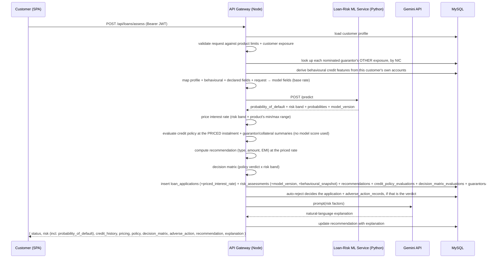

Admin/staff can also call `POST /api/loans/manual-assess` for a standalone
what-if risk check (same model + policy + recommendation pipeline, no
`customer_profiles` row involved, nothing persisted).

### 9.1.1 Credit policy engine (deterministic, in Node)

The mandatory lending criteria, evaluated **independently of the ML model** —
nothing in `creditPolicy.service.js` reads a risk label or probability. The
model ranks applicants; policy states who the institution will not lend to
regardless of rank, in fixed thresholds a reviewer can check by hand and a
declined applicant can be given as a reason.

Policy is judged from the applicant's own figures and the instalment for the
terms they requested — never from a risk score. It runs *after* the model
call, though, because since D3 the instalment it judges is priced at the
applicant's actual risk-based rate (§9.1.3), not the product's flat one:
the DTI and residual-income rules must be judged against what the applicant
would actually pay, or a low-risk applicant's genuinely lower instalment
would be judged against a rate nobody offered them.

| Rule | Refer | Decline |
|---|---|---|
| `AGE_MIN` | — | under 18 |
| `AGE_AT_MATURITY` | — | over 65 at the final instalment (term rounded up to whole years) |
| `MIN_MONTHLY_INCOME` | — | gross below LKR 30,000 |
| `NET_INCOME_POSITIVE` | — | expenses ≥ income |
| `DTI_LIMIT` (instalment / gross income) | above 40% | above 55% |
| `RESIDUAL_INCOME` (net income − instalment) | below LKR 15,000 | negative |
| `LOAN_TO_INCOME` (principal / annual gross) | above 5× | above 8× |
| `EMPLOYMENT_TENURE` | under 1 year (2 for Contract / Self-Employed) | — |
| `EXISTING_FACILITIES` | 4 or more | — |
| `PREVIOUS_DEFAULTS` | 1 | 2 or more |
| `CRIB_SCORE` | below 600 | below 500 |
| `GUARANTOR_DEFAULTS` | 1 or more | — |

Each rule returns `pass` / `refer` / `fail` / **`skipped`**, and the overall
outcome (`pass` / `refer` / `decline`) is the worst status any single rule
returned. `skipped` is the important one: the credit-history inputs are
self-declared with no bureau integration, so a rule whose input was never
supplied records that fact instead of scoring the neutral default
`mlClient.service.js` would otherwise substitute — an applicant is never
declined on, nor cleared by, a CRIB score they didn't claim.

A `decline` does **not** change the application's status. D1 records and
surfaces the verdict; combining it with the risk score into an automated
approve/review/reject is D2's decision matrix, which sits above both.

Every evaluation is stored in `credit_policy_evaluations` inside the same
transaction as the application itself, with `policy_version` and the full
per-rule JSON, so a past decision stays reproducible after the thresholds
move. Implementation: `finance-backend/src/services/creditPolicy.service.js`;
tests: `src/services/__tests__/creditPolicy.test.js`.

### 9.1.2 Decision policy matrix (deterministic, in Node)

The single place the model's risk band and the policy verdict are combined
into a recommended action. It runs at the end of the assess flow, after both
inputs exist.

| policy \ risk | Low (0) | Medium (1) | High (2) |
|---|---|---|---|
| **pass** | `auto_approve` | `manual_review` | `manual_review` |
| **refer** | `manual_review` | `manual_review` | `manual_review` |
| **decline** | `auto_reject` | `auto_reject` | `auto_reject` |

Two properties of that table are deliberate:

- The **decline row ignores the risk band**. A mandatory policy criterion is
  one the institution does not lend against; a flattering model score cannot
  buy an exception, and if it could, the criterion was never mandatory.
- **Only one cell auto-approves.** Everything the model is unsure about goes
  to a human — the interesting middle is exactly where automation is worst
  and a reviewer is cheapest.

**What the actions do at runtime:**

- `auto_reject` — **the system acts.** The application is written straight to
  `rejected` inside the assess transaction, with `decision_source='system'`,
  `decided_by` NULL, an audit event whose `actor_role` is `system`, and a
  customer notification. `system` is a real role in the status machine
  (§9.1.1's sibling, `applicationStatus.service.js`), not a bypass around it,
  so an automatic move is validated by the same machine as a human one.
- `auto_approve` — **the system recommends.** Status is untouched; staff get
  a pre-cleared application flagged for one-click approval. Approving issues
  a binding offer with real money behind it (`loan_offers`, 023), so a human
  stays on that path.
- `manual_review` — no recommendation; normal review applies.

An unrecognised input (missing policy verdict, unknown risk label) always
falls to `manual_review`. A matrix that guesses when it doesn't recognise its
own inputs is worse than no matrix.

**Overrides.** A reviewer may always decide against the matrix — they are the
authority, not the table. What they may not do is leave no trace. Any
decision deviating from the recommendation, in either direction, requires a
standardized code from `OVERRIDE_REASONS` **plus** a written note; the server
returns `422` with the codes valid for that direction until both arrive.
Codes are directional, so an approval is never offered "adverse information"
as its justification. Approving over a policy `decline` is gated regardless
of which cell fired.

Because the matrix can reject with no human involved, `rejected` is no longer
absolutely terminal: an **admin** (not staff) may reopen a rejection back to
`under_review`, which is itself an override requiring a reason code.
Reopening vacates the decision fields — the rejection survives in
`loan_application_events`. An application still cannot leap from `rejected`
straight to `approved`; it re-enters the normal review path.

Implementation: `finance-backend/src/services/decisionMatrix.service.js`;
storage: `decision_matrix_evaluations` (030) plus
`loan_applications.override_reason_code` / `decision_source` and
`loan_application_events.override_reason_code`; tests:
`src/services/__tests__/decisionMatrix.test.js`.

### 9.1.3 Risk-based interest pricing (deterministic, in Node)

Every `loan_products` row carries one `interest_rate` — the STANDARD rate. A
product MAY also carry `min_interest_rate`/`max_interest_rate` (031), and
when it does, an applicant is actually assessed and quoted at whichever of
the three the ML model's risk band selects:

| Risk band | Priced at |
|---|---|
| Low (0) | `min_interest_rate` — preferential |
| Medium (1) | `interest_rate` — standard, unchanged from before D3 |
| High (2) | `max_interest_rate` — premium |

A product with no configured range prices every applicant at `interest_rate`
— the range is **opt-in per product**, set by an admin in the product
catalog UI, not a forced repricing of the whole catalogue. An unrecognised
risk label always resolves to the base rate, the same "never guess" default
as the credit policy engine and the decision matrix.

**Why this runs where it runs.** The rate fed to the ML model as one of its
35 input features is always the product's BASE rate — the same way a real
underwriter assesses against a product's headline terms before a risk-based
price is set. The priced rate is an *output* of that assessment, computed
immediately after `predictRisk()` returns, and it is what everything
downstream is computed from: the credit policy engine's DTI/residual-income
rules (§9.1.1) and the recommended EMI shown to the applicant. Both would
otherwise be judging an instalment nobody was actually offered.

**Persistence and the offer.** The resolved rate is snapshotted onto
`loan_applications.priced_interest_rate` inside the assess transaction — the
same reasoning as `loan_offers.offered_interest_rate` (023): a later change
to the product's rate or range must not silently rewrite what an existing
application was assessed against. When staff approve, `buildOfferTerms`
(`loanOffer.service.js`) reads this column as its rate fallback — ahead of
the product's base rate — so the offer quotes the rate the applicant's own
assessment priced them at, not a fresh read of a product that may have been
re-priced since. NULL for applications assessed before D3, or on a product
with no configured range; those fall through to the product's base rate
exactly as the system behaved before D3.

Implementation: `finance-backend/src/services/interestPricing.service.js`;
migration: `031_risk_based_interest_pricing.sql`; tests:
`src/services/__tests__/interestPricing.test.js`.

### 9.1.4 Adverse-action documentation (deterministic, in Node)

Before D4, the only structured "why" a rejection carried was inconsistent:

- an auto-reject's `credit_policy_evaluations.reason_codes` (D1) — real, but
  written in rule-engineer language (`PREVIOUS_DEFAULTS`, `DTI_LIMIT`), never
  meant to be shown to the applicant it describes;
- a manual reject's `override_reason_code` (D2) — but **only** when that
  rejection deviated from the decision matrix's own recommendation. A
  manual reject that followed the matrix's own `manual_review` verdict —
  the single most common way a human actually rejects someone — needed no
  code at all.

D4 closes both gaps with two pieces:

**A standardized, applicant-facing reason catalog** (`REASONS` in
`adverseAction.service.js`) — `INSUFFICIENT_INCOME`, `EXCESSIVE_OBLIGATIONS`,
`INSUFFICIENT_CREDIT_HISTORY`, `DELINQUENT_CREDIT_HISTORY`,
`INSUFFICIENT_EMPLOYMENT_HISTORY`, `AGE_INELIGIBLE`, `UNABLE_TO_VERIFY`,
`ADVERSE_INFORMATION`, `HIGH_RISK_ASSESSMENT`, `OTHER`. Most map from one or
more of D1's policy rule codes (`deriveReasonCodesFromPolicy` —
`EXCESSIVE_OBLIGATIONS` alone collapses four separate affordability rules
into one sentence an applicant is actually owed); the rest
(`UNABLE_TO_VERIFY`, `ADVERSE_INFORMATION`, `HIGH_RISK_ASSESSMENT`, `OTHER`)
have no policy mapping at all and exist purely for a reviewer to select, for
cases the deterministic engine could never have caught on its own.
Deliberately a **separate catalog** from D2's `OVERRIDE_REASONS`: those
answer "why did a reviewer decide against the system" (an internal
governance question, asked of the reviewer); these answer "why is this
applicant not getting the loan" (asked of, and owed to, the applicant).
Conflating them would mean a matrix-consistent rejection — which needs no
override — could still carry no adverse-action reason at all, exactly the
gap being closed.

**A rejection reason is now required, unconditionally, on EVERY
rejection** — auto or manual, matrix-consistent or not. An auto-reject
derives its reasons entirely from the policy verdict that triggered it,
with no human input. A manual reject to `rejected` returns `422` with the
suggested codes (from the application's own policy verdict, if any) and the
full catalog until the reviewer supplies ≥1 real code plus a note — this
check is independent of, and can compose with, D2's override gate: a
reviewer rejecting an `auto_approve`-recommended application needs BOTH an
override code (why they went against the system) and an adverse-action
reason (why the applicant is declined).

**Every record is immutable and independent of `loan_applications`' own
decision columns.** D2's reopen flow (`rejected → under_review`)
deliberately clears `decided_by`/`decision_note`/etc. — correct for a live
application, but wrong for history. `adverse_action_records` is append-only:
a reject → reopen → reject-again cycle produces two full records, each a
frozen snapshot — reason codes, the model's `risk_label`/probabilities/
`model_version`, the policy's `policy_version`/outcome, the matrix's
`matrix_version`/action, and the priced rate — taken at the exact moment of
that decision, not reconstructed later from four other tables that may have
moved on. `GET /api/loans/:id/adverse-actions` returns the full history;
`adverse_action` on the application itself is always just the latest.

**Closing the model-version gap this depended on.** `risk_assessments.model_version`
existed as a column since the original schema but was never populated — the
Python `/predict` response carried no version field. It now does: the
service hashes its loaded `.joblib` artifact at startup (`_artifact_hash` in
`loan-risk-model/api/main.py`) and returns that hash as `model_version` on
every prediction, automatically correct for whichever model is actually
loaded — no training-pipeline step to remember, and no drift between a
human-maintained label and the file in use.

Implementation: `finance-backend/src/services/adverseAction.service.js`;
storage: `adverse_action_records` (032); tests:
`src/services/__tests__/adverseAction.test.js`.

### 9.1.5 Collateral and guarantor management (D5)

Before this, `loan_applications.guarantor_exposure`/`guarantor_defaults`
(005) were the only trace of a guarantor anywhere in the system — and they
describe the OPPOSITE relationship to what "guarantor management" usually
means. Those two columns are the applicant's OWN self-declared liability as
guarantor for someone ELSE's loan (genuinely unverifiable, outside this
system — self-declaration is the only option there, same as CRIB score, and
those columns are untouched by D5). What didn't exist at all was the real
feature: letting an applicant nominate a real person to back THEIR OWN loan,
and any collateral pledged against it.

**Guarantors are a shared person entity, keyed by National Identity Card
number** (`guarantors.nic`, UNIQUE) — not a `users` foreign key, because a
guarantor is very often not a registered customer at all. Keying by NIC is
what makes "exposure tracking" a real, computable fact rather than a
per-application number: the same person guaranteeing three different
applications lands on the SAME row, so their combined outstanding exposure
and the reliability of their other guarantees can be summed and checked. The
junction table `loan_guarantors` links guarantor ↔ application (many-to-many
in principle; the customer-facing apply form currently offers one per
application). NIC is normalised (trimmed, uppercased) before either the
lookup or the write, so `"851234567v"` and `"851234567V"` are always the
same guarantor.

**Collateral** (`collateral_items`, application-scoped) always starts
`'self_declared'` — a claimed value proves nothing on its own, the same
reasoning D1 already applies to a self-declared CRIB score. Staff sign off
(`verified`) or reject it via `PATCH
/admin/applications/:id/collateral/:collateralId/verify`; only `verified`
value counts toward coverage. `ownership_reference` is a free-text pointer
(deed number, vehicle registration, FD account number) — **not** a document
upload; actual file evidence is E1's scope (secure document management),
deliberately left out here.

**Two new, additive credit-policy rules** consume this data
(`creditPolicy.service.js`), both refer-only (no decline tier) and both
`pass` — not `skipped` — when nothing was pledged, since "no guarantor/no
collateral" is a confirmed, evaluated fact for an application that asked:

- `GUARANTOR_RELIABILITY` — refers if any linked guarantor has another
  ACTIVE guarantee elsewhere with an overdue instalment right now
  (`repayment_schedule.status = 'due' AND due_date < CURDATE()`, the same
  definition `repayment.service.js`'s own arrears logic uses). Independent
  of `GUARANTOR_DEFAULTS` above — different question, different input,
  reported separately.
- `COLLATERAL_COVERAGE` — refers while any pledged item is still
  unverified, regardless of stated value; once fully verified, refers only
  if verified value covers less than 80% of the requested amount.

Both feed D4's adverse-action catalog too
(`GUARANTOR_RELIABILITY_CONCERN`, `INSUFFICIENT_COLLATERAL`), so a
rejection driven by either reason is documented in the same applicant-facing
language as every other policy-driven decline.

**Exposure lookup happens BEFORE persistence, not after**: each nominated
guarantor's existing exposure is queried by NIC first (their loan_guarantors
row for THIS application doesn't exist yet, so the query can't double-count
it), summarized, fed into `evaluateCreditPolicy`, and only then is
everything — application, guarantor upsert, junction row, collateral rows —
written atomically inside `runAssessmentTransaction`.

`GET /api/loans/:id/security` returns the guarantor(s)/collateral on one
application (NIC/phone/address redacted for the customer, visible to
staff); `GET /api/admin/guarantors/:nic/exposure` returns one guarantor's
full standing — every facility they back, its status, and whether any is
currently overdue — the detail behind what `GUARANTOR_RELIABILITY` computes
as a verdict.

Implementation: `finance-backend/src/services/collateralGuarantor.service.js`;
migration: `033_guarantors_and_collateral.sql`; tests:
`src/services/__tests__/collateralGuarantor.test.js` (module) and the
`creditPolicy.test.js`/`adverseAction.test.js` sections covering the two
new rules and their reason mappings.

### 9.1.6 Behavioural credit features (deterministic, in Node)

The risk model's strongest inputs had no data source. Because there is no CRIB
bureau integration, `mlClient.service.js` sent a documented neutral constant
for every CRIB field on every application — and three of those constants are
the model's top drivers, together carrying roughly **46% of its total gain**
(§7.8). Nearly half the model's decision power was pinned to a fixed value for
every applicant, which is an input problem no amount of retraining fixes.

There is still no bureau feed. But for a customer who has borrowed from this
institution before, we hold the same facts first-hand:

| Model field | Derived from |
|---|---|
| `number_of_defaults` | `loan_accounts.status = 'written_off'` — see the caveat below |
| `overdue_installments` | `repayment_schedule` rows past due with anything outstanding |
| `historical_delinquencies` | instalments ever settled after their `due_date` |
| `active_facilities` / `settled_loans` / `existing_loans` | `loan_accounts` by status |
| `credit_utilization` | outstanding ÷ scheduled principal, live facilities only |
| `avg_repayment_behaviour` | share of concluded instalments settled on time |
| `credit_inquiry_count` | applications ever submitted |
| `highest_outstanding_balance` | largest principal ever advanced |

This is the **application-scoring vs. behavioural-scoring** distinction from
the credit literature: a new applicant is judged on declared attributes, an
existing customer additionally on observed conduct.

**Caveat on `number_of_defaults`.** It is derived from
`loan_accounts.status = 'written_off'`, and no workflow in this system
currently sets that status, so in practice it resolves to 0 and the model's
strongest input still rests on the applicant's declaration. The wiring is
correct and starts producing real values the moment a write-off flow exists.
Every other behavioural feature in the table above fires on real data today.

**A thin file is a normal state, not an error — and it is sent as `null`.**
A first-time borrower has nothing to observe, and the gateway says exactly
that rather than substituting a population average. This matters more than it
sounds: an average is not a neutral statement, and filling the block with one
previously let an applicant declaring three defaults score "Low Risk" (§7.6.1).
The model is trained with the same fields absent at the same rate and learns a
default branch for them, so `null` reads as *unknown*, not as *fine*. The
assessment is also flagged `is_thin_file`, because "no defaults recorded" and
"no record" render identically on screen and must not be confused — without
the flag, *absence of evidence of problems* reads as *evidence of no problems*.

Fields with a genuine real-world zero are **not** nulled: `guarantor_exposure: 0`
means no guarantee was pledged, which is a fact, not an absence of information.

**Rates are shrunk, counts are not, and nothing is invented.** Where a record
exists but is short, rate-style measures are blended toward the neutral prior
in proportion to the evidence behind them (`shrunk = (n·observed + k·prior) /
(n + k)`, k = 6) — a customer two instalments in is weak evidence, not no
evidence, and confidence should grow smoothly rather than flip at a cut-off.
Where *nothing* has concluded, the value is `null`: there is nothing to shrink,
and a prior would be pure invention. Utilisation is never shrunk at all — it is
the exact utilisation of the facilities held, not a noisy estimate of some
underlying rate, and damping a fact toward a prior would understate a genuinely
maxed-out borrower. A recorded write-off is likewise never softened.
Punctuality is judged
against **concluded** instalments only: a loan three months into a five-year
term has 57 instalments that are neither late nor on time yet, and counting
them as on-time would manufacture a spotless record out of a loan that has
barely started.

**Precedence, weakest to strongest:** neutral default → behavioural
observation → applicant declaration → hard profile fact. A declaration beats an
observation because the applicant can see facilities at *other* institutions
that our own record cannot; our history is a lower bound on theirs, never the
whole picture.

**The `previous_defaults` fix.** v1 let the applicant declare
`previous_defaults` — a field the model measurably ignored — while
`number_of_defaults`, its single strongest input, was hardcoded to zero. The
declared value now maps onto `number_of_defaults`, combined with our own
written-off facilities by **taking the worse of the two, never the sum**:
summing would double-count a charge-off the customer had already declared.
Verified end-to-end, two applicants with an identical loan request and opposite
credit declarations now score PD 0.0008 against 0.4915 — a 629× difference,
and the impaired application is auto-rejected by the decision matrix. Under v1
the declaration moved the score by 0.00009.

**The evidence is snapshotted, not recomputed.** `risk_assessments.behavioural_snapshot`
(migration 043) freezes what the model was shown at the moment it scored the
application. Recomputing on read would show a reviewer today's repayment record
beside a decision that never saw it — the same reasoning `loan_offers` (023)
and `adverse_action_records` (032) already follow. It is stored as JSON because
it is diagnostic provenance read as a whole, never filtered or joined on, and
nothing in the application logic branches on its contents. NULL for assessments
made before this existed, which is accurate rather than a gap.

The snapshot also names the fields that remain assumptions even for a customer
with full history — `income_stability`, `digital_payment_ratio`, `rent`,
`province` — so the remaining gap is explicit rather than implied by absence.
The staff review panel renders all of this as an "Evidence behind this score"
note beside the probability of default.

`mlClient.service.js` is also where the gateway reconciles the registration
form's employment taxonomy with the model's, which are two different
vocabularies (§7.6.2) — `normalizeEmploymentType` is the single place they
meet, and it is written so an unrecognised value degrades with a warning
rather than failing an assessment.

Implementation: `finance-backend/src/services/behaviouralFeatures.service.js`
and `loanModel.findBorrowerCreditHistory`; migration:
`043_behavioural_credit_snapshot.sql`; tests:
`src/services/__tests__/behaviouralFeatures.test.js` (31 assertions, covering
source precedence, shrinkage, and the `previous_defaults` defect).

### 9.2 Recommendation engine (deterministic, in Node)
- **EMI (reducing balance):** `EMI = P·r·(1+r)^n / ((1+r)^n − 1)`, `r = annual% / 12 / 100`, `n = tenure_months`. Zero-interest is a straight-line special case.
- **Max amount:** `maxEMI = netIncome × affordability` where affordability = 0.50 / 0.35 / 0.20 for Low / Medium / High risk; invert the EMI formula for principal `P`. The recommended amount is capped at whichever is smaller of that ceiling and the requested amount.
- **Loan type:** keyword rules over the applicant's stated purpose (housing, vehicle/leasing, education, business, pawning), falling back to Personal (or Pawning for small, high-risk/low-income asks) → Sri Lankan products seeded in the `loan_products` table.
- Implementation: `finance-backend/src/services/recommendation.service.js`.

### 9.3 Gemini API (explanation)
- Called from the gateway only (`finance-backend/src/services/gemini.service.js`), key held server-side. Input: risk category + probabilities + structured factors (DTI, CRIB score, guarantor exposure, savings ratio — each flagged as applicant-declared or a neutral default so the prompt never asserts a default as fact). Output: 3-5 sentence plain-language explanation, optionally in Sinhala or Tamil.
- If `GEMINI_API_KEY` is unset, the call fails, or the response is empty, `explainRisk()` returns a deterministic fallback built from the same factors — the assess flow never fails because of Gemini.

### 9.4 Currency analytics

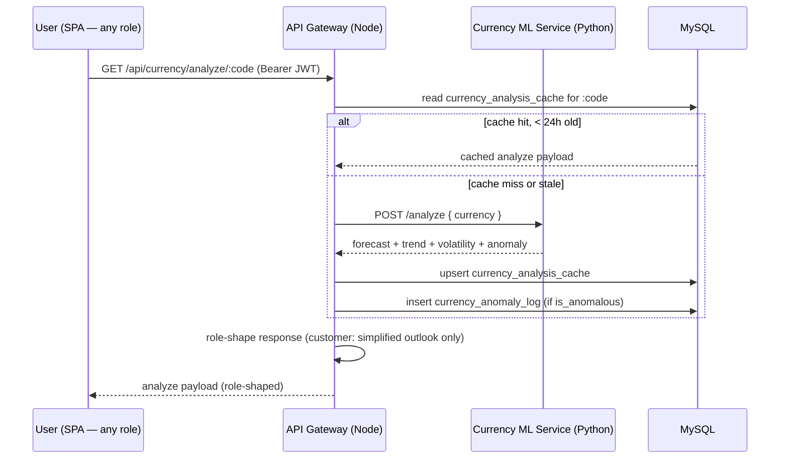

On a cache hit there's no round trip to the Python service at all — the 24h
cache exists because the model's `as_of_date` is anchored to a fixed
historical date (no live rate feed), so repeated calls within the same day
would otherwise recompute an identical result.

- **Gateway ↔ currency service:** one endpoint per prediction type
  (`POST /forecast`, `/trend`, `/volatility`, `/anomaly`) plus a combined
  `POST /analyze` the gateway prefers (one round trip instead of four).
  `currency` is a 3-letter ISO code, not a base/target pair — every series
  is already USD-denominated. `POST /forecast` returns predicted rates per
  horizon alongside a naive random-walk baseline; `POST /trend` returns a
  90-day up/down label with probabilities; `POST /volatility` returns a
  conditional-volatility forecast plus a low/med/high band; `POST /anomaly`
  scores a caller-supplied ≥21-point window.
- **SPA ↔ gateway:** `GET /api/currency/currencies`, `/rates/:code`,
  `/board`, `/live-forecast/:code`, `/analyze/:code` (role-shaped),
  `/anomalies` (staff/admin), and admin-only `/admin/model-status`,
  `PATCH /admin/currencies/:code/status`, `POST /admin/analyze/:code/refresh`,
  `POST /admin/rates/refresh`.
- As with the loan ML service, the browser never sees the currency service's
  URL — only the gateway does (P3).

### 9.5 Data provenance (`data_vintage`)
Every currency-model prediction response carries a `data_vintage` block
(`training_data_source`, `training_data_end`, `is_live: false`,
`model_version`, `trained_at`) making explicit that the response answers from
a fixed Fed H.10 cutoff — 2026-07-24 for forecast/trend/anomaly, 2022-12-31
for volatility (the fitted GARCH model's own internal cutoff) — never from
live data. This is a hard requirement (P6): a live rate and a model output
must never be merged into one flat field, and every UI surface must label
which plane a number came from. The live rate board (`/board`) and
`/live-forecast/:code` (a plain OLS trend line over live rates only) are
genuinely live but explicitly **not** ML output, and are styled/labelled to
read as lower-confidence than the trained forecast.

### 9.6 FX exchange-request workflow
A real bank workflow, not a trading platform: a customer requests a
short-TTL locked quote off the live rate board, submits a request against
it, staff review it (approve / reject / counter-offer) subject to
admin-configured per-transaction and daily limits, and settlement happens
physically at a branch — there is no payment gateway or balance ledger, and
no money moves inside the system. A background sweep auto-expires requests
staff never actioned. Forecast/trend/volatility/anomaly output is never
consulted when quoting or reviewing — it's staff decision support elsewhere
in the app, not something that gates or auto-decides a request.

**Quoting either side of the trade.** `POST /quote` accepts exactly one of
`foreign_amount` (the customer knows how much foreign currency they need) or
`lkr_amount` (they know how much LKR they have to spend/expect to receive).
When `lkr_amount` drives the quote, the service derives the foreign amount,
rounds it to 2dp (the precision a request is actually submitted/settled at),
then recomputes the LKR total from that rounded figure — the two numbers on
a quote are always mutually consistent, never off by a rounding remainder.

**Headroom and documentation shown before commitment, not after.** The quote
response also carries `max_per_transaction_lkr`, `remaining_today_lkr`
(today's per-customer daily allowance already consumed, from the same
`fxExchangeModel.getEffectiveLimits`/`sumTodaysCommittedLkr` calls
`POST /requests` re-checks), and `document_threshold_lkr` /
`will_require_documents` (§9.7) — so a customer sees whether an amount will
be rejected, or will need supporting evidence, before locking a quote,
picking a branch, and choosing a settlement date. This is a display
convenience only: `POST /requests` re-checks every one of these
independently and remains the actual enforcement point, since a second
in-flight request (another tab, a race) could still change the picture
between quote and submission.

**Settlement slip.** Once a request reaches `ready_for_settlement` or
`settled`, the customer can print a slip (reference, terms, purpose, branch,
settlement date, a staff-signature/branch-stamp line) — the paper artifact
the "settlement happens physically at a branch" model otherwise produces
nothing for. Rendered client-side only (`hidden print:block`, shown solely
in the browser's print output); not a new API response.

**State machine:** `pending_review` → (`review: approve`) → `ready_for_settlement`
→ (`settle`) → `settled`; `pending_review` → (`review: reject`) → `rejected`;
`pending_review` → (`review: counter`) → `pending_review` (revised terms, same
status); `pending_review` → (`cancel`, customer only) → `cancelled`;
`pending_review` → (background sweep past the review SLA) → `expired`. Every
transition is validated server-side; an illegal one (e.g. settling a
`rejected` request, or approving one still missing required documents — see
§9.7) returns `409`, never `500`.

Rules enforced server-side (not just in a UI): ownership on every
read/cancel; quote expiry/reuse/ownership on submission; tradability and
per-transaction/per-customer-per-day LKR limits re-checked at submission
time, not just at quote time; every status change writes an audit-trail row
and a notification.

Implementation: `finance-backend/src/controllers/fxExchange.controller.js`,
`services/fxQuote.service.js` (signed short-TTL quote tokens, foreign/LKR
inversion), `services/crossRate.service.js` (USD-per-unit → LKR-per-unit
conversion + spread), `services/fxExpirySweep.service.js`.

### 9.7 FX compliance documents
Above a configurable LKR value, an exchange request must be evidenced before
staff can approve it — a control a real bank's FX desk would have and the
original workflow (§9.6) didn't.

- **`fx_limits.document_threshold_lkr`** — admin-configurable, resolved with
  the same per-currency-else-`ALL` fallback as the existing per-transaction
  and daily caps. Nullable: `NULL` means "no documentation requirement for
  this currency" (distinct from `0`, which would mean "every request needs
  documents"), so it is never defaulted to a number.
- **`fx_exchange_requests.requires_documents`** — a **snapshot** of whether
  the threshold applied, taken at submission and never re-derived on read.
  Matches how the same row already snapshots `spread_bps_applied` and
  `rate_source`: an admin changing the threshold later must not retroactively
  make an already-approved request look non-compliant, and must not erase
  that a document was demanded and supplied.
- **`fx_request_documents`** — one row per uploaded file (customer's
  filename, MIME type, size, uploader, timestamp). Upload/delete are
  owner-only and restricted to `pending_review` — once staff have actioned a
  request its evidence is frozen. Reads (list + download) are open to the
  owner and to staff/admin.
- **Approval gate.** `POST .../review` with `action: "approve"` returns `409`
  if `requires_documents` is true and no document has been uploaded yet;
  reject and counter-quote remain available regardless, so staff can still
  turn away a request whose customer never supplied evidence.

**Storage is deliberately NOT under the public `uploads/` tree.** `src/app.js`
serves `uploads/` as unauthenticated `express.static` — fine for a profile
picture, wrong for a passport scan or a tuition invoice. Compliance documents
are written to `finance-backend/secure-uploads/fx-documents/`, which nothing
serves statically; the only way to read one back is
`GET /requests/:ref/documents/:id/download`, which re-checks ownership/role
on every call, defends against a `storage_path` resolving outside the
document directory, and never returns the server-side path to a client (see
§11). Randomised filenames mean the customer-supplied original name never
touches a filesystem path.

Implementation: `finance-backend/src/config/multer.js` (`fxDocumentUpload`,
PDF/JPG/PNG, 5 MB), `models/fxExchangeModel.js` (document CRUD),
`controllers/fxExchange.controller.js` (`requiresDocumentsFor`, the
upload/list/download/delete handlers).

### 9.8 FX exchange reports
Admin-only aggregates over a submission-date range (`GET /admin/reports`),
plus the same filtered request rows as a CSV download
(`GET /admin/reports/export`) — both read from one query
(`fxExchangeModel.getReportRows`), so the on-screen numbers and the exported
file can never disagree.

- **Status-rate summary** — counts per status, and approval/rejection/
  expiry/pending rates computed against *decidable* requests (total minus
  `cancelled`, since cancellation is a customer action, not a bank outcome).
  A rate is `null`, not `0`, when a period has nothing decidable in it.
- **Settled volume by currency/direction** — count, total foreign amount,
  total LKR amount; settled requests only (completed business, not
  in-flight).
- **Spread revenue** — the bank's margin per settled request, recovered from
  the rate actually charged and the spread snapshot on the row
  (`quoted_rate = mid × (1 ± bps/10000)`, inverted to recover the implied mid
  and hence the margin) — without needing the live mid-rate the quote was
  built from, which isn't stored anywhere on the request.

Implementation: `finance-backend/src/controllers/fxExchange.controller.js`
(`getReports`, `exportReportsCsv`, `computeSpreadRevenueLkr`),
`finance-frontend/src/components/admin/AdminReports.jsx`.

### 9.9 FX inventory (bank-wide stock)
§9.6 tracks what customers *ask for*; this tracks whether the bank actually
*holds* it. Approving a `buy` request is a promise to hand the customer
foreign currency at the branch — from Phase FX-inventory onward that promise
is checked and committed against real stock, not made blind.

**Scope: one notional vault per currency, bank-wide.** There is no
per-branch stock — `fx_exchange_requests.branch` stays free text and
inventory never reads it (branch normalization was explicitly out of scope;
see §13). There is no LKR-side inventory, no denomination breakdown, and no
procurement/replenishment workflow — see §13 for what each of those would
require and why none of it is here.

**Schema** — `fx_inventory` (one row per currency: `on_hand_units`,
`reserved_units`, a nullable `reorder_level_units` for the low-stock alert,
`is_active`) and `fx_inventory_movements`, an append-only ledger:
`movement_type` (`restock`, `adjustment`, `reserve`, `settle_out`,
`settle_in`, `release`; the original `settlement` value predates the
reserve/settle split and is kept but no longer written, since dropping an
ENUM value would silently rewrite any row still holding it), signed
`delta_units`/`delta_reserved_units`, `balance_after`/`reserved_after`
snapshots taken in the same transaction as the write, an optional
`request_id`, and the acting staff/admin's `user_id`.

**Single writer.** `fxInventoryModel.applyMovement` is the only function
anywhere in the codebase permitted to change `on_hand_units` or
`reserved_units`; it always writes the balance and its ledger row in one
transaction, so the ledger is guaranteed, not just conventionally, a
complete history of every balance that has ever existed.

**Reserve-on-approve, atomically.** Approving a `buy` reserves
`foreign_amount` units via a single guarded statement —
`UPDATE ... SET reserved_units = reserved_units + ? WHERE currency_code = ?
AND (on_hand_units - reserved_units) >= ?` — never a read followed by a
write. `affectedRows = 0` means the stock isn't there (or another approval
just took it) and raises a `409` naming the shortage; the transition is
rolled back with it, so a failed reservation never leaves the request
half-approved. Two concurrent approvals racing for the same stock can never
both succeed: proven directly, across 200 repeated races, by
`finance-backend/src/services/__tests__/fxInventoryConcurrency.test.js`.
Approving a `sell` reserves nothing — the customer is bringing currency
*in*, not drawing it down.

**Settlement moves the physical stock.** `buy` → `settle_out`: both
`reserved_units` and `on_hand_units` fall by the settled amount (the
reservation is consumed, not just released — the notes left the vault).
`sell` → `settle_in`: `on_hand_units` rises; `reserved_units` is untouched,
since a sell never reserved.

**Release: the leak-prevention path.** Any approved `buy` that reaches a
terminal, non-settled state (rejected, cancelled, or expired after
approval) must hand its reservation back, or `reserved_units` only ever
grows, `available` (`on_hand − reserved`) drifts toward zero, and approvals
eventually stop working bank-wide with nothing to explain why.
`fxInventoryModel.releaseReservation` is reusable and idempotent — it
derives the outstanding amount from the ledger itself rather than trusting
a caller-supplied number, so a request that never reserved is a no-op, and
a request that already settled cannot be double-released. Wired into
reject, cancel, and the background expiry sweep.

**Advisory-only surfaces.** `POST /quote` includes `available_amount` /
`sufficient_stock` for `buy` quotes (`null` for `sell`, where stock is
irrelevant) so a customer sees likely fulfillability before submitting —
this never blocks submission. The staff review queue shows the same
availability before approval and disables **Approve** (not reject or
counter-quote) when stock is insufficient, mirroring the §9.7 documents
gate. In both places the atomic check inside `reviewRequest` remains the
only real enforcement point; a stale advisory read can at worst show a
badge that lags reality for a few seconds, never let an approval through it
shouldn't.

**Admin console** — an Inventory tab (opening-balance and adjustment
editors, paginated movement history) alongside Spreads/Limits/Position/
Audit/Rate Feed. Every write goes through `applyMovement`; there is no
direct `UPDATE fx_inventory` anywhere in the admin path either. Reads are
open to staff (needed to see availability before approving); writes are
admin-only.

Implementation: `finance-backend/src/models/fxInventoryModel.js`,
`db/migrations/015`–`018_*.sql`, `controllers/fxExchange.controller.js`
(the inventory endpoints, and the `reviewRequest`/`settleRequest` gates),
`services/fxExpirySweep.service.js`,
`finance-frontend/src/components/admin/AdminFxExchange.jsx` (Inventory tab),
`finance-frontend/src/components/currency/FxRequestQueue.jsx` (staff
availability), `finance-frontend/src/pages/customer/CurrencyExchange.jsx`
(customer advisory).

### 9.10 Loan offer & disbursement lifecycle

`loan_applications.status` (020, 024) is a nine-state machine, not a flag.
The legal next-state(s) from any status, and which role may make each move,
live in one table (`applicationStatus.service.js`'s `TRANSITIONS`) reused by
route validation, the model's in-transaction guard, and the
`allowed_transitions` array the API hands the frontend — so the UI never has
to duplicate the rule set to decide which buttons to show.

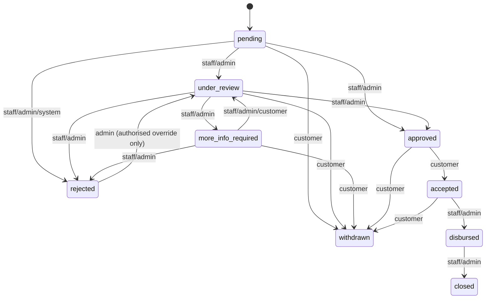

Three design points carried through from the migrations that built this:

- **There is deliberately no `approved → disbursed` edge.** `approved`
  means a credit decision was made and an offer issued; it does not mean
  the applicant has agreed to the terms. A binding **offer**
  (`loan_offers`: amount, tenure, rate, EMI, an expiry, and a status of its
  own — `pending`/`accepted`/`declined`/`expired`/`superseded`) is issued
  against every approval, and only the applicant's explicit
  accept/decline moves the application past `approved`. Money can only
  ever be released against terms the customer actually signed off on.
- **A rejection is not always final.** The automatic decision-policy
  engine (§9.1.2) can reject an application entirely on its own; a verdict
  a machine can reach unattended must be one a human can reconsider. An
  **admin** (not staff) can reopen a rejected application back to
  `under_review`, but only behind a mandatory, recorded override reason —
  and only back into normal review, never straight to `approved`.
- **The "more information" loop is a real two-way conversation, not a
  one-off message.** When staff request more information, what was asked
  and the applicant's response are both stored (`info_request_note`/
  `info_response` and their timestamps) and visible to both sides, not
  just relayed once as a notification that vanishes.

Every transition — including the application's own creation — is written
to `loan_application_events` as an append-only row (`from_status`,
`to_status`, who made it, their role, and any note or override reason),
independent of the "current decision" columns on `loan_applications` itself
(`decided_by`/`decision_note`/`decision_source`/`decided_at`, added in 019).
That split matters: the "current decision" columns answer *what is true
right now*, while the events table answers *everything that ever
happened*, including operational moves (staff opening a file) that are not
credit decisions and must never overwrite who actually approved or
rejected the loan.

Customers are emailed (in addition to the in-app notification) on the major
transitions — a decision, an offer, disbursement — not on every operational
step, so the inbox stays meaningful rather than noisy.

Implementation: `finance-backend/src/services/applicationStatus.service.js`,
`db/migrations/019`–`024_*.sql`, `022_loan_application_events.sql`,
`loan.controller.js` (`respondToOffer`, `reissueOffer`,
`respondToInfoRequest`, `withdrawApplication`), `loanModel.js`
(`updateApplicationStatus`), `utils/mailer.js`
(`sendApplicationStatusEmail`).

### 9.11 Document management & customer identity verification (KYC)

Two separate, advisory-only verification trails — neither is a hard gate on
the automated credit decision, both are context a human reviewer sees
before deciding.

**Loan-supporting documents** (`loan_application_documents`) — a customer
attaches evidence (national ID, payslip, bank statement, or other) to a
specific application. Metadata only is stored in MySQL; the file itself
lives under a non-public `secure-uploads/loan-documents/` directory that is
never mounted as static content (unlike public profile-picture uploads) —
the only way to read a file back is an authenticated,
ownership-or-staff-checked download route. Staff mark each document
`verified` or `rejected` (with a note); a customer may delete and re-upload
a document only while it is still `pending` — once reviewed, the record is
kept rather than allowed to disappear.

**Customer KYC** (`customer_profiles.national_id` + `kyc_status`) — a
customer submits their National Identity Card number from their profile;
it starts `pending` and is reviewed the same way as a document
(`verified`/`rejected`, with a reviewer, timestamp, and note). Once
`verified`, the NIC is locked: a further change from the customer
re-opens review rather than silently overwriting a confirmed identity.

Implementation: `db/migrations/034_loan_application_documents.sql`,
`035_customer_kyc_verification.sql`, `services/loanDocument.service.js`,
`user.controller.js#updateProfile`, `admin.controller.js#verifyCustomerKyc`,
`loan.controller.js` (document upload/list/download/delete, `verifyDocument`).

### 9.12 Applicant experience: pre-fill, stable attributes, and drafts

Three related conveniences, all aimed at the same problem — a repeat
applicant should not have to re-type what the bank already knows about
them:

- **Stable personal attributes** (marital status, education level,
  occupation, employer category, years employed) were originally
  re-declared on every single application (005). They are now also stored
  on `customer_profiles` (036): editable from the profile page, prefilled
  into every new application, and refreshed there whenever an application
  confirms or changes them. Attributes that are genuinely per-application
  facts rather than durable customer attributes (additional income,
  existing loan count, previous defaults, self-declared CRIB score,
  guarantor exposure) deliberately stay application-only.
- **New-application pre-fill** carries those stable attributes plus
  answers from the customer's most recent application into a new one as
  starting values the customer confirms or edits, rather than a blank
  form.
- **Save-and-resume drafts** (`loan_application_drafts`) — a customer
  interrupted partway through the multi-step wizard has their progress
  (current step + full form payload, as JSON) saved automatically and can
  resume exactly where they left off. Kept in its own table rather than as
  an incomplete `loan_applications` row, because a real application row
  has several `NOT NULL` columns (product, amount, tenure) an
  abandoned-at-step-1 draft does not yet have, and because a draft must
  never count toward the customer's active credit exposure the way a real
  submitted application does. Exactly one draft per customer
  (`UNIQUE(user_id)`) — starting a new application overwrites any earlier
  abandoned one rather than accumulating stale drafts.

Implementation: `db/migrations/036_customer_profile_declared_fields.sql`,
`037_loan_application_drafts.sql`, `services/loanDraft.service.js`,
`loan.controller.js` (`getDraft`/`saveDraft`/`deleteDraft`),
`finance-frontend/src/pages/customer/LoanApplication.jsx`.

### 9.13 Disbursement & bank accounts

This is a **single-bank platform** — every customer's disbursement account
is necessarily an account *at this same bank*, so there is deliberately no
"which bank" field anywhere in this feature, unlike a general payments
platform.

An account number is **issued by the bank**, never typed in by a customer:
a self-declared number could not be verified and would be exactly the kind
of unauditable input the rest of this system avoids. Instead, the moment a
customer **accepts a loan offer**, the system resolves their disbursement
account with one idempotent rule, covering both real-world cases in a
single step:

- the customer already has an account here → it is reused, nothing new is
  created;
- the customer has no account yet → one is opened automatically, in their
  name, at the bank's configured main branch, with a number the bank
  itself derives — the customer does nothing and types nothing.

A customer who already banks at a physical branch but is unknown to this
platform would otherwise look "new" and receive a duplicate account; staff
close that gap from the customer's record by registering the
already-existing account directly (this is the one place an account
number is entered by a person rather than issued, and it is staff-only
because staff can check it against core banking first).

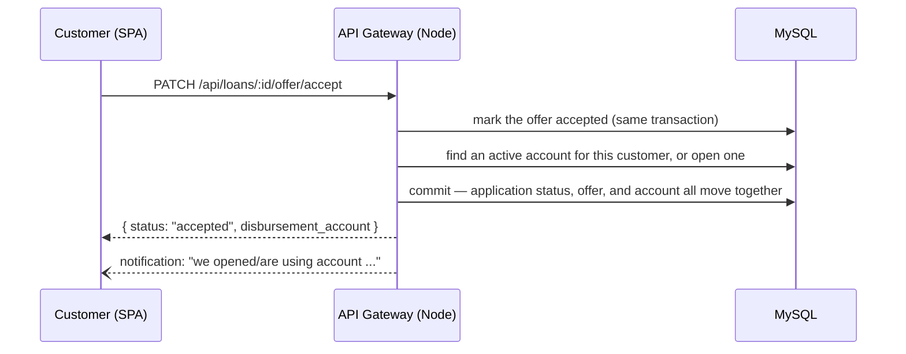

When staff later mark the loan **disbursed**, the account, interest rate,
tenure and EMI are copied from the *accepted offer* (never recomputed, and
never taken from what the applicant originally asked for) into a new
`loan_accounts` row, and the full repayment calendar (§9.14) is generated
from those exact terms in the same transaction. The beneficiary account
details are **snapshotted** onto `loan_accounts` at that instant — if the
customer's account is later closed or changed, an already-disbursed loan's
record of where its money went does not retroactively change.

Implementation: `db/migrations/025_loan_accounts.sql`,
`039_bank_accounts.sql`, `services/bankAccount.service.js`,
`models/bankAccountModel.js` (`findOrOpenWithin`, `registerExisting`),
`loan.controller.js#respondToOffer`, `loanModel.js#createAccountWithin`.

### 9.14 Loan servicing: repayment schedule, arrears, and settlement

Once disbursed, a loan is serviced from two tables designed to always
agree with each other: `repayment_schedule` (what is owed, one row per
instalment, plus running "paid so far" totals per instalment) and an
append-only ledger, `loan_payments` + `loan_payment_allocations` (how
every payment ever received was actually split). The running totals exist
purely so "what is outstanding right now" is a plain read instead of an
aggregate over every payment ever made; the ledger exists so that split
can always be independently reconstructed and proven correct — the two are
never allowed to drift apart.

**Every payment is allocated the same way, everywhere it is accepted**:
oldest unpaid instalment first, and within an instalment, fees before
interest before principal. This rule is fixed, not configurable — a split
that depended on a setting nobody can see later would be unauditable.

**Arrears, outstanding balance, and an early-settlement quote are all
computed on read, never stored** — they change with the passage of a
single day even with no transaction occurring, so storing them would need
a nightly job just to stay true, and a stale stored figure would be worse
than none. **Early settlement** is quoted as: everything already due,
minus interest on instalments not yet due (waived), so a customer who
settles early is not charged interest for time that never passed.

**Late fees** are a one-time penalty added to a specific instalment once
it has been overdue past a grace period — a property of that instalment
(alongside its principal/interest), not a separate transaction — and staff
can waive a fee, recording why.

Implementation: `db/migrations/026_repayment_schedule.sql`,
`027_loan_repayments.sql`, `028_loan_late_fees.sql`,
`services/amortization.service.js`, `services/repayment.service.js`
(`allocatePayment`, `computeOutstanding`, `computeArrears`,
`computeSettlement`, `computeLateFeeAssessments`),
`services/lateFeeSweep.service.js` (background sweep),
`loanModel.js#recordPaymentWithin`.

### 9.15 Customer-initiated repayments (Stripe)

Every repayment used to be a fact staff typed in on the customer's behalf.
That rule — *a repayment is a fact the system observes, not one the
borrower merely asserts* — is preserved here, not relaxed: a card payment
confirmed by Stripe is still the bank **observing** money arrive, via a
cryptographically signed notification, rather than the customer simply
claiming they paid. What changes is only who is allowed to **start** a
payment; confirmation is never taken on trust from the browser.

The amount charged is decided **entirely by the server**, from the live
repayment schedule — a customer chooses only *which kind* of payment they
want (next instalment / full early settlement / a custom amount), never
the figure itself. A custom amount is bounded against the real outstanding
balance before Stripe is ever contacted, so it is not possible to
under-pay by manipulating the request.

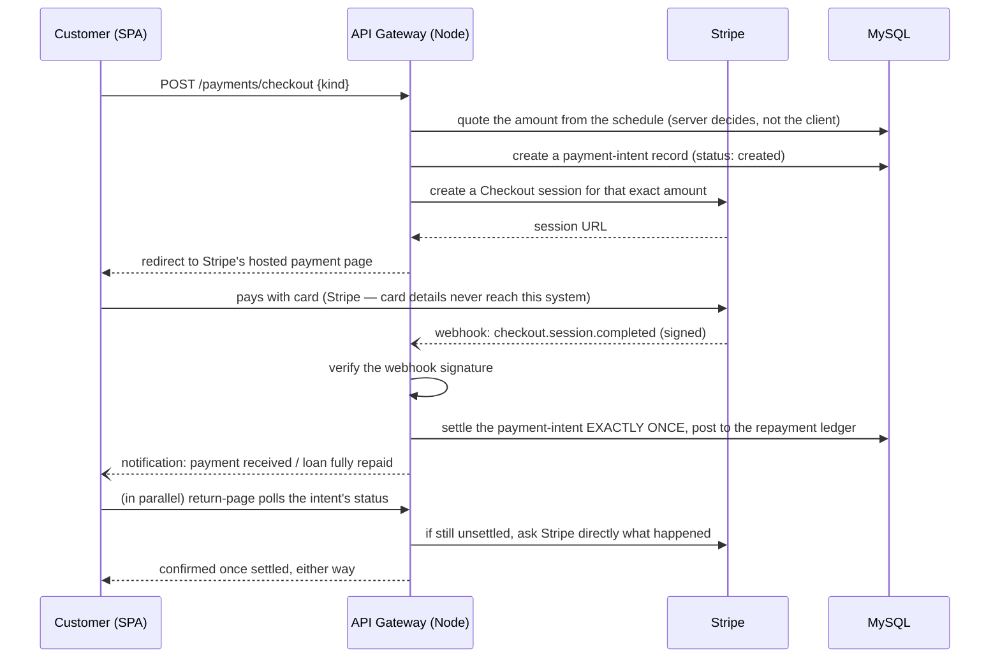

**Settling a payment happens exactly once**, however many times
confirmation arrives — Stripe retries a webhook delivery for days on any
failure, and the browser's own return-from-payment redirect routinely
arrives before the webhook does. Both paths funnel through one locked
gate keyed on the Stripe session id: whichever arrives first posts the
payment and flips the attempt's status from `created` to `succeeded`;
every later arrival for that same session finds it already settled and
does nothing further. A database-level uniqueness constraint (one payment
per payment-intent) backs this even if that gate were ever bypassed.

**The return-page reconciliation is not just a UI nicety — it is what
makes the feature work with no webhook configured at all** (the normal
state of a local development machine, with no public URL for Stripe to
call back to): if the customer's browser returns and the payment intent
is still open, the system asks Stripe directly whether the session was
paid and settles it through the exact same gate a webhook would have
used.

The system can run with **no Stripe account configured at all** — the
repayment panel simply reports card payment as unavailable, and staff can
still record any payment manually. No card number, expiry date, or CVC is
ever transmitted to, or stored by, this system's own servers; Stripe's
hosted Checkout page handles that entirely (see §11).

A **payment receipt (PDF)**, generated the same way for an online or a
staff-recorded payment, shows not just the amount but exactly which
instalment(s) it cleared and how it split across fees, interest, and
principal — read directly from the payment ledger, not recalculated.

Implementation: `db/migrations/040_loan_payment_intents.sql`,
`services/stripe.service.js`, `services/repaymentQuote.service.js`,
`models/paymentIntentModel.js` (`settleWithin` — the idempotency gate),
`controllers/repayment.controller.js`, `services/paymentReceipt.service.js`,
`routes/paymentWebhook.routes.js`, `finance-frontend/src/components/loans/RepaymentPanel.jsx`,
`PaymentReturnHandler.jsx`.

### 9.16 Staff & admin reporting

**Staff work queue** — every application needing attention shows how long
it has sat in its current status, colour-coded against a configurable SLA
(on track / due soon / overdue), calculated from the same
`loan_application_events` audit trail §9.10 writes — not a separately
maintained "last touched" timestamp that could drift out of sync with
reality.

**Portfolio dashboard** (admin) — aggregates across the *entire* loan
book: approval rate, total amount disbursed, the proportion of accounts
in arrears at 30/60/90+ days (portfolio-at-risk), and how the book is
distributed across products and AI risk categories. Computed from bulk
reads plus the same `repayment.service.js` arrears/outstanding functions
used everywhere else in the system (§9.14), rather than a second,
independently-maintained arrears calculation that could silently
disagree with the customer-facing figures.

**Decision letters & statements** — a formatted PDF decision letter
(approval terms, or the standardised decline reasons) for any decided
application, and a full repayment-schedule statement as a downloadable
CSV, available to the applicant themselves as well as staff/admin.

Implementation: `services/loanReports.service.js`,
`controllers/loanReports.controller.js`,
`applicationStatus.service.js#computeProcessingAge`,
`services/decisionLetter.service.js`,
`loan.controller.js` (`getDecisionLetter`, `getLoanStatementCsv`),
`finance-frontend/src/components/admin/AdminPortfolioDashboard.jsx`.

### 9.17 Fees, charges, net disbursement & effective APR (I1)

Before this, a loan cost the borrower exactly `principal + interest` —
no processing fee, documentation fee, or credit-life insurance premium
existed anywhere in the schema or the offer, which understated both the
"total repayable" figure and the amount actually credited at
disbursement. This adds fees as a real, configurable, auditable part of
the product and the offer, then does the one thing that makes fee
disclosure meaningful rather than decorative: states the **effective
APR** — the rate the borrower is genuinely paying once fees are
accounted for.

**Fees are deducted from the disbursement, not capitalised onto the
loan.** The borrower still repays against the full approved amount; they
simply *receive* that amount minus fees. This is a deliberate design
choice with one important consequence: `principal`, the EMI, the
amortization schedule, the repayment ledger, and the affordability/DTI
check (§9.1.1) are **completely untouched** — `amortization.service.js`,
`repayment.service.js`, and `creditPolicy.service.js` needed no changes
at all. Fees change what is *paid out* and what the loan *truly costs*,
never what is *owed back*.

**Config vs. snapshot**, the same split this codebase already uses for
`loan_products` → `loan_offers` → `loan_accounts`: `loan_product_fees` is
what a product currently charges (admin-editable — percentage-of-amount
or a fixed LKR figure, with an optional min/max clamp on a percentage
fee); `loan_offer_fees` is what a *specific offer* actually charged,
resolved and copied at offer-issuance time and never recomputed even if
the product's fee configuration later changes. A staff member issuing or
re-issuing an offer can waive an individual fee, but only with a
mandatory recorded reason — the same rule this system already applies to
a rejection reason or a late-fee waiver.

**Effective APR** is the one genuinely new piece of maths: the borrower
receives `net_disbursed` today and pays a fixed EMI for the tenure: the
APR is the rate that makes those cash flows balance, an IRR with no
closed form. Solved by **bisection** over a bracketed monthly rate
(0–100%/month, ~60 iterations) rather than Newton-Raphson —
deliberately, since Newton can diverge on a degenerate input and this is
money, not a demo. Where no rate can be determined (e.g. `net_disbursed`
would already exceed total repayments), it returns `null`, never `0` —
"we couldn't work this out" and "this loan is free" are different claims
and only one is safe to show a borrower. The identity that proves the
solver correct: a **zero-fee loan's effective APR must equal its nominal
rate**, verified in the test suite to within a cent across several
rate/tenure combinations.

At disbursement, `loan_accounts.total_fees_charged` and
`net_disbursed_amount` snapshot the accepted offer's fee total and net
payout — mirroring how the beneficiary account is snapshotted there
(§9.13) — while `principal` keeps its exact existing meaning and value.
The decision letter (§9.16) and the customer's offer view both show the
fee breakdown, the net amount actually received, and the effective APR
beside the nominal rate.

Admin fee configuration: `GET`/`PUT /api/admin/products/:id/fees`
(whole-set replace, the same convention product CRUD already uses).

Implementation: `db/migrations/041_loan_fees.sql`,
`services/loanFees.service.js` (`resolveFee`, `resolveFees`,
`applyWaivers`, `computeEffectiveApr`),
`services/__tests__/loanFees.test.js`, `models/loanModel.js`
(`findProductFees`, `replaceProductFees`, `findOfferFees`, fee rows
written inside `createOfferWithin`; totals read inside
`createAccountWithin`), `loan.controller.js` (`serializeOffer`'s
`fees[]`/`total_fees`/`net_disbursed`/`effective_apr`, `getProductFees`,
`replaceProductFees`), `services/decisionLetter.service.js`,
`finance-frontend/src/components/admin/ProductFeesModal.jsx`,
`finance-frontend/src/pages/customer/dashboardWidgets.jsx`.

### 9.18 Consent management (J1)

Two things this system does to a customer's personal data require their
explicit, provable agreement first: pulling their CRIB/credit-bureau
record, and processing their personal data at all (KYC documents,
income, employment, guarantor details — everything the application
wizard and profile collect). Previously neither was gated on anything;
registering an account was treated as sufficient.

**`user_consents` is an append-only audit log, never a mutable settings
row.** A grant is always a fresh `INSERT`, never an `UPDATE` — a policy
accepted under version 1.0 must still read exactly that way after the
policy text moves to version 1.1, because "what did they agree to AT THE
TIME" has to survive the policy being edited later. Each row records
the consent type, the policy version actually shown, whether it was
granted, and the IP address/user agent/timestamp — the specific facts a
compliance review would ask for, not just "yes, some consent exists."

**The gate is server-side, and it runs first.** `loan.controller.js#assess`
checks `findMissingConsents` (`services/consent.service.js`) before it
even loads the applicant's profile — before any personal data is
touched and before the ML/CRIB-aware risk assessment (§9.1) runs. A
frontend checkbox is UX; this check is the actual control, and it
returns `403` with the specific missing consent types if it fails.
Consent types and their current required version live in one place
(`CONSENT_POLICIES`), so bumping a version does not retroactively
invalidate anything already granted — every past grant simply keeps the
version it was actually given under, immutably. Bumping a version only
means the NEXT assessment for that user requires a fresh grant.

Endpoints: `GET /api/consents/policies` (current policy text/version per
type), `GET /api/consents/status` (the caller's own granted vs. missing,
against the current version), `POST /api/consents` (grant one or more —
rejects a stale `policy_version` with `400` rather than silently
accepting agreement to text the caller was never shown), `GET
/api/consents/history` (full audit trail — self, or any user for
staff/admin).

On the customer side, the loan application wizard's review step (§9.12)
shows only the consents actually missing or outdated — a returning,
already-consented applicant sees nothing extra and submits with zero
added friction.

Implementation: `db/migrations/042_consents.sql`,
`services/consent.service.js` (`CONSENT_POLICIES`,
`findMissingConsents`, `isConsentCurrent`),
`services/__tests__/consent.test.js`, `models/consentModel.js`
(`recordConsent`, `getLatestConsentsByUser` — append-only, no update
path), `controllers/consent.controller.js`, `routes/consent.routes.js`,
`finance-frontend/src/pages/customer/LoanApplication.jsx`.

---

### 9.19 Vehicle leasing module

**A finance lease is not a loan.** It is a distinct instrument under Sri
Lanka's Finance Leasing Act: the institution (the **lessor**) buys and owns
the vehicle, the customer (the **lessee**) pays a monthly **rental** to use
it, and legal ownership transfers to the lessee only after the final rental
is paid. There is no borrower and no principal — the vocabulary a loan uses
does not fit, and the schema and code below use lease vocabulary throughout
(*lessee*, not borrower; *financed amount*, not principal; *rentals*, not
instalments; an *agreement*, not an account) as a deliberate, enforced
discipline.

**This corrects an earlier design.** The first version of this module
modelled leasing as a `Vehicle Leasing` row in `loan_products`, with leases
stored as ordinary `loan_applications` drawing down into `loan_accounts`.
That was structurally wrong in a way no amount of UI polish could fix — a
lease has no borrower to disburse to and no principal to amortise the same
way — and was corrected before it shipped. The misclassified product row
still exists (`loan_products.id = 3`, `type = 'Leasing'`) but is
**deactivated, not deleted**, since deleting it would cascade away fee and
pricing rows other migrations hung off it; the customer-facing catalogue
filters it out, and `findProductById` deliberately does not, so a lease
history predating the correction still resolves.

#### Entity spine vs. reused services

Leasing gets its **own entity spine** but reuses shared *services* — never
shared *entity tables*. Credit policy, the Gemini explanation service,
Stripe, and consent capture are credit-decisioning and customer concerns, not
"loan" concerns; they take arguments and return answers rather than reading
`loan_applications` directly, so a lease application is underwritten,
explained, and paid for through the exact same code a loan is — with one
deliberate exception, the AI risk model, which a lease never calls at all
(see "Locked design decisions" below):

```
Own spine (19 tables)               Reused services (unchanged)
────────────────────                ───────────────────────────
lease_products                      creditPolicy.service     (+ LEASE_LTV rule)
lease_applications                  gemini.service           (explanation)
  └─ lease_vehicles                 stripe.service           (payment gateway)
       └─ vehicle_valuations        consent.service
       └─ vehicle_registrations
lease_quotations (+ fees)           loanFees.service         (resolveFees/IRR)
lease_agreements                    buildAmortizationSchedule (schedule maths)
  └─ lease_rental_schedule
  └─ lease_rentals
lease_down_payments (+ intents)     Independent reference data
lease_rental_intents                ───────────────────────────
lease_supplier_payouts              lease_suppliers   (dealer register)
lease_application_documents         lease_valuers     (valuer register)
lease_risk_assessments*
lease_policy_evaluations
lease_application_events
```
<sub>* kept in the spine and still readable on old applications, but no
longer written to — see "Locked design decisions".</sub>

The middle column is the real cost of keeping the spine separate:
`risk_assessments`, `credit_policy_evaluations`,
`loan_application_documents`, the audit trail, and adverse actions are all
keyed to `loan_applications` in the existing schema. Rather than making
those tables polymorphic (able to point at either a loan or a lease), each
was mirrored as a parallel `lease_*` table. That touches **no working loan
code**, which is the entire reason it was chosen — a polymorphic refactor of
tables the whole loan pipeline already depends on carries real regression
risk for no benefit a lessee or lender would ever notice.

**Verification, not assertion:** the lease spine has **zero foreign keys
into any `loan_*` table**, checked directly against
`information_schema` — the structural proof the separation actually holds,
worth re-running after any future lease migration.

#### Lifecycle

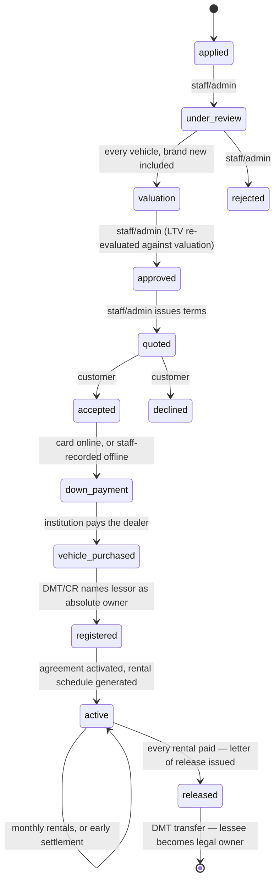

Shown identically to the lessee, staff, and admin — a lessee ringing to ask
"what's happening with my lease?" and the officer who answers must be
looking at one description of the workflow, not two that can drift (see
"Progress tracking and the next-action derivation" below). The order of the
last three steps before rentals begin is itself
the load-bearing rule, not an implementation detail: the down payment must
settle **before** the dealer is paid (the institution's own money should
never chase a commitment the lessee hasn't made), the dealer must be paid
**before** the CR is lodged (you cannot register as absolute owner of a
vehicle you don't yet own), and the CR must be registered **before** rentals
begin (until title names the lessor, this would be a loan in all but name).
Each gate is enforced in one pure module (`leaseRegistration.service.js`)
and returns a *reason*, not a boolean, so a blocked step explains the
exposure rather than citing a rule.

#### Locked design decisions

- **Down payment and rentals: both channels, one ledger.** A customer can
  pay online by card through the same Stripe/payment-intent machinery loan
  repayments use (§9.15), or have a payment recorded offline by staff — both
  post to the same running total, so "how much is still owed?" always has
  one answer regardless of which channel paid it.
- **Dealers are admin-managed, with a separation of duties.** A staff member
  may add a dealer's identity (name, contact details) from within an
  application, but only an **administrator** may set or edit a dealer's
  payout bank account — the account the institution's own purchase money is
  wired to. A staff-created dealer is therefore *born unpayable*, and the
  payout step is gated on exactly the fields staff cannot set; the person
  processing a file still cannot redirect where the money goes.
- **DMT/CR registration is a tracked workflow**, with reference numbers and
  dates per stage, not a single status flag — matching how a real Sri
  Lankan lessor's back office actually operates.
- **The duplicate (spare) key is tracked custody, never a gate.** Sri Lankan
  lease practice requires the lessee's spare key alongside the CR, valuation
  report and supplier invoice, held by the institution as a physical control
  against unauthorised use of an asset it owns until the final rental clears.
  `vehicle_registrations` carries `duplicate_key_received`/`_returned` (plus
  who logged each and when), staff log both from the same panel as the CR —
  but neither flag gates approval, activation, or the release letter. The
  key secures the asset *during* the lease; whether the lessee has *earned*
  release is a pure function of rentals paid, and conditioning legally-owed
  paperwork on an internal custody step nobody is required to log promptly
  would be exactly the kind of implied condition the release letter is
  written to avoid.
- **A lease is never scored by the AI risk model.** Unlike every other
  reused decisioning service, `mlClient.service` (§7) is deliberately never
  called for a lease application — underwriting rests entirely on the fixed
  credit-policy rules (age, income, DTI, CRIB score, existing obligations)
  plus loan-to-value (`LEASE_LTV`, fed by the vehicle's own valuation, never
  a model feature). The reasoning: a lease is asset-backed and the
  institution holds the vehicle as absolute owner until the final rental, so
  LTV and the fixed affordability rules already carry the real underwriting
  weight — a probability-of-default score adds the most value exactly where
  a lender has nothing but the borrower's promise to fall back on, which is
  the loan case, not this one. `lease_risk_assessments` remains in the
  schema and is still read for applications scored before this decision, but
  nothing writes to it any more. Every lease now prices at its product's one
  standard rate rather than a risk-tiered rate, for the same reason.
- **Navigation is a top-level section**, peer to Loans and Currency, with
  its own customer/staff/admin sub-pages — not nested under Loans, since
  doing so would reintroduce in the UI the exact misclassification the
  schema was corrected of.

#### Cost model: fees are payable up front, not deducted from a disbursement

A loan's fees (§9.17) are deducted from what the borrower receives, because
a loan disburses money to the borrower. **A lease disburses nothing to the
lessee** — the money goes to the dealer — so lease fees are payable
**up front, alongside the down payment**, and change only what is due at
signing; the financed amount, monthly rental, and schedule are untouched.
Percentage-based fees are charged on the **financed amount**, not the
vehicle's price, since a larger down payment means a smaller facility and
the fee is for the facility. Fee resolution itself — percentage/fixed
calculation, min/max clamping, staff waivers, and the IRR-based effective
APR solver — is **reused from the loan side** (`loanFees.service.js`)
unchanged; only the vocabulary and the point in the flow at which the money
is due are lease-specific.

#### Payment architecture: reused patterns, one lease-specific addition

Both the down payment and rental collection follow the **same
exactly-once settlement pattern** loan repayments use (§9.15): a
`SELECT … FOR UPDATE` on the payment intent, a status gate, a unique
constraint behind it, and the checkout-return page reconciling through the
identical function the Stripe webhook calls — so a webhook delivered
multiple times, or a customer's browser returning after the fact, can never
credit the ledger twice.

One addition specific to leasing: because two people can be settling one
signing amount at once (a card payment in flight while a clerk keys in an
offline receipt), the settle transaction re-reads the balance under its own
lock and, if a payment no longer fits because the balance moved underneath
it, marks that attempt `failed` with an explanation **without rolling back**
— real money already moved, and the only way anyone learns a refund is owed
is if that record survives.

**Every quoted rental figure is a top-up, never a face value.** The
schedule keeps no per-row paid amount — a rental's status is re-derived from
the *total* received against it, not incrementally allocated — so "pay the
next rental" must combine with whatever partial amount already sits on that
row. Left unhandled, this produces a genuine payment-gateway defect: three
part-payments landing fractions of a cent short of a rental's face value
quote a shortfall no card gateway will process (a real, reported case:
LKR 0.36 outstanding on a schedule row, forever unpayable). Two defences
close it, applied identically on the loan side once the same latent defect
was found there: **roll-forward** (a top-up below the payment gateway's
minimum combines with the following row(s) until the charge is real money,
labelled to the customer as "Pay rentals 3–4" rather than mislabelling it as
one rental), and a **final floor** inside the settlement function itself
that refuses a payment below the minimum outright, before ever calling the
gateway — catching dust on a schedule's last row, where there is nothing
left to roll into.

#### Progress tracking and the next-action derivation

A lease has eight recognisable steps most customers have never encountered
before (a down payment before anything is bought, the institution — not
the customer — buying the vehicle, the CR naming it as absolute owner), and
a bare status chip names only the current one. Two pure, framework-agnostic
functions in `leaseProgress.js` — `deriveLeaseProgress()` (where a lease has
got to) and `deriveNextAction()` (the single outstanding action, whose move
it is, and which section holds the controls) — are the **single source**
both the lessee's page and the staff review queue render from, so the two
can never describe the same lease differently. Both are pure derivations
over the six objects every lease surface already loads (application,
quotations, down payment, purchase, agreement, valuation) rather than a
stored column, because the underlying facts live across several tables and
a status column attempting to summarise all of them would be a second
source of truth to keep in step with the records it summarises.

**One derivation, two audiences, enforced at the render layer.** The
wording differs by who is looking — "Awaiting the down payment" for staff,
"Pay your down payment" for the lessee describing the identical fact — so
`deriveNextAction()` returns both, each as an i18n key with its parameters
rather than a rendered sentence. The React components that consume it
(`LeaseNextAction.jsx`, `LeaseProgressTracker.jsx`) resolve the customer copy
through the ambient (possibly Sinhala/Tamil) translator, but resolve the
**staff** copy through a translator fixed to English
(`i18n.getFixedT("en")`) regardless of the ambient language — because staff
and the public site share one `i18next` instance and one `localStorage` key,
and nothing resets it between a customer browsing session and a staff login
on the same machine. Gating on the fixed translator, rather than trusting
that staff sessions simply never touch the language switcher, is what makes
"staff/admin screens stay English" a property of the code rather than an
assumption about user behaviour.

#### Notifications

Leasing follows the same event-driven notification design the rest of the
system uses (§9.10), extended with one addition genuinely new to this
module: a `dedupe_key` with a unique index on `notifications`. A reminder
("rental due in 3 days") is a *condition* that stays true for days, so a
periodic sweep re-evaluating it would otherwise re-send the same notice on
every run; the unique key makes a given notice sendable exactly once,
enforced by the schema rather than by application code remembering what it
already sent — the same reasoning behind the payment intents' own unique
settlement constraint. The sweep itself keeps no state between runs and is
safe to run at any frequency, including twice at once, for the same reason.
**Who is told what** mirrors `deriveNextAction()`'s own division exactly:
the desk is notified when work arrives or is unblocked, the lessee about
decisions, terms, money, and their vehicle — so the portal's own "your turn"
indicator and the notification a person receives can never disagree.

#### Policy knobs

At the top of `leasing.service.js`, house policy rather than statute:

| Knob | Brand new | Reconditioned | Used |
|---|---|---|---|
| Minimum down payment | 20% | 25% | 30% |
| Maximum loan-to-value (LTV) | 80% | 75% | 70% |

Two properties are worth preserving if these are retuned: **LTV is measured
against the lower of invoice price and independent valuation**, never simply
the valuation — defending against an inflated invoice (the lessee financing
their own down payment) as much as an inflated valuation (a lenient valuer
letting the lessor over-advance). And **a missing valuation returns "not yet
decidable"**, never a pass and never a fail, since it is neither a reason to
approve nor one to decline. Early settlement rebates unearned finance charge
by sum-of-digits (Rule of 78) — a policy choice, not law, kept honest by the
identity that settling before any rental is paid must cost exactly the
financed amount.

#### What it contributes, by role

- **Customer** — apply for a lease, see an eight-step progress tracker and a
  single "what happens next" banner, review and accept/decline a quotation,
  pay the down payment and monthly rentals online or have them recorded by
  staff, download the lease agreement and (once complete) the letter of
  release, and receive notifications at every stage — all in English,
  Sinhala, or Tamil (§9.19 draws on the same i18n infrastructure as the loan
  side, §6.1).
- **Staff** — a review queue with the same progress indicator, an
  independent-valuation workflow (every vehicle, brand new included),
  policy-and-LTV credit decisioning (no AI risk score), quotation issuance
  with fee waivers, down-payment/rental recording, dealer/CR/purchase
  tracking, duplicate-key custody logging, and a dealer/valuer register —
  all English-only, matching the existing staff/admin i18n policy (§13).
- **Admin** — everything staff has, plus leasing product configuration, a
  dealer's payout banking details, suspending a dealer or valuer, and a
  leasing portfolio dashboard reported **separately** from the loan
  portfolio — combining the two would restate the very misclassification
  this module was built to correct, this time in the reporting layer. The
  line a lender has no equivalent of is *vehicles currently owned*: under a
  finance lease the institution holds a real asset, not merely a claim, and
  a completed lease stops counting as one the moment its release letter is
  issued.

## 10. Data model

```mermaid
erDiagram
    users ||--o| customer_profiles : has
    users ||--o{ notifications : receives
    users ||--o{ loan_applications : submits
    users ||--o| password_resets : "resets via"
    loan_products ||--o{ loan_applications : "applied for"
    loan_products ||--o{ loan_product_fees : "charges"
    loan_offers ||--o{ loan_offer_fees : "charged"
    users ||--o{ user_consents : "granted"
    loan_applications ||--o| risk_assessments : "scored by"
    loan_applications ||--o| recommendations : "produces"
    loan_applications ||--o{ credit_policy_evaluations : "screened by"
    loan_applications ||--o{ decision_matrix_evaluations : "decided by"
    loan_applications ||--o{ adverse_action_records : "declined for"
    loan_applications ||--o{ loan_guarantors : "backed by"
    guarantors ||--o{ loan_guarantors : "guarantees"
    loan_applications ||--o{ collateral_items : "secured by"
    loan_applications ||--o{ loan_offers : "offered via"
    loan_applications ||--o{ loan_application_documents : "supported by"
    loan_applications ||--o{ loan_application_events : "audited by"
    users ||--o| loan_application_drafts : "drafts"
    loan_applications ||--o| loan_accounts : "disbursed as"
    loan_accounts ||--o{ repayment_schedule : "scheduled as"
    loan_accounts ||--o{ loan_payments : "paid via"
    loan_payments ||--o{ loan_payment_allocations : "allocated across"
    repayment_schedule ||--o{ loan_payment_allocations : "cleared by"
    loan_accounts ||--o{ loan_payment_intents : "attempted via"
    loan_payment_intents ||--o| loan_payments : "settles as"
    users ||--o{ bank_accounts : "holds"

    users {
        int user_id PK
        string email UK
        string password
        enum role "customer, admin, staff"
        enum status "active, inactive, suspended"
        string profile_image
        tinyint email_verified
        text refresh_token
        timestamp created_at
    }
    customer_profiles {
        int id PK
        int user_id FK
        date date_of_birth
        string gender
        string national_id "nullable — customer-submitted NIC (E2)"
        enum kyc_status "pending, verified, rejected — nullable until an NIC is submitted (E2)"
        int kyc_verified_by FK "nullable"
        timestamp kyc_verified_at "nullable"
        string kyc_notes "nullable"
        text address
        string employment_type
        string company_name
        decimal monthly_income
        decimal monthly_expense
        string marital_status "nullable — promoted from per-application to durable (H2)"
        string education_level "nullable (H2)"
        string occupation "nullable (H2)"
        string employer_category "nullable (H2)"
        int years_employed "nullable (H2)"
    }
    notifications {
        int id PK
        int user_id FK
        string title
        text message
        tinyint is_read
        timestamp created_at
    }
    password_resets {
        int id PK
        int user_id FK "unique"
        string otp_hash
        timestamp expires_at
        int attempts
        tinyint verified
    }
    loan_products {
        int id PK
        string name
        string type
        decimal min_amount
        decimal max_amount
        int min_tenure_months
        int max_tenure_months
        decimal interest_rate
        decimal min_interest_rate "nullable — risk-based pricing floor (D3)"
        decimal max_interest_rate "nullable — risk-based pricing ceiling (D3)"
        enum rate_type "reducing, flat"
        text description
    }
    loan_applications {
        int id PK
        int user_id FK
        int product_id FK
        decimal requested_amount
        int tenure_months
        string purpose
        enum status "pending, under_review, more_info_required, approved, accepted, rejected, withdrawn, disbursed, closed (C1/C2)"
        decimal priced_interest_rate "nullable — the rate this application was assessed/quoted at (D3)"
        string override_reason_code "nullable, set when a decision overrode the matrix"
        int decided_by FK "nullable — who made the CURRENT decision (C1)"
        text decision_note "nullable"
        enum decision_source "system, manual"
        timestamp decided_at "nullable"
        text info_request_note "nullable — what staff asked for (C1)"
        timestamp info_requested_at "nullable"
        text info_response "nullable — the applicant's reply (C1)"
        timestamp info_responded_at "nullable"
        string marital_status "nullable, applicant-declared per application (H2 promoted the durable copy to customer_profiles)"
        string crib_score "nullable, applicant-declared"
        string guarantor_exposure "nullable, applicant-declared — APPLICANT's OWN liability elsewhere; see loan_guarantors for who backs THIS loan (D5)"
        timestamp created_at
    }
    risk_assessments {
        int id PK
        int application_id FK
        int risk_label
        string risk_category
        decimal prob_low
        decimal prob_medium
        decimal prob_high
        string model_version "hash of the loaded model artifact (D4)"
        timestamp assessed_at
    }
    recommendations {
        int id PK
        int application_id FK
        decimal recommended_amount
        decimal recommended_emi
        int recommended_product_id FK
        text gemini_explanation
        timestamp created_at
    }
    decision_matrix_evaluations {
        int id PK
        int application_id FK
        string matrix_version
        enum action "auto_approve, manual_review, auto_reject"
        enum policy_outcome "pass, refer, decline"
        int risk_label "nullable"
        string risk_category "nullable"
        text rationale
        tinyint acted "did the system actually move the application"
        timestamp evaluated_at
    }
    adverse_action_records {
        int id PK
        int application_id FK
        string reason_codes "denormalised, standardized catalog codes (D4)"
        json reasons "full catalog entries used — code, label, description"
        enum decision_source "system, manual"
        int decided_by FK "nullable — NULL when decision_source=system"
        text note "nullable"
        int risk_label "nullable, snapshot at time of rejection"
        string risk_category "nullable"
        decimal prob_low "nullable"
        decimal prob_medium "nullable"
        decimal prob_high "nullable"
        string model_version "nullable, immutable snapshot"
        string policy_version "nullable"
        enum policy_outcome "pass, refer, decline — nullable"
        string matrix_version "nullable"
        enum matrix_action "auto_approve, manual_review, auto_reject — nullable"
        decimal priced_interest_rate "nullable"
        timestamp created_at
    }
    guarantors {
        int id PK
        string nic UK "Sri Lankan NIC — shared key across applications (D5)"
        string full_name
        string phone "nullable"
        text address "nullable"
        timestamp created_at
    }
    loan_guarantors {
        int id PK
        int application_id FK
        int guarantor_id FK
        string relationship_to_applicant "nullable"
        decimal guaranteed_amount
        enum status "active, released"
        int added_by FK "nullable"
        timestamp added_at
        timestamp released_at "nullable"
    }
    collateral_items {
        int id PK
        int application_id FK
        enum collateral_type "property, vehicle, gold_jewellery, fixed_deposit, other"
        text description "nullable"
        decimal estimated_value
        date valuation_date "nullable"
        string ownership_reference "nullable — free text, not a document (D5, cf. E1)"
        enum verification_status "self_declared, verified, rejected"
        int verified_by FK "nullable"
        timestamp verified_at "nullable"
        enum status "pledged, released"
        timestamp created_at
    }
    credit_policy_evaluations {
        int id PK
        int application_id FK
        string policy_version
        enum outcome "pass, refer, decline"
        string reason_codes "denormalised for querying"
        decimal dti "nullable"
        decimal loan_to_income "nullable"
        decimal residual_income "nullable"
        int age_at_maturity "nullable"
        json rules "full per-rule snapshot"
        timestamp evaluated_at
    }
    loan_application_documents {
        int id PK
        int application_id FK
        enum document_type "national_id, payslip, bank_statement, other (E1)"
        int uploaded_by FK "nullable"
        string original_name
        string storage_path "server-side only, never returned to a client"
        string mime_type
        int size_bytes
        enum verification_status "pending, verified, rejected"
        int verified_by FK "nullable"
        timestamp verified_at "nullable"
        string verification_notes "nullable"
        timestamp created_at
    }
    loan_application_events {
        int id PK
        int application_id FK
        string from_status "nullable — NULL on the creation event"
        string to_status
        int actor_user_id FK "nullable"
        string actor_role "customer, staff, admin, system"
        text note "nullable"
        string override_reason_code "nullable"
        timestamp created_at
    }
    loan_application_drafts {
        int id PK
        int user_id FK "unique — one draft per customer (H3)"
        int step "which wizard step the draft was saved at"
        json payload "the full in-progress form"
        timestamp created_at
        timestamp updated_at
    }
    loan_offers {
        int id PK
        int application_id FK
        decimal offered_amount
        int offered_tenure_months
        decimal offered_interest_rate
        enum rate_type "reducing, flat"
        decimal offered_emi
        text offer_note "nullable"
        enum status "pending, accepted, declined, expired, superseded"
        int offered_by FK "nullable"
        timestamp offered_at
        timestamp expires_at
        timestamp responded_at "nullable"
        text response_note "nullable"
    }
    loan_accounts {
        int id PK
        string account_no "nullable until issued, then unique — e.g. LN-000123"
        int application_id FK "unique — one account per application"
        int user_id FK "denormalised borrower"
        decimal principal "SNAPSHOTTED from the accepted offer, not recomputed"
        decimal interest_rate
        enum rate_type "reducing, flat"
        int tenure_months
        decimal emi
        timestamp disbursed_at
        date first_due_date
        date maturity_date
        int disbursed_by FK "nullable"
        enum status "active, closed, written_off"
        timestamp closed_at "nullable"
        string beneficiary_branch "SNAPSHOTTED from bank_accounts at disbursement (H4)"
        string beneficiary_account_number "snapshot"
        string beneficiary_account_holder "snapshot"
        decimal total_fees_charged "SNAPSHOTTED from the accepted offer's loan_offer_fees total (I1)"
        decimal net_disbursed_amount "nullable — principal minus total_fees_charged; what was actually paid out (I1)"
    }
    repayment_schedule {
        int id PK
        int account_id FK
        int installment_no
        date due_date
        decimal opening_balance
        decimal principal_component
        decimal interest_component
        decimal emi
        decimal closing_balance
        decimal principal_paid "running total"
        decimal interest_paid "running total"
        decimal interest_waived "running total — early-settlement waiver"
        decimal late_fee_amount "running total"
        decimal late_fee_paid "running total"
        decimal late_fee_waived "running total"
        timestamp late_fee_charged_at "nullable"
        int late_fee_waived_by FK "nullable"
        timestamp late_fee_waived_at "nullable"
        text late_fee_waived_note "nullable"
        timestamp settled_at "nullable"
        enum rate_type "reducing, flat"
        enum status "due, partial, paid"
    }
    loan_payments {
        int id PK
        int account_id FK
        string reference_no "nullable until issued, then unique — e.g. PMT-000123"
        decimal amount
        date paid_on "the VALUE date, not necessarily when it was keyed in"
        enum method "cash, bank_transfer, cheque, standing_order, card, other"
        enum payment_type "installment, settlement"
        string external_ref "nullable"
        text note "nullable"
        int recorded_by FK "nullable — NULL for a customer's own online card payment"
        timestamp recorded_at
    }
    loan_payment_allocations {
        int id PK
        int payment_id FK
        int schedule_id FK "which instalment this portion cleared"
        decimal fee_amount
        decimal interest_amount
        decimal principal_amount
        timestamp created_at
    }
    loan_payment_intents {
        int id PK
        int account_id FK
        int user_id FK
        decimal amount "decided by the SERVER, never the client"
        string currency "e.g. LKR"
        enum payment_type "installment, settlement"
        enum provider "stripe"
        string provider_session_id "unique — the idempotency key"
        string provider_payment_ref "nullable"
        enum status "created, succeeded, failed, expired, cancelled"
        int payment_id FK "nullable — set only once posted to the ledger; unique"
        string failure_reason "nullable"
        timestamp created_at
        timestamp completed_at "nullable"
    }
    bank_accounts {
        int id PK
        int user_id FK
        string account_number "nullable until issued, then unique — bank-derived, never customer-typed (H4)"
        string branch
        string account_holder "snapshotted from the customer's registered name"
        enum account_type "savings, loan_disbursement"
        enum status "active, closed"
        enum opened_via "auto_offer_acceptance, staff_registered"
        int opened_by FK "nullable — staff user, when staff_registered"
        timestamp opened_at
    }
    loan_product_fees {
        int id PK
        int product_id FK
        enum fee_type "processing, documentation, credit_life_insurance, other"
        string label
        enum calc_method "percentage, fixed"
        decimal rate_or_amount "percent of approved amount, or a flat LKR figure, per calc_method (I1)"
        decimal min_amount "nullable — clamp, percentage fees only"
        decimal max_amount "nullable — clamp, percentage fees only"
        tinyint active
        timestamp created_at
    }
    loan_offer_fees {
        int id PK
        int offer_id FK
        enum fee_type "processing, documentation, credit_life_insurance, other"
        string label
        enum calc_method "percentage, fixed"
        decimal rate_or_amount "the config AS IT STOOD at offer time, for audit (I1)"
        decimal amount "the resolved LKR charge, zeroed (not deleted) if waived"
        tinyint waived
        int waived_by FK "nullable"
        string waived_reason "nullable — mandatory when waived=1"
    }
    user_consents {
        int id PK
        int user_id FK
        enum consent_type "data_processing, credit_bureau_check (J1)"
        string policy_version "the policy text version actually shown/agreed to — never recomputed from current"
        tinyint granted
        string ip_address "nullable"
        string user_agent "nullable"
        timestamp created_at
    }
```

Separate from the loan ERD above (linked only loosely via `users`/role, not a
foreign-key chain): `currency_rates` (live-board snapshot), `currency_rate_history`
(dated series, both H.10-backfilled and live, tagged by `source`),
`currency_analysis_cache` (24h-cached `/analyze` payload per currency),
`currency_anomaly_log`, `currency_settings` (per-currency active/inactive),
`fx_rate_board_config` (admin spreads), `fx_exchange_requests`/`fx_request_events`
(the exchange workflow + its audit trail — the former also carries
`requires_documents`, a submission-time snapshot; see §9.7),
`fx_request_documents` (uploaded compliance evidence — filename/MIME/size and
a server-side `storage_path`, never returned to a client), `fx_limits`
(per-transaction/daily caps plus a nullable `document_threshold_lkr`),
`fx_inventory`/`fx_inventory_movements` (bank-wide stock and its append-only
ledger — see §9.9). Plus `faqs` (staff/admin-managed, optional Sinhala/Tamil
columns) and `contact_messages` (public contact form → admin inbox).

### 10.1 Vehicle leasing entity spine

Its own spine, deliberately disconnected from the loan ERD above — **zero
foreign keys into any `loan_*` table** (§9.19). Shown as relationships only;
each table's own columns follow the same disciplined lease vocabulary
(`lessee`, `financed_amount`, `rental`, `agreement`) rather than the loan
schema's.

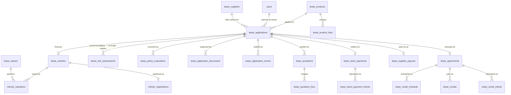

| Table | Role |
|---|---|
| `lease_products` / `lease_product_fees` | Product catalogue (vehicle class, financed-amount and term ranges, base rate) and its configured fees — the lease-side counterparts of `loan_products`/`loan_product_fees`, never rows in either. |
| `lease_applications` | The intake record: lessee, product, financed amount, term, self-declared credit fields — the lease counterpart of `loan_applications`, with its own independent status machine (no `disbursed`/`closed`, since a lease has no disbursement; see §9.19's lifecycle diagram). |
| `lease_vehicles` | One row per application: make, model, year, condition, invoice price — required, unlike a loan's optional collateral, because a lease without a vehicle is not a lease. |
| `vehicle_valuations` | An independent valuer's assessment of a used/reconditioned vehicle; a `completed` row is immutable (a correction is a fresh valuation, never an edit) and is what unlocks approval (§9.19). |
| `vehicle_registrations` | The DMT/CR workflow — reference numbers and dates per stage, naming the lessor as absolute owner and lessee as registered user — plus `duplicate_key_received`/`_returned` (with who logged each and when, migration 053): custody of the vehicle's spare key, tracked but never gating anything (see "Locked design decisions"). |
| `lease_risk_assessments` | The lease-side mirror of `risk_assessments`. Legacy: applications scored before the decision to never AI-score a lease (§9.19) still have a row here, but nothing writes to this table any more. |
| `lease_policy_evaluations` | The lease-side mirror of `credit_policy_evaluations`, storing the SAME shared credit-policy engine's output (§9.19) against a lease rather than a loan — still actively written on every application, unlike its risk-assessment sibling above. |
| `lease_application_documents` / `lease_application_events` | Supporting-document metadata and the append-only audit trail, mirroring `loan_application_documents`/`loan_application_events`. |
| `lease_quotations` / `lease_quotation_fees` | A snapshotted, staff-issued offer (rental, down payment, term, rate) and its fee lines, with `accepted`/`declined`/`superseded` status — the lease counterpart of `loan_offers`/`loan_offer_fees`. |
| `lease_down_payments` / `lease_down_payment_intents` | The signing-amount ledger and its Stripe/offline payment attempts — exactly-once settlement, mirroring `loan_payment_intents` (§9.15), but application-scoped rather than account-scoped since no agreement exists yet at this stage. |
| `lease_supplier_payouts` | The institution's payment to the dealer for the vehicle, gated on the down payment having settled (§9.19); `UNIQUE(application_id)` makes a double purchase impossible at the schema level. |
| `lease_agreements` | Created on activation (once the vehicle is registered); holds the live financed amount, rate, term, and monthly rental the schedule below is generated from. |
| `lease_rental_schedule` / `lease_rentals` / `lease_rental_intents` | The amortisation schedule (built by the same `buildAmortizationSchedule` a loan uses, with lease vocabulary at the persistence boundary — §9.19), the payment ledger against it, and its Stripe/offline payment attempts — the lease counterparts of `repayment_schedule`/`loan_payments`/`loan_payment_intents`. |

Independent reference data, referenced by `lease_applications`/
`vehicle_valuations` but owned by neither: `lease_suppliers` (the admin-managed
dealer register — identity is staff-editable, payout banking is admin-only,
§9.19) and `lease_valuers` (the independent valuer register).

**Superseded columns, kept rather than dropped:** `customer_profiles`
still carries `beneficiary_branch`/`beneficiary_account_number`/
`beneficiary_account_holder` (038) from an earlier design where a customer
typed in their own disbursement account. That design was replaced by the
bank-issued `bank_accounts` table (039, §9.13) before it shipped to real
users; migration 039 backfilled any values already in those three columns
into `bank_accounts` and nothing reads or writes them anymore. They are
left in the schema rather than dropped, matching this project's
"migrations are never edited, only added" rule (see Status below) — dropping
a column retroactively would mean rewriting migration 038 as if the
superseded design never existed.

**Status:** all tables above exist and are applied by `npm run migrate`
(from `finance-backend/`) via numbered, idempotent migrations under
`finance-backend/db/migrations/` — new tables are always added as a new
migration file, never by editing a past one.

---

## 11. Security architecture

| Aspect | Design |
|---|---|
| Authentication | JWT — short-lived access token sent as `Authorization: Bearer`; long-lived refresh token in an `httpOnly`, `sameSite` cookie. |
| Password storage | `bcrypt` hashing. |
| Password reset | OTP (bcrypt-hashed, time-limited, attempt-capped) emailed via `nodemailer`, or logged to the console when SMTP isn't configured. |
| Authorization | Role-based (`customer` / `admin` / `staff`) via gateway middleware on every non-public route. |
| Transport / headers | `helmet` security headers; `cors` restricted to the SPA origin with credentials. |
| Secrets | Held in gateway environment variables; excluded from version control. |
| File uploads | Profile images: `multer`, 2 MB limit, MIME allow-list (JPG/PNG), public `uploads/`. FX compliance documents and loan application documents: two separate `multer` instances, size/MIME-limited, randomised filenames, each written to its own **non-public** `secure-uploads/` subdirectory — neither is served statically; the only read path for either is an ownership/role-checked download route (§9.7/§9.11). |
| Input validation | `express-validator` on gateway endpoints. |
| FX quote integrity | Locked quotes are signed, short-TTL tokens (`FX_QUOTE_SECRET`) — not stored server-side until redeemed. |
| FX compliance document access | Every document read/write re-checks that the caller owns the parent request (or is staff/admin, for reads); the download route additionally refuses to serve any resolved path outside the document directory. |
| Payment card data | Never transmitted to, or stored by, this system's own servers — a customer paying online is redirected to Stripe's own hosted Checkout page, which is entirely out of this system's PCI scope by design (§9.15). |
| Payment gateway authenticity | Every incoming payment-gateway notification is cryptographically signature-verified (`STRIPE_WEBHOOK_SECRET`) before anything in it is trusted; a delivery with a missing or invalid signature is rejected outright and never touches a loan balance. This is the entire trust boundary of that endpoint, which otherwise has no login of its own — a payment provider cannot present a JWT (§9.15). |
| Payment idempotency | A payment can be posted to the ledger at most once per attempt, enforced both in application logic (a locked "settle once" gate) and at the database level (a uniqueness constraint), so a retried or duplicated confirmation can never credit a loan twice (§9.15). |
| Amount integrity | The amount charged for an online repayment is always computed server-side from the live loan balance; a request can choose *which* payment to make, never *how much*, closing off under-payment by request tampering (§9.15). |
| Identity/decision integrity | A verified NIC is locked against silent customer edits (re-verification is required on any change); every credit decision and status change is written to an append-only audit trail that is never edited retroactively (§9.10/§9.11). |

---

## 12. Runtime / deployment view (local development)

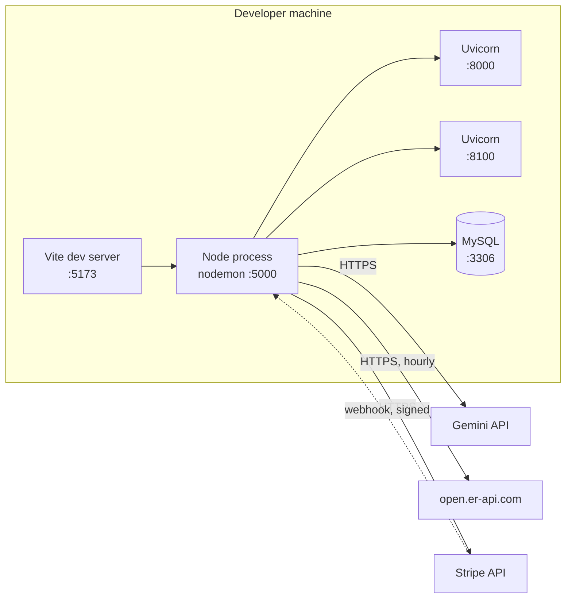

Each module runs as an independent process and can be developed, deployed, and
scaled separately. The gateway is the only component exposed to the browser;
both ML services and the database are reachable only from the gateway. See
[README.md](README.md#running-all-four-services-local-dev) for exact startup
commands and ordering.

**Stripe is the one external dependency that also calls back IN** (a
webhook), rather than only being called out to, like Gemini or the FX rate
feed. On a developer machine with no public URL for Stripe to reach, the
[Stripe CLI](https://docs.stripe.com/stripe-cli) forwards webhook
deliveries to `localhost:5000` (`stripe listen --forward-to
localhost:5000/api/payments/stripe/webhook`); in a real deployment, Stripe
is configured to call the gateway's own public address directly. Either
way this is optional — see §9.15 for why the feature still works
correctly with no webhook configured at all.

---

## 13. Known limitations / not yet built

- **Admin FX reports cover FX exchange requests only** — there is no equivalent aggregate/export view for loan applications or currency-analytics usage.
- **Frontend API base URL is hard-coded**, not read from a `VITE_API_URL` env var (`finance-frontend/src/api/axios.js`).
- **H.10 refresh is manual** — `currency-forecast-model/src/data_fetcher.py` pulls the current FRED series and splices it onto the bundled export, but nothing runs it on a schedule; model forecasts are anchored "as of" the last run (2026-07-24), not "today" (see §8.7).
- **No retraining trigger** — retraining is a manual Kaggle round-trip (see [README.md](README.md#4-currency-forecast-ml-service-8100)), not an in-app admin action.
- **Pawning is modelled as a plain instalment loan** — it exists only as a `loan_products` catalog entry and goes through the exact same assessment/offer/disbursement/repayment flow as a personal loan; there is no gold-appraisal/redemption/auction mechanic. (Vehicle leasing was modelled this way too until it was rebuilt as its own module — see §9.19 and the leasing-specific gaps below.)
- **Vehicle leasing has no adverse-action or decision-matrix parallel** (§9.1.2/§9.1.4) — a lease application is never auto-rejected; a policy `decline` routes to `under_review` for a human instead, the conservative direction until those parallels are built.
- **Vehicle leasing never calls the AI risk model** — a deliberate design boundary (§9.19), not a gap: underwriting rests on the fixed credit-policy rules and loan-to-value alone, so `lease_risk_assessments` is never written for a new application and every lease prices at its product's one standard rate rather than a risk-tiered rate. Contrast with a loan, which is both scored and risk-priced.
- **The lease agreement PDF is not a signed instrument** — execution is the recorded acceptance of a quotation, and the document says so rather than drawing a signature line for a witnessing that never happened.
- **Vehicle leasing has no guarantor mechanic, no joint-lessee applications, and only one lease structure** — a full-payout finance lease ending in mandatory ownership transfer; there is no operating-lease/optional-return-the-vehicle variant.
- **Vehicle leasing approval is not gated on documents** — an application can be approved with nothing on file; the review panel prompts for uploads and flags an empty set, but nothing refuses.
- **Leasing notifications and staff/admin leasing screens are English-only**, matching the existing i18n policy — translating notification text would mean storing a key plus parameters instead of prose for every notification in the system, not a change scoped to leasing alone.
- **No real CRIB bureau integration** — the loan-risk model's CRIB fields are self-declared or neutral-default, not pulled from a live bureau API.
- **Loan-risk dataset is synthetic**, not real applicant data (see §7.1).
- **i18n is headline-level** — admin/staff tooling and DB-sourced content (loan products, most FAQ entries unless translated) stay English by design, not a gap to close.
- **FX inventory has no per-branch dimension** — one notional vault per currency, bank-wide (§9.9). `fx_exchange_requests.branch` is free text ("Colombo", "colombo", "Colombo 07" are three different strings today) and normalizing it was explicitly out of scope for this feature; keying stock off that column as-is would silently split one currency's stock across typo-distinct "branches" with no way to detect it. Real per-branch stock would need a `branches` table and a `branch_id` foreign key on `fx_inventory`, not a reinterpretation of the existing string.
- **No LKR-side inventory** — `fx_inventory` tracks foreign-currency stock only. The LKR a customer hands over on a `buy` settlement, or receives on a `sell` settlement, is not modeled anywhere; §9.6 already establishes that no money moves inside this system. Adding it would mean a second, LKR-denominated ledger with its own reserve/settle semantics — a materially different feature, not an extension of this one.
- **No denomination-level inventory** — a vault holds "10,000 USD," not a breakdown by note (e.g. how many $100s vs $20s). Real cash operations care about denomination mix for physical handover; nothing in `fx_inventory` or `fx_inventory_movements` records it, and adding it would mean a denomination dimension on every movement row, not just a new column.
- **No replenishment/procurement workflow** — restocking is a manual admin action (the opening-balance/adjustment editors in the Inventory tab, §9.9), not a purchase order, supplier relationship, or approval chain. There is no vendor, procurement-request, or purchase-order entity anywhere in the schema; an admin restock is indistinguishable, structurally, from a correction.
- **Repayment frequency is monthly-only** — there is no weekly or fortnightly instalment option anywhere in the amortization or scheduling logic (§9.14).
- **No co-borrower / joint applications** — the schema and every workflow assume exactly one applicant per loan throughout.
- **No loan top-up, restructuring, or refinancing** — an existing disbursed loan cannot be topped up, have its terms renegotiated, or be refinanced; the only paths out of `active` are scheduled repayment, early settlement, or (structurally possible but never triggered — see next point) write-off.
- **`written_off` exists in the schema but nothing ever sets it** — `loan_accounts.status` includes `written_off` as a legal value, but no workflow, endpoint, or scheduled job currently transitions an account into it; a genuinely uncollectable loan has no formal write-off path today. **This limits §9.1.6:** behavioural `number_of_defaults` is derived from exactly that status, so in practice it is always 0 and the model's strongest input still relies on the applicant's own declaration. The other behavioural features (arrears, delinquency history, utilisation, punctuality) are unaffected and do fire on real data. Building a write-off flow would activate this one with no further change to the risk pipeline.
- **Card payment is the only self-service repayment channel** — a customer can pay online by card (§9.15) or have staff record any other method; there is no "I paid by bank transfer, here's my slip" self-reported-and-staff-verified path, distinct from a card payment staff never has to verify.
- **Guarantor consent is not captured** — an applicant names a guarantor and the system tracks that guarantor's exposure (§9.1.5/D5), but the guarantor themselves is never notified or asked to confirm they agreed to be named.
- **No maker-checker (dual authorisation)** — a single staff member's approval, offer, or disbursement action is final; there is no second-reviewer sign-off step for high-value decisions.
- **No document or identity expiry** — a document or NIC verified once (§9.11) stays verified indefinitely; there is no re-verification prompt after a period of time.
- **Consent covers two types only, and has no withdrawal path** — `user_consents` (J1) gates `data_processing` and `credit_bureau_check` before an assessment can run, but there is no marketing/communications consent, and a grant, once given, cannot be revoked through the product (only a fresh, superseding grant is possible — see §9.18). There is also still no access log recording who viewed a specific customer's KYC/NIC or uploaded documents.
- **Fees are one-time and non-refundable** (I1) — `loan_offer_fees` is charged once at disbursement and never revisited; an early settlement (§9.14) recomputes the remaining interest but never refunds any portion of a processing/documentation/insurance fee already deducted. There is no discount/promo-code mechanism.
- **Webhook delivery on a local machine requires the Stripe CLI** to be running (§12); without it, online repayments still complete correctly — the dashboard's own return page reconciles directly with Stripe (§9.15) — but only once the customer's browser returns, not the instant Stripe processes the charge.
