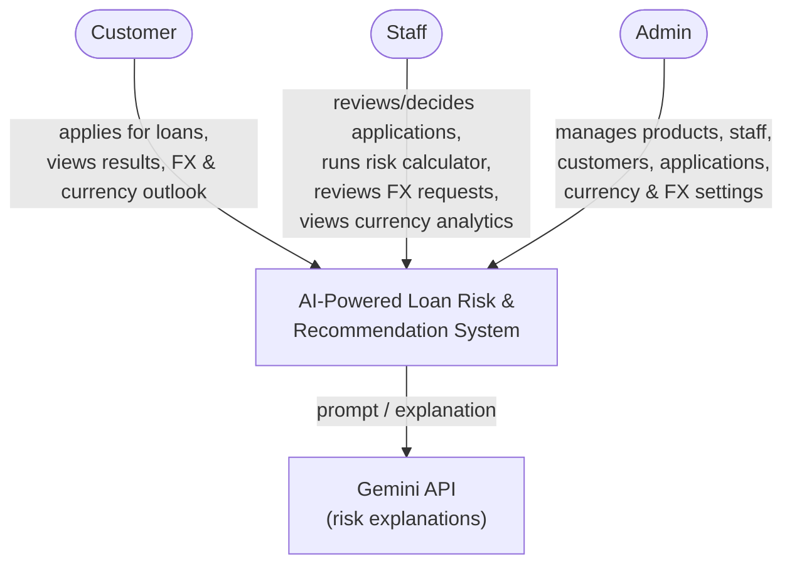
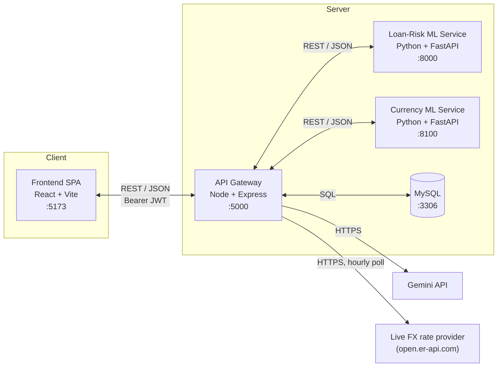
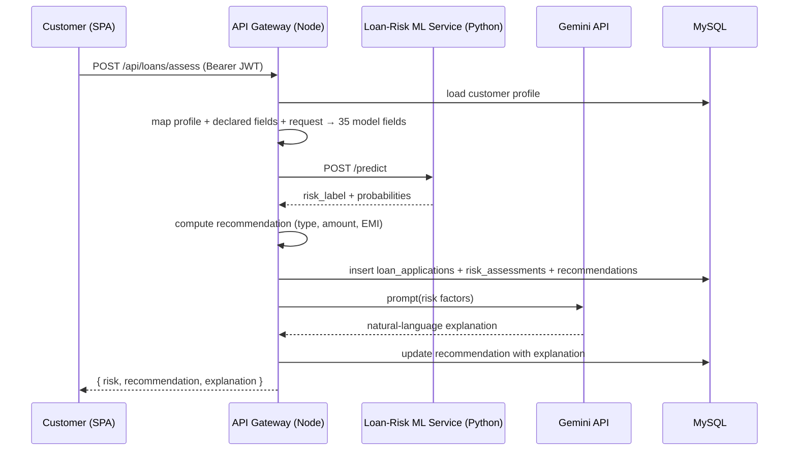
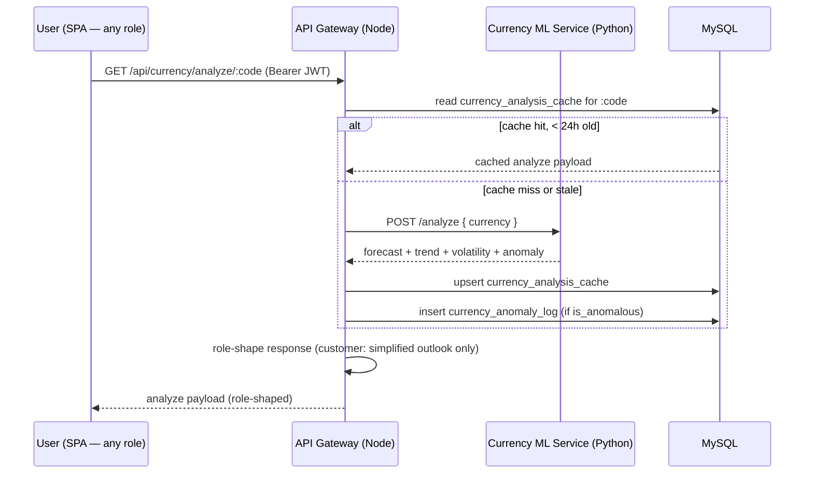
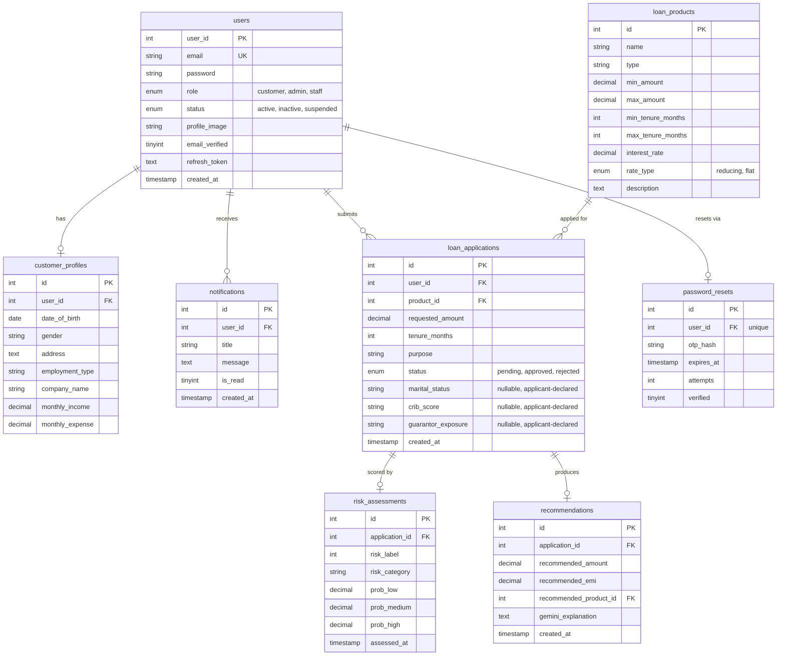
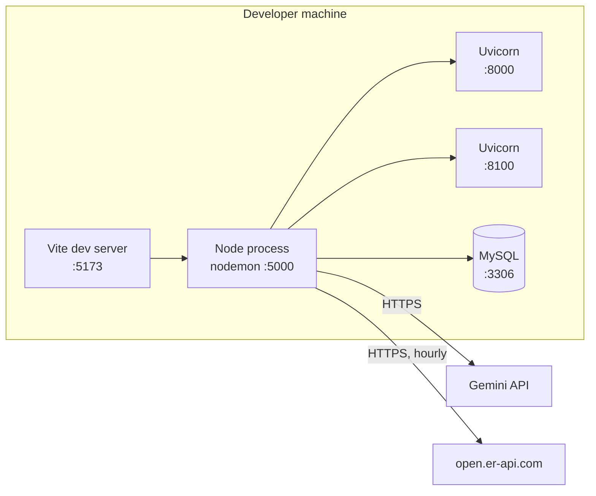

# System Architecture — AI-Powered Loan Risk & Recommendation System

**Project:** AI-Powered Loan Risk & Recommendation System (Sri Lankan banking context)
**Repository:** `finance-application/` (monorepo — four modules)
**Last updated:** 2026-08-01

This document describes the **structural architecture** of the system: its
components, technology stack, machine-learning models, data model,
integration contracts, and security design. For setup/installation/run
instructions, see **[README.md](README.md)**.

---

## 1. Overview

The system is a modular, service-oriented web application that classifies loan
applicants into **Low / Medium / High** risk, produces loan recommendations,
and surfaces currency exchange-rate analytics plus a bank-style FX exchange
workflow. It is composed of five cooperating parts:

1. A **Single-Page Application** (React) — the presentation layer for customers, staff, and admins, in English, Sinhala, and Tamil.
2. An **API gateway** (Node/Express) — authentication, business logic, orchestration, and persistence.
3. A **machine-learning microservice** (Python/FastAPI) — loan risk inference only.
4. A second **machine-learning microservice** (Python/FastAPI) — currency exchange-rate forecasting only (`currency-forecast-model/`; LSTM, XGBoost, GARCH, Isolation Forest).
5. A **relational database** (MySQL) — the system of record.

One external service is consumed by the gateway: a **generative-AI API**
(Gemini) for natural-language risk explanations, called with a graceful
deterministic fallback when no key is configured or the call fails.

**Architectural style:** layered gateway architecture. The browser talks only to
the gateway; the gateway fans out to the ML services, the database, and Gemini.

---

## 2. Architectural principles

| # | Principle |
|---|---|
| P1 | **Single gateway.** The SPA calls only the Node API. It never calls an ML service, database, or external API directly. |
| P2 | **ML as an isolated microservice.** Each Python service is a pure *features-in → prediction-out* function with no database or business logic. |
| P3 | **Secrets stay server-side.** API keys (Gemini), DB credentials, and the model URLs live only in the Node process. |
| P4 | **Stateless authentication.** JSON Web Tokens; no server-side session store. |
| P5 | **Separation of concerns.** Risk/analytics *scoring* (ML) is separate from *recommendation*/business decisions (deterministic rules in Node). |
| P6 | **Data-plane separation (currency feature).** A live rate and a trained-model output are never merged into one field — every currency number carries provenance saying which plane it came from (see §9.5). |

---

## 3. System context (Level 1)



---

## 4. Container architecture (Level 2)



| Container | Module | Runtime | Port | Responsibility |
|---|---|---|---|---|
| Frontend SPA | `finance-frontend/` | React 19 / Vite | 5173 | Presentation, routing, i18n, auth session, forms, dashboards |
| API Gateway | `finance-backend/` | Node / Express 5 | 5000 | Auth, application lifecycle, orchestration, recommendation & explanation, FX workflow, persistence |
| Loan-Risk ML Service | `loan-risk-model/` | Python / FastAPI | 8000 | Feature engineering + loan risk inference (XGBoost) |
| Currency ML Service | `currency-forecast-model/` | Python / FastAPI | 8100 | Exchange-rate forecast / trend / volatility / anomaly inference (LSTM, XGBoost, GARCH, Isolation Forest) |
| Database | (managed by backend) | MySQL 8 | 3306 | System of record |

---

## 5. Technology stack

| Concern | Frontend | Backend | Loan-Risk ML | Currency ML |
|---|---|---|---|---|
| Language | JavaScript (JSX) | JavaScript (Node) | Python 3.10/3.11 | Python 3.10/3.11 |
| Framework | React 19, Vite | Express 5 | FastAPI | FastAPI |
| Styling / UI | Tailwind CSS, framer-motion, lucide-react | — | — | — |
| Routing | React Router 7 | Express Router | — | — |
| i18n | react-i18next (`en`/`si`/`ta`) | — | — | — |
| Data access | axios | mysql2 (pool) | — | — |
| ML | — | — | XGBoost, scikit-learn, pandas, numpy | LSTM (`tensorflow-cpu`/Keras), XGBoost, GARCH (`arch`), Isolation Forest (scikit-learn), pandas, numpy, pyarrow |
| Auth | JWT (in-memory access token) | jsonwebtoken, bcrypt, httpOnly cookie | — | — |
| Security | — | helmet, cors, express-validator | — | — |
| Uploads | — | multer — two separate instances: profile images (public `uploads/`) and FX compliance documents (non-public `secure-uploads/`, see §9.7/§11) | — | — |
| Email | — | nodemailer (forgot-password OTP) | — | — |
| Charts | Recharts (currency rate/forecast charts) | — | — | — |
| Serialization | — | — | joblib | joblib |

---

## 6. Module responsibilities

### 6.1 Frontend (SPA)
- Public/marketing pages, plus a real-time Eligibility checker and EMI calculator wired to the backend.
- Auth session handling: in-memory access token + silent refresh via the gateway.
- Role-based routing (`customer` / `staff` / `admin`), each with its own dashboard shell.
- Full trilingual UI (English / Sinhala / Tamil) via `react-i18next`, headline-level translation — admin/staff tooling and database-sourced content (loan products, FAQ entries, etc.) stay English.
- **Customer portal** — apply for a loan (wizard form with optional applicant-declared fields), view application history and risk/recommendation results, edit profile; a Currency tab (simplified quarterly exchange-rate outlook, live rate board, rate-history chart); a full FX exchange-request flow — quote in either the foreign currency or a target LKR amount (server inverts the rate either way), live per-transaction/daily limit headroom shown before committing, supporting-document upload when the exchange is over the admin-configured compliance threshold, submit, history, cancel, audit timeline, and a printable settlement slip once a request is approved or settled; read-only FAQ.
- **Staff portal** — review and decide (approve/reject) loan applications, read-only customer/product views, standalone risk calculator, a Currency tab with the full forecast/trend/volatility breakdown and anomaly-alert log, an FX Exchange review queue (approve/reject/counter-quote/settle, with per-request compliance-document status and an approval gate that blocks approving a request still missing required evidence), FAQ management (CRUD).
- **Admin portal** — everything staff has, plus loan-product CRUD, staff account management, a Currency Analytics tab (model/cache status, currency activate/deactivate, cache refresh), FX configuration (spreads, limits, documentation threshold, net position, live-feed refresh), an FX Reports tab (status-rate/volume/spread-revenue aggregates over a date range, plus CSV export of the underlying request rows), FAQ management (CRUD), and a Messages/contact-support inbox.

### 6.2 Backend (API gateway)
- **Authentication & authorization** — registration, login, JWT issuance/refresh, OTP-based forgot-password, RBAC.
- **Application lifecycle** — create, store, and transition loan applications (pending → approved/rejected), with a notification on decision.
- **Model orchestration** — map applicant profile + optional self-declared fields to model inputs, call the loan-risk ML service, persist results.
- **Recommendation engine** — deterministic rules: loan type, recommended amount, EMI (see §9.2).
- **Explanation service** — call Gemini with structured risk factors, return/store a natural-language explanation (with a deterministic fallback if Gemini is unavailable), optionally localized (Sinhala/Tamil).
- **Currency analytics orchestration** — proxy the currency ML service's `/analyze` per currency, role-shape the response (simplified for customers, full detail for staff/admin), cache results in MySQL for 24h, log flagged anomalies, expose admin currency management (see §9.4/§9.5).
- **Live FX rate feed & board** — polls a free public FX API hourly for a customer-facing LKR buy/sell board, kept as a separate, clearly-labelled data plane from the trained-model output (§9.5).
- **FX exchange-request workflow** — customer requests a locked quote (in either the foreign currency or a target LKR amount), submits, staff review (approve/reject/counter-offer)/settle, admin configures spreads/limits/documentation threshold, all persisted with a full audit trail (see §9.6). Requests over the configured LKR threshold require an uploaded supporting document before staff can approve them (see §9.7). An admin-only reports endpoint aggregates status rates, settled volume, and spread revenue over a date range, with a matching CSV export (see §9.8).
- **FAQ management** — public/customer read-only catalog; staff/admin CRUD, with optional Sinhala/Tamil translations per entry (English is the source of truth).
- **Contact/support messaging** — public contact form persisted to the DB; admin inbox to triage and respond.
- **Persistence** — all reads/writes to MySQL.

### 6.3 Loan-Risk ML service
See §7 for the model itself. Accepts 35 raw applicant fields; computes 6 derived features; runs the trained preprocessor + XGBoost classifier; returns risk label + class probabilities. Stateless; no persistence.

### 6.4 Currency service
See §8 for the four models. Loads all four model families once at startup for 5 currencies (LKR, INR, EUR, GBP, JPY); fails fast if any artifact is missing. Supplies its own "recent data" from a bundled historical series (Fed H.10, through 2026-07-24) for `/forecast`, `/trend`, `/volatility`; `/anomaly` takes caller-supplied prices instead. Returns forecast / trend / volatility / anomaly predictions, individually or combined via `/analyze`. Stateless; no persistence, no business logic.

### 6.5 Database
Authoritative store for users, profiles, applications, assessments, recommendations, notifications, password-reset OTPs, FAQ entries, contact messages, and the currency-analytics/FX-exchange tables.

---

## 7. Loan-risk model (`loan-risk-model/`)

An XGBoost classifier that predicts loan default risk (**0 = Low, 1 = Medium,
2 = High**) for the Sri Lankan lending context, with a strong emphasis on CRIB
(Credit Information Bureau) features, including guarantor liability history.

### 7.1 Where the dataset comes from, and why it is synthetic

**Source: generated, not collected.** `src/data_generator.py` produces
**150,000 rows** using `Faker` plus province-weighted NumPy distributions. No
real applicant data was used at any point.

This was a deliberate choice, not a fallback, and the reasoning matters more
than the result:

- **Real Sri Lankan credit data is not publicly obtainable.** CRIB data is
  regulated and released only to member institutions under a lending
  relationship. There is no public SL equivalent of the datasets below.
- **The public alternatives are the wrong country.** Home Credit, Lending Club
  and the UCI German Credit dataset are the standard open credit-risk corpora,
  but none carries the features this project exists to model: a **CRIB score**,
  **guarantor exposure and guarantor default history**, LKR-denominated income
  bands, or Sri Lankan provinces. Training on them would produce a
  competent-but-generic credit model and discard the entire domain contribution.
- **Using real data would raise consent and privacy obligations** that a
  student project cannot discharge.

So the generator borrows *design patterns* from those three public datasets
(feature families, plausible value ranges, class balance) and re-expresses them
in a Sri Lankan frame. The honest trade-off is stated in §7.3.

**Demographic grounding:** 9 provinces at realistic population weights;
education distribution skewed to O/L / A/L (55% combined) matching national
attainment; ~30% of applicants carry guarantor exposure, reflecting how common
third-party guarantees are in SL retail lending.

### 7.2 Feature design

**41 features = 35 raw + 6 derived**, in five families:

| Family | Examples |
|---|---|
| Personal | age, province, education level, employment type |
| Income | monthly income, income stability, savings ratio |
| Expenses & banking | expenses, credit utilization, avg repayment behaviour |
| Loan | amount requested, tenure, purpose |
| CRIB | `crib_score`, `number_of_defaults`, `overdue_installments`, `guarantor_exposure`, `guarantor_defaults` |

The **6 derived features** are computed *server-side at inference time* and are
never accepted from the caller — the API takes only the 35 raw fields. This
matters for integrity: a client cannot hand-craft a favourable
`financial_stability_score`, and train/serve feature logic cannot drift apart
because both call the same code.

```
debt_to_income_ratio        expense_ratio            loan_burden_ratio
repayment_consistency_score guarantor_risk_score     financial_stability_score
```

`guarantor_risk_score` combines guarantor exposure-to-income ratio with
guarantor default count; `financial_stability_score` blends savings, CRIB score
and repayment behaviour, then subtracts a guarantor-risk penalty. The design
intent — a guarantor default is treated as near-equivalent to a personal
default — is a genuinely Sri Lankan modelling decision and shows up in the
output: applicants with any guarantor-default history average roughly **2× the
risk label** of otherwise-identical applicants.

### 7.3 How labels are produced — and the limitation this creates

Labels are **not** observed defaults. They come from a deterministic additive
scoring rule in the generator, thresholded into three bands:

```python
score += (debt_to_income_ratio > 0.45)      * 2.8
score += (number_of_defaults   > 0)         * 3.8
score += (crib_score           < 580)       * 3.2
score += (credit_utilization   > 78)        * 2.5
score += (guarantor_defaults   > 0)         * 3.5   # guarantor ≈ personal default
score -= (savings_ratio        > 0.28)      * 1.8
...                                                  # then binned to Low/Medium/High
```

**This must be stated plainly in any write-up:** the model is learning a rule
that was authored, not a real-world outcome. The reported accuracy therefore
measures *"can XGBoost recover a known deterministic function from noisy
features"* — not *"can it predict who will actually default"*. It is an upper
bound flattered by the absence of real-world noise, unmodelled causes, and
label error.

What the pipeline **does** legitimately demonstrate: end-to-end feature
engineering, train/serve consistency, calibrated multi-class output,
class-imbalance handling, and a deployable inference contract. Those transfer
to real data unchanged; only the performance number does not.

### 7.4 Preprocessing

A single scikit-learn `ColumnTransformer` (`src/preprocessing.py`), fitted on
the training split only and persisted alongside the model so inference applies
the identical transform:

| Step | Applied to | Why |
|---|---|---|
| `StandardScaler` | numerical columns | Zero-mean/unit-variance. Not required by trees, but keeps the artifact reusable if a distance- or gradient-based model is swapped in. |
| `OneHotEncoder(handle_unknown="ignore")` | categorical columns | `ignore` is the important part: an unseen province or employment type at inference becomes an all-zero block instead of raising, so one unexpected value cannot 500 the endpoint. |

Split: **80/20 stratified** (`random_state=42`). Stratification preserves the
Low/Medium/High proportions in both halves — without it the minority High-risk
class would vary between runs and make evaluation unstable.

### 7.5 Why XGBoost

| Candidate | Why not chosen |
|---|---|
| Logistic regression | Cannot express the threshold interactions the label rule is built from (e.g. *high DTI **and** low CRIB*) without manual interaction terms. |
| Decision tree | Same representational power, far higher variance — an unstable model on a 41-feature space. |
| Random forest | Competitive, but bagging averages toward the mean and is weaker on the minority High-risk class; boosting explicitly re-weights the cases it currently gets wrong. |
| Neural network | No advantage on tabular, mostly-categorical data of this size, and much harder to explain to a credit officer. |

**Chosen: gradient-boosted trees (XGBoost)** because the task is tabular,
mixed-type, threshold-driven and moderately imbalanced — the regime where
boosted trees are the standard strong baseline. Practical reasons too: native
multi-class via `mlogloss`, `predict_proba` for the confidence the
recommendation engine and UI both consume, and per-feature importances that
make a decision defensible to a human reviewer.

Hyperparameters (`src/model_utils.py`): `n_estimators=400`,
`learning_rate=0.08`, `max_depth=7`, `subsample=0.85`,
`colsample_bytree=0.85`. The low learning rate with many trees is the standard
accuracy-over-speed trade; `subsample`/`colsample_bytree` at 0.85 add row and
column randomness per tree as regularisation, which matters here because a
deterministic label rule is easy to overfit.

### 7.6 Performance

**Accuracy 88.10%**, weighted F1 **88.05%** (30,000-row held-out test set,
evaluated 2026-07-03). Low and Medium risk sit at F1 ≈ 0.89; **High risk gets
precision 0.86 / recall 0.74** — the minority class, and the gap worth
discussing: the model misses about a quarter of genuinely high-risk applicants.
In lending, that direction of error (approving someone who should have been
declined) is the expensive one, which is why the output feeds a rules layer and
a human decision rather than an automatic rejection.

`model_utils.py` regenerates `model_artifacts/evaluation_report.txt` on every
retrain, so the reported numbers cannot drift from the shipped artifact.

### 7.7 What it contributes to the system

A pure *features-in → risk-out* function (§6.3): the gateway maps a stored
customer profile (plus optional applicant-declared fields) to the 35 raw
fields, calls `POST /predict`, and feeds the result into the recommendation
engine (§9.2) and the Gemini explanation service (§9.3). No CRIB bureau
integration exists yet — most CRIB/banking-behaviour fields are self-declared
or fall back to a documented neutral default.

---

## 8. Currency-forecast models (`currency-forecast-model/`)

Four models over the **US Federal Reserve H.10** exchange-rate release
(23 currency pairs vs. USD, 1971–**2026-07-24**), served by a stateless FastAPI
service the gateway calls exclusively (§6.4). Trained for 5 currencies:
**LKR, INR, EUR, GBP, JPY**.

**v3 — the 2026 data refresh.** The bundled Kaggle H.10 export stopped at
2017-08-25, which put the training window entirely *before* the 2022 Sri
Lankan currency crisis (152.90 → 355 LKR/USD). `src/data_fetcher.py` now pulls
the live FRED series for the five modelled currencies and splices them onto
that export; the two sources were verified to agree on **50,150 overlapping
observations with zero mismatches** before writing, which is what confirms the
mixed quote conventions (EUR/GBP are USD-per-unit, the rest units-per-USD) line
up. All four families were retrained together and share one version number,
because a mixed set would put 2017-era and 2026-era numbers in one response.
Walk-forward split for all four: train ≤ 2022-12-31, val ≤ 2024-06-30,
test = 2024-07-01 onward.

### 8.1 Where the dataset comes from

**Source: the US Federal Reserve H.10 release** — the Fed's official daily
foreign-exchange rate publication (noon buying rates, New York). Two origins,
spliced into one series:

| Segment | Origin | Span |
|---|---|---|
| Historical | Kaggle export of H.10 (23 currency pairs + 3 trade-weighted dollar indices) | 1971-01-04 → 2017-08-25 |
| Extension | FRED series `DEXSLUS`, `DEXINUS`, `DEXJPUS`, `DEXUSEU`, `DEXUSUK`, pulled by `src/data_fetcher.py` | 2017-08-28 → 2026-07-24 |

**Why H.10 rather than a commercial FX feed:** it is authoritative, free,
keyless, revision-stable, and — critically for Sri Lanka — it actually
publishes LKR, which most free FX APIs either omit or carry only as a derived
cross-rate. It also reaches back to 1971, giving LKR ~13,000 observations
including the 1977 devaluation and the 2022 collapse.

**Its limitation, stated honestly:** H.10 is a *daily reference rate*, not
market microstructure. There is no OHLC, no bid/ask, no volume. Every feature
in this subsystem is therefore built from a single daily close-equivalent
series, which rules out whole model families (order-flow, volatility-surface,
intraday) and is why the retail board runs on a separate live feed (§8.4).

**Splice integrity.** The two segments were verified to agree on **50,150
overlapping observations with zero mismatches** before writing. That check is
not ceremonial: EUR and GBP are quoted **USD per unit** while LKR/INR/JPY are
quoted **units per USD**, so pointing a FRED series at the wrong column would
silently invert that currency's entire history. `data_fetcher.py` refuses to
write if the overlap disagrees.

Only the five modelled currencies were extended. The other 18 pairs and the 3
dollar indices still end at 2017-08-25, carried as the file's own `ND` marker.

### 8.2 Preprocessing

`data/prepare_data.py` → `training/preprocessing_utils.py`:

1. **Parse the six-row H.10 metadata header**, normalise the mixed quote
   conventions, and split bilateral pairs from the trade-weighted indices.
2. **Restrict each currency to its own trading window** (first → last valid
   observation) before any gap filling. This is why EUR correctly starts in
   1999 rather than being back-filled to 1971 with fabricated pre-euro values.
3. **Forward-fill `ND` gaps inside that window only.** A known artifact,
   documented rather than hidden: a filled gap followed by a real print appears
   as one large single-day return, and that zero-return point mass is the
   direct cause of the GARCH fit problems on pre-2017 LKR (§8.5).
4. **Log returns** `ln(rₜ/rₜ₋₁)` as the base transform for every
   returns-based model — additive over time and roughly scale-free, so one
   model spec works across currencies quoted at 1.13 and at 336.
5. **Walk-forward split, never shuffled:** train ≤ 2022-12-31,
   val ≤ 2024-06-30, test = 2024-07-01 onward. Random splitting a time series
   leaks the future into training; with overlapping forecast windows it would
   also put near-duplicate rows on both sides.
6. **Per-model scaling fitted on train only** — the LSTM's `MinMaxScaler` sees
   no test-period range, or the price bounds themselves would leak.

### 8.3 Why these four algorithms

The four are not competing at one task. Each answers a different question, and
that separation is the design:

| Question | Model | Why this one |
|---|---|---|
| What will the rate **be**? | LSTM | Sequence model over a 60-day window; recurrent state can in principle capture regime persistence a fixed-lag regression cannot. Predicts the **change** from the last known level, not the level, so "no change" (the random-walk baseline) is its natural zero point rather than something it must reconstruct. |
| Which **direction**? | XGBoost | Direction is a classification problem on engineered lag/rolling features — the tabular regime where boosted trees are the strong baseline, and the same justification as §7.5. |
| **How much** will it move? | GARCH(1,1) | The textbook volatility model, chosen because it encodes the property FX returns actually exhibit: volatility clusters. Student-t innovations model the fat tails daily FX is known for; the fitted α+β reports persistence directly, which is interpretable in a way a black box is not. |
| Is this move **unusual**? | Isolation Forest | Unsupervised — there are no labelled "anomalous days" to learn from. Isolates outliers by random partitioning rather than modelling normality, so it needs no distributional assumption, and it runs on scale-invariant return features so one contamination setting works across all five currencies. |

**The empirical finding that came out of this — and it is the subsystem's real
contribution — is that the split above predicts which models work.** GARCH and
Isolation Forest learn from **returns**, which are approximately stationary;
their parameters transfer across time and both perform. LSTM and XGBoost learn
from **price levels**, which are not stationary; both fail to beat trivial
baselines. Retraining on nine additional years of data, including a currency
collapse, did not change that (§8.5) — which is the strongest available
evidence that the cause is the target, not the tuning.

Two non-ML signals complement the four, deliberately kept separate so no
trained-model output is ever implied where none exists: a **live OLS trend
extrapolation** over live rates (labelled as a naive statistic) and a
**historical-simulation VaR / Expected Shortfall** panel over the bank's net FX
position, for admin risk monitoring.

### 8.4 The central rule: two data planes
The system holds two kinds of number that must never be confused:

| | **Live plane** | **Model plane** |
|---|---|---|
| Source | `open.er-api.com`, polled hourly | Trained models on Fed H.10 data |
| Quote convention | LKR per unit (retail board) | Units per 1 USD (H.10 convention) |
| Date | Today | Anchored at **2026-07-24** (the H.10 series' own last print; refreshable via `src/data_fetcher.py`) |
| Used for | Live rate board, FX exchange quotes/trades | Analytics, forecasting, education |

A live value and a model value are **never merged** into one field, badge, or
chart series — every displayed number carries provenance saying which plane
it came from (`data_vintage` on every prediction response; see §9.5).

### 8.5 Model summary

All figures below are **2017-trained → 2026-trained**, both measured locally on
the same machine. (The originally shipped artifacts were fitted on Kaggle and
score differently — a different `arch`/`scipy` build converges to a different
optimum on these near-unit-root likelihood surfaces — so only local-vs-local
comparisons are meaningful. That is itself a reportable finding: fitted GARCH
parameters are optimizer-sensitive here.)

| Model | Answers | Learns from | Beats its baseline? |
|---|---|---|---|
| **LSTM v3** (`lstm_forecast_<CCY>_h<H>_v3.keras`) | What will the rate *be* in 1/7/30 days? | price levels | **No** — 11/20 → 12/20 cells vs. a random walk |
| **XGBoost v3** (`xgb_trend_<CCY>_h90_v3.json`) | Will it rise or fall over ~a quarter? | price levels | **No** — 1/5 → 1/5 currencies vs. majority class |
| **GARCH(1,1) v3** (`garch_<CCY>_v3.pkl`) | How *much* will it move (volatility)? | returns | **Yes** — 10/15 → **13/15** cells vs. rolling realized variance |
| **Isolation Forest v3** (`isoforest_<CCY>_v3.joblib`) | Is recent movement unusual? | returns (scale-invariant features) | Unsupervised — no baseline to beat |

The empirical pattern, now tested on a second data vintage rather than
asserted: **models learning from returns transfer across time and perform;
models learning price levels do not.** Nine extra years of data — including a
currency collapse — moved the level-based models by one cell and left mean
directional accuracy at a coin flip (0.513 → 0.526). More data does not create
signal that is not in price levels.

Three results from the refresh are worth stating explicitly:

- **GARCH on LKR went from unusable to sound.** Fit-quality correlation
  0.279 → 0.843, and its correlation with realized volatility at the 1-day
  horizon went from **−0.166 to +0.422** — it was previously worse than
  useless on the project's most important currency. Cause: pre-2017 LKR was a
  managed float whose forward-filled gaps created a zero-return point mass
  that distorted the likelihood surface. A genuinely floating LKR has real
  volatility dynamics to fit.
- **The LSTM's headline number was a trend-riding artifact, and the refresh
  proved it.** On 2017 data LKR@90d scored 93.2% directional accuracy and beat
  the random walk by 15.6%. Retrained through the crisis and tested on
  2024-2026, the same architecture scored **15.2%** with MAE **2.7× worse**
  than the naive baseline — systematically wrong, because it extrapolates the
  training window's trend and that trend reversed. The 90-day horizon is
  consequently **no longer trained or served** (§8.6). The artifact did not
  vanish, it relocated: INR@90d now shows 86.2% directional accuracy while its
  MAE is 23% *worse* than naive — right direction, wrong magnitude, the
  signature of trend-following rather than forecasting.
- **Conformal intervals did not improve.** Mean coverage gap −6.5 → **−7.7**
  points: calibration (2023–mid-2024) and test (mid-2024–2026) sit in
  different volatility regimes, and conformal does not adapt to volatility.
  The model's band is narrower than a random-walk band in only 56/80 cells,
  independently reaching the same conclusion as the MAE analysis.

Two non-ML signals complement the four models: a **live OLS trend
extrapolation** over live rates (deliberately labelled as a naive statistic,
not an ML forecast) and a **historical-simulation VaR/Expected Shortfall**
panel on the bank's FX position, for admin risk monitoring.

### 8.6 What they contribute, by role
- **Customer** — live rate board, rate history chart, a volatility band label,
  and the FX exchange flow. **No model forecasts at all** since v3: both the
  XGBoost direction call and the LSTM point forecasts were withdrawn from this
  view for the same reason — measured performance did not justify showing a
  number to a customer (§8.5). GARCH's band survives because it is the one
  family with demonstrated out-of-sample skill. The 90-day horizon is not
  served to *any* role; requesting it returns HTTP 422, enforced from
  `LSTM_HORIZONS` in `src/config.py` rather than by a hand-written check.
- **Staff** — full forecast/trend/volatility/anomaly breakdown, the anomaly
  alert log, and decision support (context only, never an auto-decision) in
  the FX review queue.
- **Admin** — everything staff has, plus model status/versions/data vintage,
  measured accuracy vs. baseline per model, currency activate/deactivate, and
  net FX position with VaR/Expected Shortfall.

### 8.7 Known limitations
- Models are anchored at 2026-07-24, not "today" — `src/data_fetcher.py` must
  be re-run and the models retrained to move that anchor. There is no
  automated retraining trigger (§13).
- The LSTM and XGBoost trend model do not beat trivial baselines. This was
  predicted before the refresh and confirmed by it: refreshing the data did
  not create predictive skill that isn't there.
- Only the five modelled currencies were extended past 2017-08-25. The other
  18 H.10 currencies and the 3 trade-weighted dollar indices still end there,
  carried as the file's own `ND` marker so each series is simply restricted to
  its own valid window — no downstream special-casing.
- The live feed has accumulated only a shallow history per currency, so live
  trend/anomaly detection need a few days/weeks to clear their minimum-data
  thresholds (5 and 21 points respectively).
- Conformal forecast intervals under-cover by ~6.5 points on average
  (calibration/test periods differ in volatility regime).
- The 2017-present chart gap is filled with clearly labelled demo-bridge data.

---

## 9. Primary data flows

### 9.1 Loan assessment



Admin/staff can also call `POST /api/loans/manual-assess` for a standalone
what-if risk check (same model + recommendation pipeline, no `customer_profiles`
row involved, nothing persisted).

### 9.2 Recommendation engine (deterministic, in Node)
- **EMI (reducing balance):** `EMI = P·r·(1+r)^n / ((1+r)^n − 1)`, `r = annual% / 12 / 100`, `n = tenure_months`. Zero-interest is a straight-line special case.
- **Max amount:** `maxEMI = netIncome × affordability` where affordability = 0.50 / 0.35 / 0.20 for Low / Medium / High risk; invert the EMI formula for principal `P`. The recommended amount is capped at whichever is smaller of that ceiling and the requested amount.
- **Loan type:** keyword rules over the applicant's stated purpose (housing, vehicle/leasing, education, business, pawning), falling back to Personal (or Pawning for small, high-risk/low-income asks) → Sri Lankan products seeded in the `loan_products` table.
- Implementation: `finance-backend/src/services/recommendation.service.js`.

### 9.3 Gemini API (explanation)
- Called from the gateway only (`finance-backend/src/services/gemini.service.js`), key held server-side. Input: risk category + probabilities + structured factors (DTI, CRIB score, guarantor exposure, savings ratio — each flagged as applicant-declared or a neutral default so the prompt never asserts a default as fact). Output: 3-5 sentence plain-language explanation, optionally in Sinhala or Tamil.
- If `GEMINI_API_KEY` is unset, the call fails, or the response is empty, `explainRisk()` returns a deterministic fallback built from the same factors — the assess flow never fails because of Gemini.

### 9.4 Currency analytics



On a cache hit there's no round trip to the Python service at all — the 24h
cache exists because the model's `as_of_date` is anchored to a fixed
historical date (no live rate feed), so repeated calls within the same day
would otherwise recompute an identical result.

- **Gateway ↔ currency service:** one endpoint per prediction type
  (`POST /forecast`, `/trend`, `/volatility`, `/anomaly`) plus a combined
  `POST /analyze` the gateway prefers (one round trip instead of four).
  `currency` is a 3-letter ISO code, not a base/target pair — every series
  is already USD-denominated. `POST /forecast` returns predicted rates per
  horizon alongside a naive random-walk baseline; `POST /trend` returns a
  90-day up/down label with probabilities; `POST /volatility` returns a
  conditional-volatility forecast plus a low/med/high band; `POST /anomaly`
  scores a caller-supplied ≥21-point window.
- **SPA ↔ gateway:** `GET /api/currency/currencies`, `/rates/:code`,
  `/board`, `/live-forecast/:code`, `/analyze/:code` (role-shaped),
  `/anomalies` (staff/admin), and admin-only `/admin/model-status`,
  `PATCH /admin/currencies/:code/status`, `POST /admin/analyze/:code/refresh`,
  `POST /admin/rates/refresh`.
- As with the loan ML service, the browser never sees the currency service's
  URL — only the gateway does (P3).

### 9.5 Data provenance (`data_vintage`)
Every currency-model prediction response carries a `data_vintage` block
(`training_data_source`, `training_data_end`, `is_live: false`,
`model_version`, `trained_at`) making explicit that the response answers from
a fixed Fed H.10 cutoff — 2026-07-24 for forecast/trend/anomaly, 2022-12-31
for volatility (the fitted GARCH model's own internal cutoff) — never from
live data. This is a hard requirement (P6): a live rate and a model output
must never be merged into one flat field, and every UI surface must label
which plane a number came from. The live rate board (`/board`) and
`/live-forecast/:code` (a plain OLS trend line over live rates only) are
genuinely live but explicitly **not** ML output, and are styled/labelled to
read as lower-confidence than the trained forecast.

### 9.6 FX exchange-request workflow
A real bank workflow, not a trading platform: a customer requests a
short-TTL locked quote off the live rate board, submits a request against
it, staff review it (approve / reject / counter-offer) subject to
admin-configured per-transaction and daily limits, and settlement happens
physically at a branch — there is no payment gateway or balance ledger, and
no money moves inside the system. A background sweep auto-expires requests
staff never actioned. Forecast/trend/volatility/anomaly output is never
consulted when quoting or reviewing — it's staff decision support elsewhere
in the app, not something that gates or auto-decides a request.

**Quoting either side of the trade.** `POST /quote` accepts exactly one of
`foreign_amount` (the customer knows how much foreign currency they need) or
`lkr_amount` (they know how much LKR they have to spend/expect to receive).
When `lkr_amount` drives the quote, the service derives the foreign amount,
rounds it to 2dp (the precision a request is actually submitted/settled at),
then recomputes the LKR total from that rounded figure — the two numbers on
a quote are always mutually consistent, never off by a rounding remainder.

**Headroom and documentation shown before commitment, not after.** The quote
response also carries `max_per_transaction_lkr`, `remaining_today_lkr`
(today's per-customer daily allowance already consumed, from the same
`fxExchangeModel.getEffectiveLimits`/`sumTodaysCommittedLkr` calls
`POST /requests` re-checks), and `document_threshold_lkr` /
`will_require_documents` (§9.7) — so a customer sees whether an amount will
be rejected, or will need supporting evidence, before locking a quote,
picking a branch, and choosing a settlement date. This is a display
convenience only: `POST /requests` re-checks every one of these
independently and remains the actual enforcement point, since a second
in-flight request (another tab, a race) could still change the picture
between quote and submission.

**Settlement slip.** Once a request reaches `ready_for_settlement` or
`settled`, the customer can print a slip (reference, terms, purpose, branch,
settlement date, a staff-signature/branch-stamp line) — the paper artifact
the "settlement happens physically at a branch" model otherwise produces
nothing for. Rendered client-side only (`hidden print:block`, shown solely
in the browser's print output); not a new API response.

**State machine:** `pending_review` → (`review: approve`) → `ready_for_settlement`
→ (`settle`) → `settled`; `pending_review` → (`review: reject`) → `rejected`;
`pending_review` → (`review: counter`) → `pending_review` (revised terms, same
status); `pending_review` → (`cancel`, customer only) → `cancelled`;
`pending_review` → (background sweep past the review SLA) → `expired`. Every
transition is validated server-side; an illegal one (e.g. settling a
`rejected` request, or approving one still missing required documents — see
§9.7) returns `409`, never `500`.

Rules enforced server-side (not just in a UI): ownership on every
read/cancel; quote expiry/reuse/ownership on submission; tradability and
per-transaction/per-customer-per-day LKR limits re-checked at submission
time, not just at quote time; every status change writes an audit-trail row
and a notification.

Implementation: `finance-backend/src/controllers/fxExchange.controller.js`,
`services/fxQuote.service.js` (signed short-TTL quote tokens, foreign/LKR
inversion), `services/crossRate.service.js` (USD-per-unit → LKR-per-unit
conversion + spread), `services/fxExpirySweep.service.js`.

### 9.7 FX compliance documents
Above a configurable LKR value, an exchange request must be evidenced before
staff can approve it — a control a real bank's FX desk would have and the
original workflow (§9.6) didn't.

- **`fx_limits.document_threshold_lkr`** — admin-configurable, resolved with
  the same per-currency-else-`ALL` fallback as the existing per-transaction
  and daily caps. Nullable: `NULL` means "no documentation requirement for
  this currency" (distinct from `0`, which would mean "every request needs
  documents"), so it is never defaulted to a number.
- **`fx_exchange_requests.requires_documents`** — a **snapshot** of whether
  the threshold applied, taken at submission and never re-derived on read.
  Matches how the same row already snapshots `spread_bps_applied` and
  `rate_source`: an admin changing the threshold later must not retroactively
  make an already-approved request look non-compliant, and must not erase
  that a document was demanded and supplied.
- **`fx_request_documents`** — one row per uploaded file (customer's
  filename, MIME type, size, uploader, timestamp). Upload/delete are
  owner-only and restricted to `pending_review` — once staff have actioned a
  request its evidence is frozen. Reads (list + download) are open to the
  owner and to staff/admin.
- **Approval gate.** `POST .../review` with `action: "approve"` returns `409`
  if `requires_documents` is true and no document has been uploaded yet;
  reject and counter-quote remain available regardless, so staff can still
  turn away a request whose customer never supplied evidence.

**Storage is deliberately NOT under the public `uploads/` tree.** `src/app.js`
serves `uploads/` as unauthenticated `express.static` — fine for a profile
picture, wrong for a passport scan or a tuition invoice. Compliance documents
are written to `finance-backend/secure-uploads/fx-documents/`, which nothing
serves statically; the only way to read one back is
`GET /requests/:ref/documents/:id/download`, which re-checks ownership/role
on every call, defends against a `storage_path` resolving outside the
document directory, and never returns the server-side path to a client (see
§11). Randomised filenames mean the customer-supplied original name never
touches a filesystem path.

Implementation: `finance-backend/src/config/multer.js` (`fxDocumentUpload`,
PDF/JPG/PNG, 5 MB), `models/fxExchangeModel.js` (document CRUD),
`controllers/fxExchange.controller.js` (`requiresDocumentsFor`, the
upload/list/download/delete handlers).

### 9.8 FX exchange reports
Admin-only aggregates over a submission-date range (`GET /admin/reports`),
plus the same filtered request rows as a CSV download
(`GET /admin/reports/export`) — both read from one query
(`fxExchangeModel.getReportRows`), so the on-screen numbers and the exported
file can never disagree.

- **Status-rate summary** — counts per status, and approval/rejection/
  expiry/pending rates computed against *decidable* requests (total minus
  `cancelled`, since cancellation is a customer action, not a bank outcome).
  A rate is `null`, not `0`, when a period has nothing decidable in it.
- **Settled volume by currency/direction** — count, total foreign amount,
  total LKR amount; settled requests only (completed business, not
  in-flight).
- **Spread revenue** — the bank's margin per settled request, recovered from
  the rate actually charged and the spread snapshot on the row
  (`quoted_rate = mid × (1 ± bps/10000)`, inverted to recover the implied mid
  and hence the margin) — without needing the live mid-rate the quote was
  built from, which isn't stored anywhere on the request.

Implementation: `finance-backend/src/controllers/fxExchange.controller.js`
(`getReports`, `exportReportsCsv`, `computeSpreadRevenueLkr`),
`finance-frontend/src/components/admin/AdminReports.jsx`.

---

## 10. Data model



Separate from the loan ERD above (linked only loosely via `users`/role, not a
foreign-key chain): `currency_rates` (live-board snapshot), `currency_rate_history`
(dated series, both H.10-backfilled and live, tagged by `source`),
`currency_analysis_cache` (24h-cached `/analyze` payload per currency),
`currency_anomaly_log`, `currency_settings` (per-currency active/inactive),
`fx_rate_board_config` (admin spreads), `fx_exchange_requests`/`fx_request_events`
(the exchange workflow + its audit trail — the former also carries
`requires_documents`, a submission-time snapshot; see §9.7),
`fx_request_documents` (uploaded compliance evidence — filename/MIME/size and
a server-side `storage_path`, never returned to a client), `fx_limits`
(per-transaction/daily caps plus a nullable `document_threshold_lkr`). Plus
`faqs` (staff/admin-managed, optional Sinhala/Tamil columns) and
`contact_messages` (public contact form → admin inbox).

**Status:** all tables above exist and are applied by `npm run migrate`
(from `finance-backend/`) via numbered, idempotent migrations under
`finance-backend/db/migrations/` — new tables are always added as a new
migration file, never by editing a past one.

---

## 11. Security architecture

| Aspect | Design |
|---|---|
| Authentication | JWT — short-lived access token sent as `Authorization: Bearer`; long-lived refresh token in an `httpOnly`, `sameSite` cookie. |
| Password storage | `bcrypt` hashing. |
| Password reset | OTP (bcrypt-hashed, time-limited, attempt-capped) emailed via `nodemailer`, or logged to the console when SMTP isn't configured. |
| Authorization | Role-based (`customer` / `admin` / `staff`) via gateway middleware on every non-public route. |
| Transport / headers | `helmet` security headers; `cors` restricted to the SPA origin with credentials. |
| Secrets | Held in gateway environment variables; excluded from version control. |
| File uploads | Profile images: `multer`, 2 MB limit, MIME allow-list (JPG/PNG), public `uploads/`. FX compliance documents: a separate `multer` instance, 5 MB limit, MIME allow-list (PDF/JPG/PNG), randomised filenames, written to **non-public** `secure-uploads/fx-documents/` — nothing serves that directory statically; the only read path is an ownership/role-checked download route (§9.7). |
| Input validation | `express-validator` on gateway endpoints. |
| FX quote integrity | Locked quotes are signed, short-TTL tokens (`FX_QUOTE_SECRET`) — not stored server-side until redeemed. |
| FX compliance document access | Every document read/write re-checks that the caller owns the parent request (or is staff/admin, for reads); the download route additionally refuses to serve any resolved path outside the document directory. |

---

## 12. Runtime / deployment view (local development)



Each module runs as an independent process and can be developed, deployed, and
scaled separately. The gateway is the only component exposed to the browser;
both ML services and the database are reachable only from the gateway. See
[README.md](README.md#running-all-four-services-local-dev) for exact startup
commands and ordering.

---

## 13. Known limitations / not yet built

- **Admin FX reports cover FX exchange requests only** — there is no equivalent aggregate/export view for loan applications or currency-analytics usage.
- **Frontend API base URL is hard-coded**, not read from a `VITE_API_URL` env var (`finance-frontend/src/api/axios.js`).
- **H.10 refresh is manual** — `currency-forecast-model/src/data_fetcher.py` pulls the current FRED series and splices it onto the bundled export, but nothing runs it on a schedule; model forecasts are anchored "as of" the last run (2026-07-24), not "today" (see §8.7).
- **No retraining trigger** — retraining is a manual Kaggle round-trip (see [README.md](README.md#4-currency-forecast-ml-service-8100)), not an in-app admin action.
- **Vehicle leasing has no dedicated analytics feature** — "Vehicle Leasing" exists only as a loan product type in the loan catalog.
- **No real CRIB bureau integration** — the loan-risk model's CRIB fields are self-declared or neutral-default, not pulled from a live bureau API.
- **Loan-risk dataset is synthetic**, not real applicant data (see §7.1).
- **i18n is headline-level** — admin/staff tooling and DB-sourced content (loan products, most FAQ entries unless translated) stay English by design, not a gap to close.
