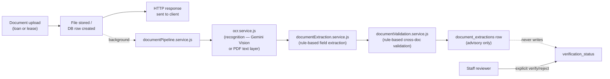

# OCR + Rule-Based Document Extraction & Validation

Advisory-only field extraction and cross-document validation for uploaded
loan and lease documents. This document explains the architecture, states
plainly what is and isn't AI here, describes the evaluation harness and its
limitations, and records the PDPA consideration behind sending document
images to a cloud vision model.

See also: [ARCHITECTURE.md](ARCHITECTURE.md) §9.11 (document management &
KYC), §11 (security architecture) for how this feature sits inside the rest
of the system; this document is scoped to the extraction pipeline itself.

---

## 1. What this is, in one sentence

**Pretrained AI-based text recognition, with a rule-based field-extraction
and validation layer on top.**

That split matters and is enforced by the code layout, not just described
in prose:

| Layer | File | What it does | AI involved? |
|---|---|---|---|
| Recognition | `src/services/ocr.service.js` | Turns a document's raw bytes into raw text | **Yes** — a pretrained cloud vision-language model (Gemini Vision), used zero-shot |
| Field extraction | `src/services/documentExtraction.service.js` | Pulls named fields (NIC number, chassis number, account number, ...) out of that raw text | **No** — deterministic regex/label-anchor rules |
| Cross-document validation | `src/services/documentValidation.service.js` | Checks extracted fields against each other and against the applicant's declared data | **No** — deterministic arithmetic/comparison rules |
| Composition & persistence | `src/services/documentPipeline.service.js` | Wires the three above together, persists results, never touches `verification_status` | No AI, no decisions |

There is **no rule-based recognition engine** — nothing in this feature
tries to read characters off a scanned image using hand-written rules.
Recognition is entirely delegated to a pretrained model. Everything
downstream of that (deciding what a "NIC number" or "chassis number" looks
like inside the transcribed text, and whether two documents agree with each
other) is ordinary deterministic code, not a model.

### Explicitly, this project:

- **Does not train a model.** No training run, no gradient descent, no
  model weights produced by this feature.
- **Does not collect a training dataset.** No corpus of real or synthetic
  documents was assembled to train anything (contrast with
  `loan-risk-model/`, which *does* train an XGBoost classifier on a
  generated dataset — see ARCHITECTURE.md §7 — a materially different kind
  of "AI" claim from this feature's).
- **Uses a pretrained recognition engine.** Gemini Vision, called over
  HTTPS, exactly as shipped by Google — no fine-tuning.
- **Uses the pretrained engine zero-shot.** The only customization is a
  fixed instruction prompt ("transcribe every piece of text visible...",
  `ocr.service.js`'s `OCR_PROMPT`) — no examples, no few-shot prompting, no
  fine-tuning, no prompt tuned per document type.
- **Uses deterministic code for field extraction.** Label-anchored regexes
  and a small closed set of bank-name/pattern keywords — same input always
  produces the same output.
- **Uses deterministic code for validation.** Fixed tolerances (e.g. ±10%
  income corroboration, ±LKR 1 payslip arithmetic) and closed-set rules —
  no learned scoring, no model in the loop.

---

## 2. Usage in this system

What OCR is actually *for* here — it exists to speed up staff document
review during loan/lease underwriting, not to perform identity verification,
fraud detection, or any decisioning on its own:

1. **Automatic field extraction on upload.** When a customer uploads a
   supporting document (NIC, vehicle registration/CR copy, bank statement,
   payslip) to a loan or lease application, the pipeline runs in the
   background after the upload succeeds: OCR reads the raw text (Gemini
   Vision, or a direct PDF text-layer read if it's a born-digital PDF), then
   deterministic rules pull out fields like NIC number, chassis number, or
   account number.
2. **Cross-document validation / consistency checks.** The extracted fields
   are checked against each other and against what the applicant declared
   elsewhere in the system — e.g. does the NIC-derived date of birth match
   what they entered, does the chassis number match across the CR copy/
   invoice/valuation report, does the payslip's net salary roughly match the
   declared income or the bank statement's recurring credit. Findings are
   tagged `info`/`warning`/`blocker`.
3. **Staff-facing assistive prefill.** Extracted fields, confidence, and
   validation findings are shown to the staff reviewer alongside each
   document (`LoanDocumentPanel.jsx` / `LeaseDocumentPanel.jsx`), with an
   explicit disclaimer that this is assistive, not automated. The reviewer
   still has to make the actual verify/reject call themselves.
4. **What it explicitly does *not* do:** it never writes
   `verification_status` — no code path lets OCR/extraction approve,
   reject, or silently change an application's standing. That's a hard
   architectural boundary, not just a convention (see §3 below and the
   "advisory-only" tests in `documentPipeline.test.js`).
5. **Admin-controlled.** Whether this runs automatically at all is a real
   toggle in Admin Settings ("Automatic Document Extraction") — turning it
   off stops extraction from running, but never affects staff's ability to
   verify/reject manually.

---

## 3. Architecture



- **Recognition routing** (`ocr.service.js`): a born-digital PDF with an
  extractable text layer is read directly (`pdf-parse`, no AI call at all);
  a scanned PDF or an image is sent to Gemini Vision. Recognition never
  throws — every failure mode (no API key, network error, timeout, empty
  response, unreadable input) resolves to `{status: 'skipped'|'failed', ...}`
  instead, so an upload can never fail because OCR failed.
- **Retry.** `skipped` (no API key, feature disabled — a config-level state)
  is never retried. `failed` (network error, timeout, transient Gemini
  error — anything that could succeed on a second attempt) is retried once
  automatically, with a fixed delay, before the pipeline gives up and
  persists the failure (`documentPipeline.service.js`'s
  `recognizeWithRetry`). If it's still `failed` after that, the staff/
  applicant document panel shows an explicit "analysis failed" state
  (distinct from "nothing found") with a **manual retry** action —
  `POST /:id/documents/:docId/extraction/retry` on both the loan and lease
  routes — that re-runs the pipeline on demand, bypassing the
  `ocr_auto_extraction` setting gate since the reviewer explicitly asked
  for it.
- **Extraction** (`documentExtraction.service.js`) is pure and does no I/O.
  Currently implemented for `national_id` (NIC number), `cr_copy` (vehicle
  registration — chassis number, engine number, make/model/year, absolute
  owner), and `bank_statement` (account number, account holder, balances,
  statement period). **`payslip` has no extractor yet** — see §6.
- **Validation** (`documentValidation.service.js`) is pure and does no I/O.
  It cross-checks NIC-derived date of birth/gender against declared
  applicant data, fuzzy-matches names across documents, corroborates income
  figures within tolerance, and (lease only) checks chassis-number
  consistency across the vehicle document set and CR-copy absolute
  ownership. Every finding carries a severity: `info` (corroborated),
  `warning` (noisy corroborative check — OCR error or ordinary variance can
  trigger it without anything being wrong), or `blocker` (identity/
  collateral integrity — an underwriter must resolve it).
- **Composition** (`documentPipeline.service.js`) runs after the file is
  stored and the upload's HTTP response has already been sent — OCR latency
  never blocks the upload. Extraction results are **advisory only**: no
  code path in this feature writes `verification_status`; that value stays
  under staff's sole authority, set only through an explicit verify/reject
  action.
- **Admin control**: whether extraction runs automatically on upload is a
  real, persisted setting (`system_settings.ocr_auto_extraction`,
  toggled from Admin Settings → "Automatic Document Extraction"). It
  controls only whether the pipeline *runs*, never whether a document
  counts as verified.

---

## 4. Fields currently extracted

| Document type | Fields |
|---|---|
| `national_id` | NIC number (parsed into birth year, day-of-year, derived gender, derived date of birth) |
| `cr_copy` | Registration number, chassis number, engine number, make, model, year of manufacture, fuel type, class of vehicle, absolute owner |
| `bank_statement` | Bank (closed set of 10 Sri Lankan banks), account number, account holder, branch, statement period, opening/closing balance |
| `payslip` | **None yet** — see §6 |

Every extracted field is either `null` (nothing found — the extractor never
guesses) or `{ value, snippet, confidence }`, where `snippet` is the exact
transcribed text the value was read from and `confidence` reflects how the
match was made (a labelled field like `"NIC No: ..."` is trusted more than a
bare pattern found with no label nearby).

---

## 5. Evaluation harness

### 5.1 What it measures

`finance-backend/scripts/ocrEval/` runs the **real, unmodified** pipeline —
`ocr.service.js`'s live Gemini Vision call followed by
`documentExtraction.service.js`'s deterministic extraction — over a fixture
set of synthetic documents, and reports **per-field precision and recall**,
not a single blended score:

```
Field              Precision       Recall
-------------------------------------------
NIC number          XX.X%           XX.X%
Chassis number       XX.X%           XX.X%
Net salary            0.0%            0.0%
Account number         XX.X%           XX.X%
```

(Exact figures from the last run are under §5.3's "Latest results" below —
a per-field report, not one aggregate number, is written on every run so
the weakest field is always visible rather than averaged away.)

Precision/recall are computed per field, per document of the matching type:
a **true positive** is a non-null prediction that matches ground truth after
normalization (case/whitespace); a **false positive** is a non-null
prediction that doesn't match; a **false negative** is no prediction where
one was expected. `precision = TP/(TP+FP)`, `recall = TP/(TP+FN)`.

### 5.2 Synthetic document generator

`scripts/ocrEval/generateSyntheticDocuments.js` renders ~50 documents
(13 each of `national_id`, `cr_copy`, `bank_statement`, `payslip`) as
**HTML/CSS templates** (`scripts/ocrEval/lib/templates.js`), screenshotted
with headless Chromium (Puppeteer), and augments each render to resemble a
photographed/scanned document rather than a clean digital export:

- **Rotation** — `transform: rotate()` on the rendered page card (±8°),
  simulating a slightly crooked phone photo.
- **Blur** — CSS `filter: blur()`, simulating camera focus/motion blur.
- **Glare** — a diagonal semi-transparent white gradient overlaid on the
  page, simulating light reflecting off a photographed surface.
- **JPEG compression** — the screenshot itself is encoded as JPEG at a
  randomly chosen quality (50–90), so every fixture carries compression
  artifacts, not just the augmented subset.

Every field value (NIC numbers, chassis numbers, account numbers, names,
amounts) is synthesized from a **seeded PRNG**
(`scripts/ocrEval/lib/prng.js`, mulberry32) via
`scripts/ocrEval/lib/syntheticData.js` — no real applicant data is used
anywhere in the generator or the fixture set, and the same seed always
reproduces the same 52 documents. This mirrors the reproducible-synthetic-
data approach `loan-risk-model/src/data_generator.py` already uses for the
risk model (ARCHITECTURE.md §7.1) — a deliberate, consistent choice across
both AI-adjacent features in this project, for the same reason: no real
personal data is available or appropriate to use for either.

Generated NICs are structurally valid per `nicValidation.service.js`'s
`parseNic()` (correct day-of-year encoding, gender bit, birth year), so
extraction and downstream cross-checks are exercised the same way they
would be against a real, valid NIC.

Fixture images (`scripts/ocrEval/fixtures/documents/*.jpg`) and the ground
truth they were generated from (`scripts/ocrEval/fixtures/ground_truth.json`)
are **committed to the repository**, not gitignored — besides feeding the
evaluation script, they double as a ready-made corpus for manually testing
the upload flow without needing real documents.

### 5.3 Running it

```bash
cd finance-backend
node scripts/ocrEval/generateSyntheticDocuments.js   # regenerate fixtures (optional — already committed)
node scripts/ocrEval/runEvaluation.js                # score the pipeline against them
```

`runEvaluation.js` makes one live Gemini Vision call per document (all 52
fixtures are JPEGs, so all of them exercise the Vision path, not the PDF
text-layer shortcut) and requires `GEMINI_API_KEY` to be set. It writes the
table above to `OCR_EVALUATION_REPORT.txt` at the repo root, and full
per-document detail (predicted vs. expected, OCR status, outcome) to
`scripts/ocrEval/fixtures/evaluation_results.json`.

Two configuration notes specific to running an evaluation batch (both via
environment variable, both leaving production defaults untouched):

- `OCR_TIMEOUT_MS` — `ocr.service.js`'s Gemini Vision timeout defaults to
  10s in production, tuned for upload-time latency. Vision calls against an
  image (as opposed to `gemini.service.js`'s text-only risk-explanation
  calls) were observed taking noticeably longer against the currently
  configured model, so `runEvaluation.js` raises this to 30s for the batch
  run only.
- `OCR_EVAL_CALL_DELAY_MS` — a fixed pause (default 1.5s) between calls so
  a 50+ document batch doesn't trip the API key's per-minute rate limit.
- `OCR_EVAL_GEMINI_MODELS` — a comma-separated list of Gemini model names
  the harness round-robins across (default:
  `gemini-3.1-flash-lite,gemini-flash-lite-latest,gemini-3-flash-preview`).
  This exists because the Gemini free tier was observed capping requests
  **per model name, per day** (as low as 20/day on one tested model) — far
  below what a single 50+ document batch needs. Rotating across several
  model names spreads the batch across separate quota buckets; every one
  is still a pretrained Gemini Vision model called zero-shot, so this
  doesn't change what's being evaluated, only how the free-tier quota
  ceiling is worked around. `ocr.service.js`'s `recognizeDocument()` takes
  an optional per-call `model` override for exactly this purpose — the
  shared `GEMINI_MODEL` env var that `gemini.service.js` also reads is
  never touched by the harness.

**Latest results** (the standalone `OCR_EVALUATION_REPORT.txt` this was
generated to has been folded in here rather than kept as a separate file —
re-run `runEvaluation.js` to refresh these numbers):

```
OCR + Rule-Based Field Extraction — Evaluation Report (synthetic fixture set)
===============================================================================
Generated: 2026-08-14T09:33:55.372Z
Fixture set: 52 synthetic documents (seed 20260814)
Recognition engine under test: Gemini Vision, zero-shot
  Model calls were round-robined across [gemini-3.1-flash-lite, gemini-flash-lite-latest, gemini-3-flash-preview]
  (each Gemini model name enforces its own separate free-tier daily quota;
  rotating across several was necessary to complete a 52-document
  batch in one run — see OCR_FEATURE.md §5.3).
Extraction: deterministic rule-based field extraction (documentExtraction.service.js)

Per-field precision and recall (not a single blended score):

Field              Precision       Recall
-------------------------------------------
NIC number         100.0%          100.0%
Chassis number     100.0%          100.0%
Net salary         N/A             0.0%
Account number     100.0%          100.0%

Detail (true positives / false positives / false negatives, per field):
  NIC number: TP=13 FP=0 FN=0 (n=13)
  Chassis number: TP=13 FP=0 FN=0 (n=13)
  Net salary: TP=0 FP=0 FN=13 (n=13)
  Account number: TP=13 FP=0 FN=0 (n=13)

OCR recognition status across all documents processed:
  succeeded=52 failed=0 skipped=0

Known gap — Net salary:
  documentExtraction.service.js does not yet implement field extraction for
  the 'payslip' document type (see its `default:` case, which returns {}).
  Net salary is scored here anyway, as required, so the gap is visible in
  the numbers rather than hidden by omitting the field: recall is 0% and
  precision is undefined (no predictions were ever made) — this reflects
  an unimplemented extractor, not an OCR or model failure.

LIMITATIONS — read before citing any number above:
  - The evaluation set is small (52 documents, 13 per field/type).
  - The evaluation is entirely synthetic: HTML/CSS-rendered documents with
    programmatic rotation/blur/glare/JPEG-compression augmentation, not real
    scans or camera photos of real documents. A separate, smaller evaluation
    against real-world/sample documents exists — see §5.4 below.
  - These results are NOT a production accuracy claim. They establish a
    reproducible baseline and a regression check, nothing more.
  - Full methodology, generator, and PDPA considerations: see this document.
```

### 5.4 Real-world/sample document evaluation

A second, separate harness — `scripts/ocrEval/runRealDocumentEvaluation.js`
— runs the identical pipeline and scoring engine
(`scripts/ocrEval/lib/evalRunner.js`, shared by both harnesses) over a small
set of real-world/sample documents instead of the synthetic set, kept in
`scripts/ocrEval/fixtures/real_documents/`. It writes its own separate
report, `REAL_DOCUMENT_EVALUATION_REPORT.txt`, and its own results file,
`scripts/ocrEval/fixtures/real_evaluation_results.json` — deliberately not
merged into the synthetic report, because the two sets answer different
questions (synthetic: "does the pipeline still work after a code change?";
real: "how does it hold up against documents nobody generated for it?") and
blending them would make both numbers harder to interpret.

**What's actually in this set.** Of the documents supplied, several turned
out, on inspection, to be third-party KYC-vendor mockup/sample templates
(watermarked "Mr. Verify", "Roposh.com", "TemplateLab") rather than
genuinely issued documents — both kinds are scored identically, since the
pipeline has no way to tell a genuine document from a realistic mockup and
isn't expected to. A meaningful fraction of the supplied documents have the
relevant field redacted, blank, absent from that particular page, or
illegible, and are **excluded from scoring** rather than counted as
failures — there's no correct value to check extraction against a redacted
field. The exact exclusion list and reasoning lives in
`scripts/ocrEval/fixtures/real_ground_truth.json`'s `excluded` array, and is
also printed in the report itself.

**Ground truth here was built differently** from the synthetic set: instead
of being generated (and therefore known exactly), each value was
transcribed by visually inspecting the document image, and carries a
`confidence: "high"|"medium"|"low"` rating in `real_ground_truth.json`
reflecting how legible the source text was. A "wrong" result against a
`low`-confidence entry may be a transcription error in the ground truth
itself rather than a genuine extraction failure — read the per-document
detail in `real_evaluation_results.json` before drawing a conclusion from
any single mismatch.

**Why this set is worth having despite being tiny:** real photographed
documents exercise layout patterns the synthetic HTML templates don't. This
run found four distinct, reproducible gaps in
`documentExtraction.service.js`'s label-anchored extraction — none of them
OCR failures (Gemini Vision transcribed all four documents correctly in
every case); all four are the deterministic extraction layer's same-line,
colon-anchored pattern failing against a real-world layout the synthetic
templates, by construction, never produce (every synthetic field renders as
one full-width "Label: Value" line):

1. **Two-column form reflow** — every real CR copy in the set. The official
   CR-copy form lays out "Registration No." and "Chassis No." as two column
   headers on one row, values on the row below; the transcribed text puts
   labels and values on separate lines, which `extractLineField()` doesn't
   match across.
2. **Label with no colon separator** — e.g. `Account Number   06 3167
   10781391`, column-aligned with whitespace rather than a `:` or `-`.
   `extractLineField()`'s pattern requires that separator character to be
   present at all.
3. **Label and value on separate lines** — e.g. `Account Number:` on its own
   line, the value on the next. Same same-line limitation as #1, on a bank
   statement rather than a CR copy.
4. **A space before an old-format NIC's check-letter** — `961230144 v`
   rather than `961230144V`, on a card with no "NIC No:" label at all (so
   extraction falls back to a bare pattern match). The bare pattern's
   `\b...\b` word boundary doesn't span the space.

Fixing any of these is future extraction work, out of scope for this
evaluation step; they're recorded here — and with full per-document detail
in `scripts/ocrEval/fixtures/real_evaluation_results.json` — so they don't
get lost.

Running it:

```bash
cd finance-backend
node scripts/ocrEval/runRealDocumentEvaluation.js
```

Same environment variables as §5.3 apply (`OCR_TIMEOUT_MS`,
`OCR_EVAL_CALL_DELAY_MS`, `OCR_EVAL_GEMINI_MODELS`), since both harnesses
share the same underlying call/retry/model-rotation logic.

**Latest results** (the standalone `REAL_DOCUMENT_EVALUATION_REPORT.txt`
this was generated to has been folded in here rather than kept as a
separate file — re-run `runRealDocumentEvaluation.js` to refresh these
numbers):

```
OCR + Rule-Based Field Extraction — Evaluation Report (real-world/sample documents)
======================================================================================
Generated: 2026-08-14T09:26:26.348Z
Document set: 14 scored (10 excluded — redacted/blank/illegible field, see below)
Recognition engine under test: Gemini Vision, zero-shot
  Model calls were round-robined across [gemini-3.1-flash-lite, gemini-flash-lite-latest, gemini-3-flash-preview] — same reason as the synthetic run (see §5.3 above).
Extraction: deterministic rule-based field extraction (documentExtraction.service.js)

Per-field precision and recall (not a single blended score):

Field              Precision       Recall
-------------------------------------------
NIC number         100.0%          75.0%
Chassis number     N/A             0.0%
Account number     100.0%          20.0%

Detail (true positives / false positives / false negatives, per field):
  NIC number: TP=3 FP=0 FN=1 (n=4)
  Chassis number: TP=0 FP=0 FN=5 (n=5)
  Account number: TP=1 FP=0 FN=4 (n=5)

OCR recognition status across all documents processed:
  succeeded=14 failed=0 skipped=0

Excluded from scoring (10 documents — no valid value to check extraction against):
  NIC-02.jpg: placeholder/all-zero NIC number on a KYC-vendor mockup template — no valid value to score
  NIC-04.jpg: every field including the NIC number is blurred/redacted in the source image
  NIC-06.jpg: fan-made parody card design, not the official NIC layout — the printed number doesn't correspond to a real card format
  CR-02.jpeg: blank/unfilled template — no chassis number present
  CR-03.jpeg: this page is the certificate's terms-and-conditions cover page, not the data page — no chassis number on it
  CR-05.jpeg: chassis number field is redacted (red box) in the source image
  CR-06.jpg: chassis number field is partially covered by a redaction mark — not fully legible
  BS-02.jpg: this statement layout has no field labelled 'Account No' (only a masked card number) — nothing for the current label-anchored extractor to find
  BS-05.png: same layout as BS-02 — no 'Account No' labelled field
  BS-07.jpg: account number field is redacted (strikethrough) in the source image

Observed failure modes (why the false negatives above happened):
  These are read directly off this run's raw OCR transcripts, not guessed.
  1. Two-column form reflow (all 5 Chassis number FNs: CR-01, CR-04, CR-07,
     CR-08, CR-09). The official CR-copy form lays out 'Registration No.' and
     'Chassis No.' as two column headers on one row, with both values on the
     row below. Gemini transcribes exactly what it sees, so the labels and
     values land on separate lines in the output text — but extractLineField()
     in documentExtraction.service.js only matches a label and its value on
     the SAME line. Every real CR copy in this set hit this, unanimously —
     the synthetic set never could, since its HTML template renders each
     field as one full-width 'Label: Value' line by construction.
  2. Label with no colon separator (Account number FN: BS-08, BS-09). This
     statement prints 'Account Number   06 3167 10781391' — label and value
     column-aligned with whitespace, no ':' or '-' between them anywhere.
     extractLineField()'s pattern requires that separator; without one, the
     line simply never matches, regardless of how clean the transcription is.
  3. Label and value on separate lines (Account number FN: BS-01). This
     statement prints 'Account Number:' on its own line, then the (partially
     masked) value on the next line — the same same-line requirement as #1,
     different document type.
  4. Space before an old-format NIC's check-letter (NIC number FN: NIC-01).
     This card has no 'NIC No:' label at all, so extraction falls back to a
     bare pattern match; Gemini transcribed it as '961230144 v' (with a
     space before the letter), and the bare pattern's \b...\b word boundary
     doesn't span a space, so it never matches.
  None of these are OCR failures — Gemini Vision read all four documents
  correctly in every case above. All four are gaps in the deterministic
  extraction layer's same-line, colon-anchored pattern, exposed by real
  document layouts the synthetic templates don't produce. Fixing them is
  future extraction work, out of scope for this evaluation step; they are
  recorded here so they don't get lost.

What this set actually contains:
  Of the 24 documents supplied, only 14 had a legible, unredacted value in the
  field this harness checks. Several of the 14 are genuine Sri Lankan documents
  (mainly the CR copies); several others turned out, on inspection, to be
  third-party KYC-vendor mockup/sample templates (watermarked 'Mr. Verify',
  'Roposh.com', 'TemplateLab') rather than genuine issued documents — see each
  document's "source" field in real_ground_truth.json. Both kinds are scored
  identically; the recognition/extraction pipeline has no way to tell a genuine
  document from a realistic mockup, and isn't expected to.

LIMITATIONS — read before citing any number above:
  - This set is very small (14 scored documents, unevenly split across
    3 fields — see the per-field n above). A handful of documents can swing
    the percentage a lot; treat these numbers as anecdotal, not statistical.
  - Some ground-truth values were transcribed from small or angled text
    by visual inspection (not verified against an independent source), and
    carry a 'confidence' rating in real_ground_truth.json for that reason —
    a 'wrong' result against a 'low' confidence entry may be a ground-truth
    transcription error rather than a genuine extraction failure.
  - No payslip/net salary documents were supplied in this set, so that field
    isn't represented here at all (it is covered in the synthetic report above).
  - These results are NOT a production accuracy claim, and are not a
    substitute for the larger synthetic evaluation — see §5.3 above and
    this document generally.
```

---

## 6. Limitations

Read before citing any number in §5's evaluation results:

- **The evaluation set is small** — 52 documents, 13 per field. This is
  enough to catch a broken regex or a recognition routing bug, not enough
  to make a statistically meaningful accuracy claim.
- **The evaluation is synthetic-heavy.** Every fixture is a programmatically
  rendered and augmented HTML template, not a real scanned or photographed
  Sri Lankan document. Real documents vary in ways a template can't
  capture — different NIC card printings and wear, handwriting, non-
  standard bank statement layouts, phone-camera lighting this generator
  doesn't model, and so on.
- **These results are not a production accuracy claim.** They establish a
  reproducible baseline and a regression check — if a future change to the
  extraction rules or the recognition prompt silently breaks NIC parsing,
  re-running the harness will show it. They are not evidence of how the
  pipeline performs against real, messy, production documents.
- **Net salary extraction is not implemented.**
  `documentExtraction.service.js` has extractor logic for `national_id`,
  `cr_copy`, and `bank_statement`; the `payslip` document type falls
  through to a `default:` case that returns `{}`. This was a deliberate
  scope decision made in an earlier step of this feature, not an oversight
  discovered here — `documentValidation.service.js`'s own file header
  already documents `payslip.*` fields as "not produced by any extractor
  yet... simply treated as missing... until they are supplied," and its
  payslip-arithmetic and income-corroboration rules are written to degrade
  gracefully (skip the check, not fail it) when those fields are absent.
  The evaluation harness scores `net_salary` anyway, exactly as required,
  so this gap is visible as a flat 0% recall / undefined precision in the
  report rather than silently excluded from it — that 0% reflects an
  unimplemented extractor, not a recognition or model failure. Implementing
  a payslip extractor is future work, out of scope for this evaluation
  step.
- **Real-document ground truth was hand-transcribed, not generated** — see
  §5.4. Treat any single real-document mismatch as inconclusive until you've
  checked its `confidence` rating and the actual OCR output.

---

## 7. PDPA consideration (Act No. 9 of 2022)

Sending a document image containing a National Identity Card, bank account
number, or salary figures to a cloud vision-language model means personally
identifiable information is processed by a third party, potentially
offshore. Under Sri Lanka's Personal Data Protection Act, No. 9 of 2022,
that is a material architectural consideration, not a footnote — this
section documents it explicitly rather than leaving it implicit.

**How the design responds to this:**

- **Extraction is advisory only, never automated verification.** Nothing in
  this feature can approve, reject, or silently change an application's
  standing. The only thing extraction produces is a suggestion a staff
  member can look at — see §3. This limits the consequence of any single
  extraction being wrong (whether from a recognition error or, separately,
  a mishandled model response) to "a reviewer sees an inaccurate suggestion
  and disregards it," never to an unreviewed automated decision about a
  real person's loan.
- **Human sign-off is preserved unconditionally.** `verification_status`
  changes only through an explicit staff verify/reject action, regardless
  of what extraction found, what confidence it reported, or whether
  extraction ran at all (§3's admin toggle can disable extraction entirely
  without touching this).
- **The API key stays server-side.** `GEMINI_API_KEY` is read from the
  gateway's environment and never returned to a client; the browser never
  talks to Gemini directly, and a compromised frontend cannot exfiltrate
  the key.
- **A local OCR/VLM engine is a deliberately left-open alternative.**
  `ocr.service.js`'s recognition step is isolated behind a single function,
  `recognizeDocument({buffer, mimeType})`, that returns a fixed
  `{status, engine, rawText, pageCount}` shape — nothing downstream cares
  which engine produced that shape. A self-hosted OCR/VLM model (e.g. a
  locally-run Tesseract or open-weight vision model) could be substituted
  behind the same function without changing `documentExtraction.service.js`,
  `documentValidation.service.js`, or anything above them. That would
  remove the need to send sensitive document images to an external cloud
  service at all — not implemented here, but the architecture doesn't
  block it, which is the relevant PDPA-conscious property to have designed
  in now rather than retrofit later.

---

## 8. Where this fits, by role

| Role | What they see | What they can do |
|---|---|---|
| Applicant | Nothing extra — extraction runs in the background after upload | Nothing extraction-specific; uploads work exactly as before |
| Staff reviewer | Extracted fields, confidence, and severity-differentiated validation findings alongside each document, with an explicit "assistive, not automated" disclaimer | Verify or reject the document — extraction never does this for them |
| Admin | "Automatic Document Extraction" toggle in Admin Settings | Turn automatic extraction on/off system-wide (does not touch staff verification) |

---

## Related documentation

- [ARCHITECTURE.md](ARCHITECTURE.md) — full system architecture, including
  §9.11 (document management & KYC) and §7 (the *other* AI component in
  this system, the loan-risk model — a trained classifier, a genuinely
  different kind of "AI" claim from this feature's zero-shot pretrained
  recognition).
- §5.3 and §5.4 above hold the latest evaluation results for the synthetic
  and real-world/sample document sets respectively (folded in here rather
  than kept as separate report files — re-run the corresponding script
  under `scripts/ocrEval/` to refresh them).
